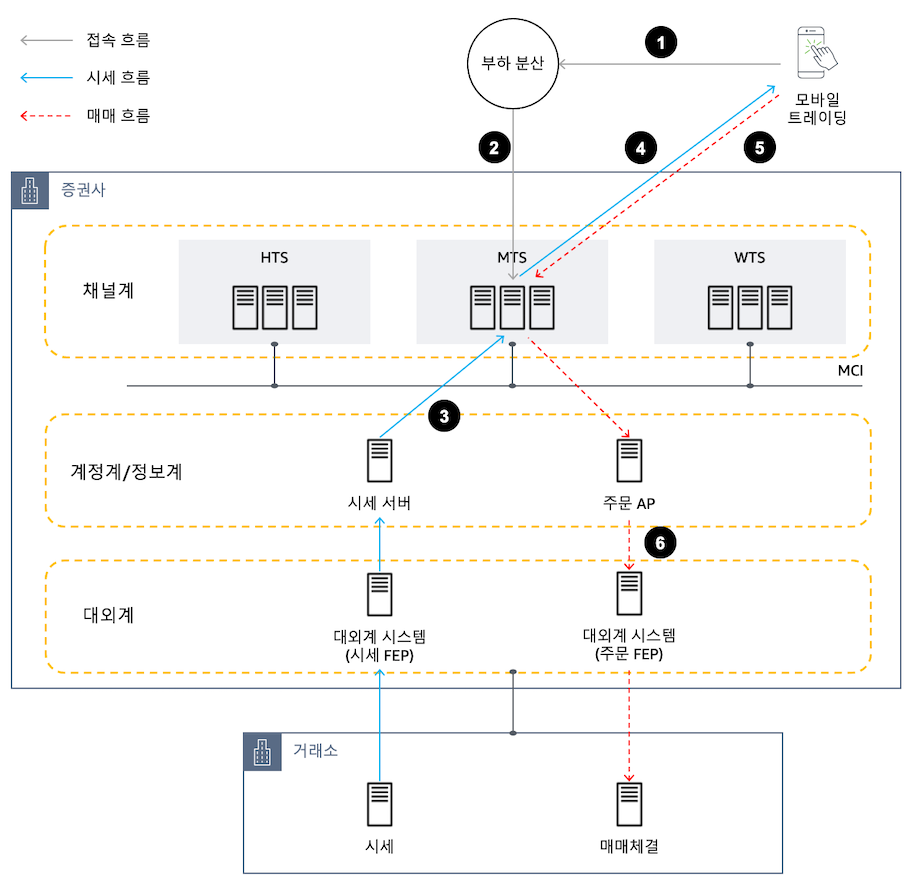
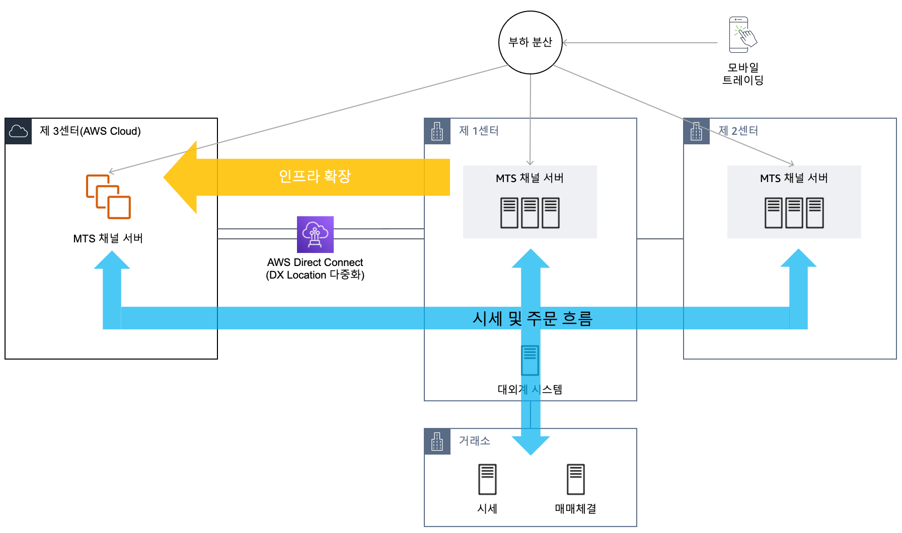
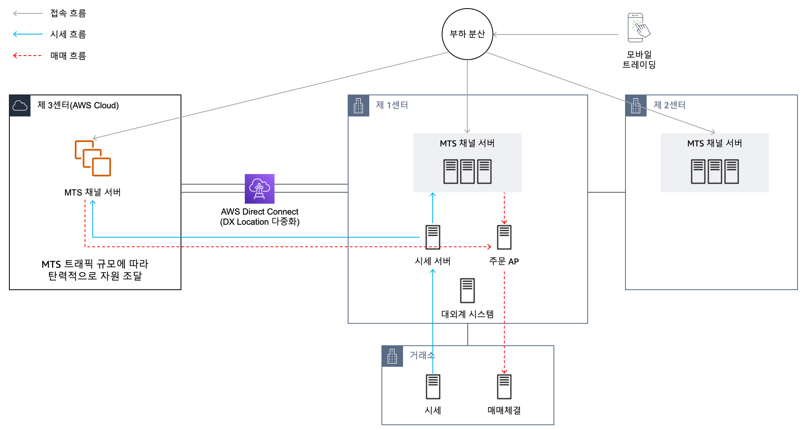
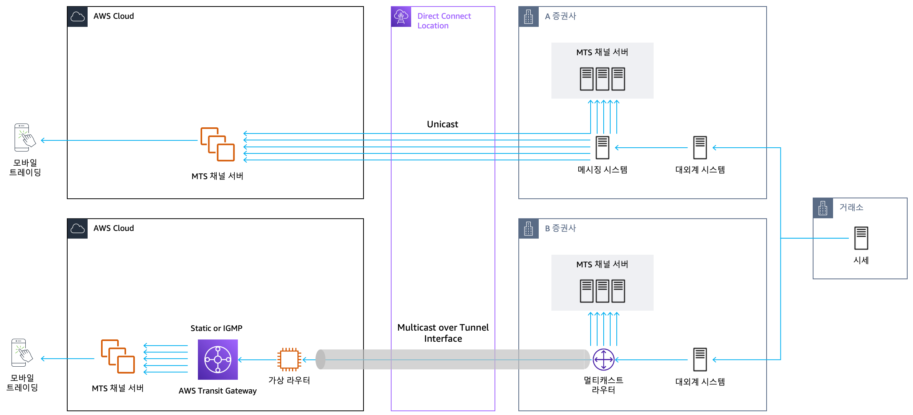
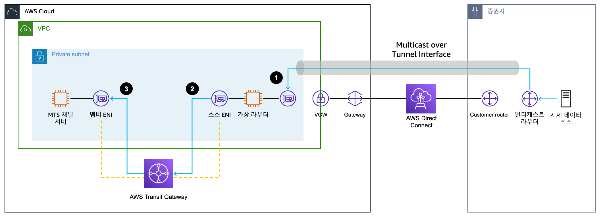

# 개요

2023-02-05  교육장
AWS 임준형

## 증권동향
- Think Big
  - 강력한 추진력
- Start Small
- Move Fast
                 

애자일한 환경 문화
- 비지니스 변화 속도

MSP
- 매가존, Kyndryl, 베스핀
   
Outpost
- AWS장비를 고객사 IDC 센터에 설치하는 것

MTS Open(가동중) 
- 신한, 토스

유안타 HPC (고성능 컴퓨팅(HPC))
- 집중적으로 자원 사용.. (일순간..., 2시간 정도)
- 파생상품 리스크 분석 (2시간 -> 30분 )

## 신중훈 (솔루션 아키텍트)
증권
- https://aws.amazon.com/ko/blogs/tech/aws-mts-scalability-mobile-trading-system/
-

- FEP는 On-premise
- 

### 온프레미스 시세 데이터를 클라우드에 전달하는 방법
   
Kafka, Nats(데이터를 저장하지 않고 stream)

- AWS는 UDP지원하지 않음
  - AWS Trans Gateway 사용함

### AWS 클라우드에서의 멀티캐스트 시세 데이터 트래픽
