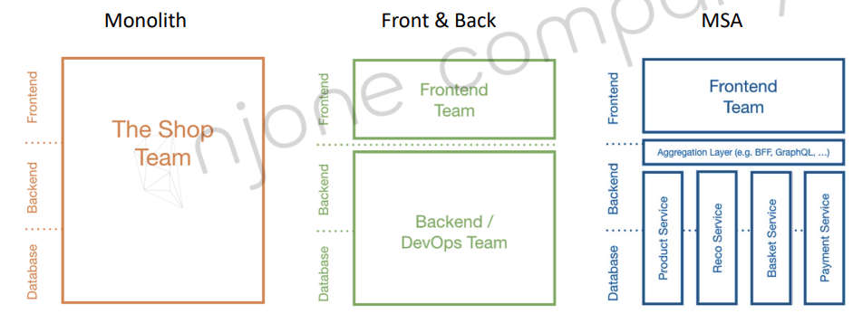

# 강의정리

- Microservice란?
- Microservice와 SOA
- Spring Cloud란?
- 필수 SW 설치

## 1. Microservice란?

### Spring Cloud 소개
1. The History of IT System
   - 1960 ~ 1980s : Fragile(부서지기[손상되기] 쉬운), Cowboys
     - Mainframe, Hardware
   - 1990 ~ 2000s : Robust, Distributed
     - Changes
   - 2010s ~ : Resilient/Anti-Fragile, Cloud Native
     - Flow of value의 지속적인 개선

2. Software Architecture
  - Antifragile
    - Auto scaling
    - Microservices
    - Chaos engineering(안전한 장애 테스트 서비스)
      - 변동
      - 예견된 불확실성
      - 예견되지 않는 불확실성
      - 카오스 불확실성
    - Continuous deployments

### Cloud Native Architecture
1. 확장 가능한 아키텍처
   - 시스템의 수평적 확정에 유연
   - 확장된 서버로 시스템의 부하 분산, 가용성 보장
   - 시스템 또는, 서비스 애플리케이션 단위의 패키지 (컨테이너 기반 패키지)
   - 모니터링
2. 탄력적 아키텍처
   - 서비스 생성 - 통합 - 배포, 비즈니스 환경 변화에 대응 시간 단축
   - 분활 된 서비스 구조
   - 무상태 통신 프로토콜
   - 서비스의 추가와 삭제 자동으로 감지
   - 변경된 서비스 요청에 따라 사용자 요청 처리 (동적 처리)
3. 장애 격리 (Fault isolation)
   -  특정 서비스에 오류가 발생해도 다른 서비스에 영향 주지 않음

1. Cloud Native Application - CI/CD

   - 지속적인 통합, CI(Continuous Integration)
     - 통합 서버, 소스 관리 (SCM), 빌드 도구, 테스트 도구
        - ex) Jenkins, Team CI, Travis CI
   - 지속적 배포
     - Continuous Delivery
     - Continuous Deployment
     - Pipe line
     - 
   - 카나리아 배포와 블루그린 배포
     - 
     - 소스
2. Cloud Native Application - DevOps
3. Cloud Native Application - Container 가상화

### 12 Factors(https://12factor.net/)
12 Factors(https://12factor.net/)

1. One codebase, one application
2. API first   (+3)
3. Dependency management
4. Design, build, release, and run
5. Configuration, credentials, and code
6. Logs
7. Disposability
8. Backing services
9. Environment parity
10. Administrative processes
11. Port binding
12. Stateless processes
13. Concurrency
14. Telemetry  (+3)
15. Authentication and authorization  (+3)

12 Factors + 3

   § Monolith vs Microservice Architecture
   Monolithic vs. MSA
   § Monolith Architecture

### Monolithic vs. MSA

1. Monolithic
   - 모든 업무 로직이 하나의 애플리케이션 형태로 패키지 되어 서비스
   - 하나의 큰 건축물
   - 애플리케이션에서 사용하는 데이터가 한곳에 모여 참조되어 서비스되는 형태
   - 일부 기능만 수정하여도 전체 애플리케이션 빌드, 배포

2. What is the Microservice?
   - Small autonomous services that work together - Sam Newman

3. Monolith vs Front & Back vs Microservice Architecture
   - 

4. Monolithic vs. MSA
   -  

5. Microservice의 특징
   - Challenges
     - 기존의 방식에서 많은 변경
   - Small Well Chosen Deployable Units
   - Bounded Context
   - RESTful
   - Configuration Management
     - 외부에서 관리
   - **Cloud Enabled**
   - Dynamic Scale Up And Scale Down
   - CI/CD
   - Visibility
6. 모든 서비스를 MSA로(No)
   - Q1) Multiple Rates of Change
   - Q2) Independent Life Cycles 
     - 독립 운영
   - Q3) Independent Scalability
   - Q4) Isolated Failure
     - 격리된 오류
   - Q5) Simplify Interactions with External Dependencies
     - 외부 종속성 간결화
   - Q6) Polyglot Technology
7. Microservice의 특징
   - Microservice Team Structure
     - Two Pizza team : 커뮤니케이션 비용
     - Teams communicating through API contracts
     - Develop, test and deploy each service independently
     - Consumer Driven Contract
## 2. Microservice와 SOA
2002- Jeff Bezos의 메일
- 
### SOA와 MSA와의 차이점
SOA와 MSA와의 차이점
   - SOA(Service Oriented Architecture)
     - 비즈니스 측면에서의 서비스 재사용성
     - ESB(Enterprise Service Bus)라는 서비스 채널 이용 > 서비스 공유, 재사용
   - MSA(Microservice Architecture)
     - 한 가지 작은 서비스에 집중
     - 서비스 공유하지 않고 독립적 실행
SOA와 MSA와의 차이점
- 서비스의 공유 지향점
  - SOA - 재사용을 통한 비용 절감
  - MSA - 서비스 간의 결합도를 낮추어 변화에 능동적으로 대응
  - 
- 기술 방식
  - SOA - 공통의 서비스를 ESB에 모아 사업 측면에서 공통 서비스 형식으로 서비스 제공
  - MSA - 각 독립된 서비스가 노출된 REST API를 사용
  - 

### RESTful Service Web Service
“A way to grade your API according to the constraints of REST.”
- by Leonard Richardson

1. LEVEL 0
   - Expose soap web services in rest style
   - http://server/getPosts
   - http://server/deletePosts
   - http://server/doThis
1. LEVEL 1
   - Expose resources with proper uri
   - http://server/accounts
   - http://server/accounts/10
   - note: improper use of http methods
3. LEVEL 2
   - Level1 + HTTP Methods
4. LEVEL 3
   - Level2 + HATEOAS
   - DATA + NEXT POSSIBLE ACTIONS

###  SOA vs. MSA

### MSA 표준 구성요소
MSA 표준 구성요소
-  

Service Mesh Capabilities
- 
- MSA 인프라 > 미들웨어
  - 프록시 역할, 인증, 권한 부여, 암호화, 서비스 검색, 요청 라우팅, 로드 밸런싱
 - 자가 치유 복구 서비스
- 서비스간의 통신과 관련된 기능을 자동화

MSA 표준 구성요소
- CNCF(Cloud Native Computing Foundation)
  - Cloud Native Interactive Landscape
  - https://landscape.cncf.io/

MSA 기반 기술
- 

Spring Cloud
- “By 2017, at least 70% of new enterprise Java applications won’t be deployed on traditional app servers” - Gartner

## 3. Spring Cloud란?
연동 버전 정보(https://spring.io/projects/spring-cloud)
- 
### Spring Cloud
Centralized configuration management
- Spring Cloud Config Server

Location transparency
- Naming Server (Eureka)

Load Distribution (Load Balancing)
- Ribbon (Client Side) 
- Spring Cloud Gateway

Easier REST Clients
- FeignClient

Visibility and monitoring
- Zipkin Distributed Tracing
- Netflix API gateway

Fault Tolerance
- Hystrix

## 4. 필수 SW 설치
IntelliJ IDEA Ultimate
- https://www.jetbrains.com/ko-kr/idea

Git
- https://git-scm.com

Visual Studio Code
- https://code.visualstudio.com

Postman
- https://www.postman.com