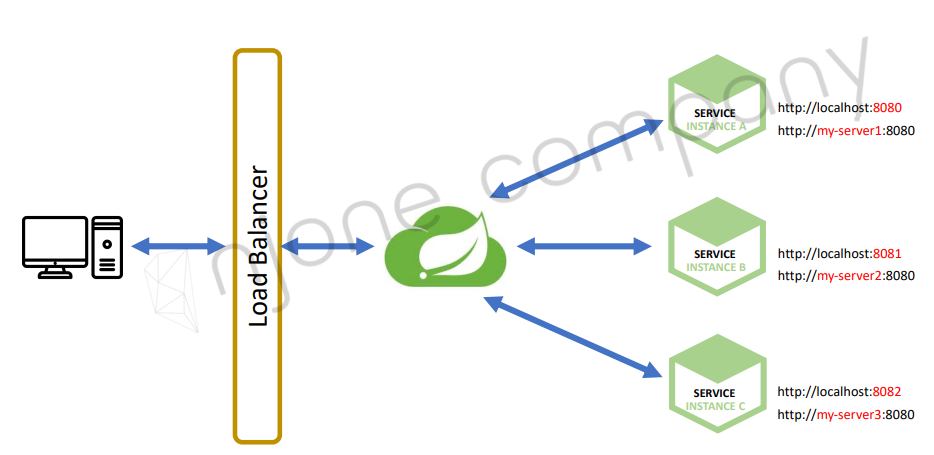
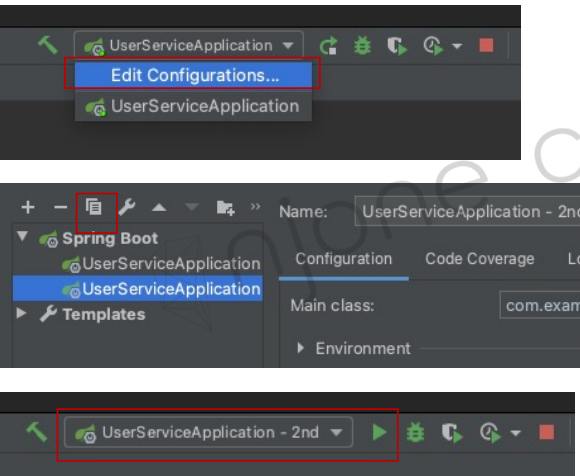
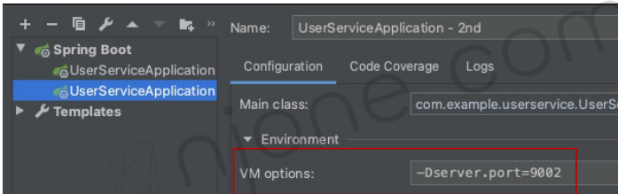

<style>
.burk {
    background-color: red;
    color: yellow;
    display:inline-block;
}
</style>

# 01. Service Discovery

- Spring Cloud Netflix Eureka
- Eureka Service Discovery – 프로젝트 생성
- User Service – 프로젝트 생성
- User Service – 등록
- User Service – Load Balancer

## 1. Spring Cloud Netflix Eureka
Service Discovery
- 전화 번호부 (서비스가 어디에 있나)
- Eureka
- 

## 2. Eureka Service Discovery – 프로젝트 생성
community version에서는  Spring Initializer 사용 불가
- Spring IO를 사용해서 생성하자 (https://start.spring.io/)
- Spring Boot 버전은 2.7.7 이상만 가능 (생성 이후 변경 예정)

1. 프로젝트 생성 정보
   - Spring Initializr
     - Group: com.example
     - Artifact: ecoomerce
     - Type : Maven
     - java: 11
     - Version: 0.0.1-SNAPSHOT
     - Package: com.example.ecoomerce
   - Dependencies
     - Spring Boot > 2.4.1
     - Spring Cloud Discovery > Eureka Server

2. application.yml
    ```yaml
    server:
      port: 8761
    
    spring:
      application:
        name: discoveryservice
    
    eureka:
      client:
        register-with-eureka: false
        fetch-registry: false
    ```

3. 소스 수정
   - main java 파일에 annotation 추가
     - @EnableEurekaServer

4. 실행
   - http://localhost:8761/


## 3. User Service – 프로젝트 생성
User-service을 생성하여 Ereka에 등록 확인
- Eureka Discovery Service에 등록

1. 프로젝트 생성 정보
    ```shell
    Dependencies
    - Spring Boot DevTools
    - Lombok
    - WEB: Spring WEB
    - Sureka Discovery Client
    ```

2. pom.xml (주요 정보)
    - web을 dependencty에 없으면 spring 기동시 오류 발생
     ```xml
    <?xml version="1.0" encoding="UTF-8"?>
    <project xmlns="http://maven.apache.org/POM/4.0.0" xmlns:xsi="http://www.w3.org/2001/XMLSchema-instance"
             xsi:schemaLocation="http://maven.apache.org/POM/4.0.0 https://maven.apache.org/xsd/maven-4.0.0.xsd">
        <modelVersion>4.0.0</modelVersion>
    
        <parent>
            <groupId>org.springframework.boot</groupId>
            <artifactId>spring-boot-starter-parent</artifactId>
            <version>2.4.1</version>
            <relativePath/> <!-- lookup parent from repository -->
        </parent>
    
        <groupId>com.example</groupId>
        <artifactId>user-service</artifactId>
        <version>1.0</version>
        <name>user-service</name>
        <description>Demo project for Spring Boot</description>
        <properties>
            <java.version>11</java.version>
            <spring-cloud.version>2020.0.0</spring-cloud.version>
            <project.build.sourceEncoding>UTF-8</project.build.sourceEncoding>
        </properties>
    
    
        <dependencies>
            <dependency>
                <groupId>org.springframework.boot</groupId>
                <artifactId>spring-boot-starter-web</artifactId>
            </dependency>
    
            <dependency>
                <groupId>org.springframework.cloud</groupId>
                <artifactId>spring-cloud-starter-netflix-eureka-client</artifactId>
            </dependency>
    
            <dependency>
                <groupId>org.springframework.boot</groupId>
                <artifactId>spring-boot-devtools</artifactId>
                <scope>runtime</scope>
                <optional>true</optional>
            </dependency>
    
            <dependency>
                <groupId>org.springframework.boot</groupId>
                <artifactId>spring-boot-starter-test</artifactId>
                <scope>test</scope>
            </dependency>
    
            <dependency>
                <groupId>org.projectlombok</groupId>
                <artifactId>lombok</artifactId>
                <optional>true</optional>
            </dependency>
    
        </dependencies>
    
    
    </project>
    ```
3. application.yml
   - prt:0 ==> Ramdom 지정
   - instance-id를 별도 지정하는 방법
    ```yaml
    server:
    #  port: 9001
      port: 0   #Ramdom Port
    #  port: ${random.int(50000,50001)}
    
    spring:
      application:
        name: user-service
    
    eureka:
      instance:
        instance-id: ${spring.application.name}:${spring.application.instance_id:${random.value}}
    
      client:
        register-with-eureka: true
        fetch-registry: true
        service-url:
          defaultZone: http://localhost:8761/eureka
    ```
4. 프로그램 수정
   - @EnableDiscoveryClient 추가 
    ```java
    @SpringBootApplication                                        
    @EnableDiscoveryClient
    public class UserServiceApplication {
        ... 
    }
    ```
## 4. User Service – 테스트
user-service을 다수 기동해 보자
- Eureka 확인 URL: http://localhost:8761

다수 서비스(user-service)기동 방법
1. UserServiceApplication을 복사하고 , vm 파라미터 추가
    ```shell
    -Dserver.port=9092
    ```
   - 
   - 
2. maven
    ```shell
    $ cd workspace\user-service
    $ mvn spring-boot:run -Dspring-boot.run.jvmArguments='-Dserver.port=9003'
    ```
3. maven
    ```shell
    $ mvn clean compile package
    $ java -jar -Dserver.port=9004 ./target/user-service-1.0.jar
    ```
4. application.yaml 수정
   - port: 0  <== Random 포트
5. 기타 
   - eureka.instance.instanceId
    ```yaml
    eureka:
      instance:
        instance-id: ${spring.application.name}:${spring.application.instance_id:${random.value}}
    ```
