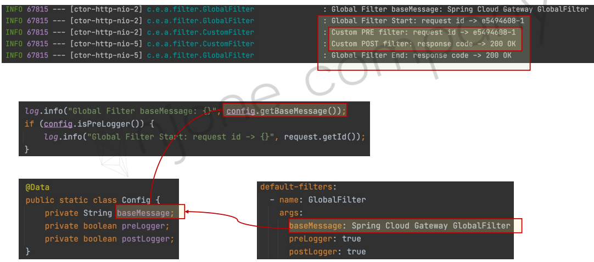

<style>
.burk {
    background-color: red;
    color: yellow;
    display:inline-block;
}
</style>

#  2. API Gateway Service

- API Gateway Service
- Netflix Ribbon과 Zuul
- Spring Cloud Gateway – 기본
- Spring Cloud Gateway – Filter
- Spring Cloud Gateway – Eureka 연동
- Spring Cloud Gateway – Load Balancer

## 1. API Gateway Service
API Gateway Service 주요 기능
- 인증 및 권한 부여
- 서비스 검색 통합
- 응답 캐싱
- 정책, 회로 차단기 및 QoS 다시 시도
- 속도 제한
- 부하 분산
- 로깅, 추적, 상관 관계
- 헤더, 쿼리 문자열 및 청구 변환
- IP 허용 목록에 추가


## 2. Netflix Ribbon과 Zuul
- Spring Cloud에서의 MSA간 통신
  1. RestTemplate
      ```java
      RestTemplate restTemplate = new RestTemplate();
      restTemplate.getForObject("http://localhost:8080/", User.class, 200);
      ```
  2. Feign Client
      ```java
      @FeignClient("stores")
      public interface StoreClient {
          @RequestMapping(method = RequestMethod.GET, value = "/stores")
          List<Store> getStores();
      }
      ```


- Ribbon: Client side Load Balancer
  1. 서비스 이름으로 호출
  2. Health Check
     -  Spring Cloud Ribbon은 Spring Boot 2.4에서 Maintenance상태


### Netflix Zuul 구현
1. 구성
   - First Service
   - Second Service
   - Netflix Zuul First Service
   - 

2. 프로젝트 생성
   - First Service, Second Service
   - 왜 버전을 이전과 다르게 했을까?(2023-01-18)
    ```shell
    - Spring Boot: 2.3.8
    - Dependencies: Lombok, Spring Web, Eureka Discovery Client
    ```
### 관련 소스
1. 업무 Controller : FirstServiceController
   - SecondServiceController 도 동일 

    ```java
    @RestController
    @RequestMapping("/")
    @Slf4j
    public class FirstServiceController {
    
        @GetMapping("/welcome")
        public String welcome() {
            log.info("welcome()");
            return "Welcome to the First service.";
        }
    
    }
    ```
2. application.yaml
    ```yaml
    server:
      port: 0
    #  port: ${random.int(10000,51000)}
    
    spring:
      application:
        name: my-first-service
    
    eureka:
      client:
        register-with-eureka: true
        fetch-registry: true
        service-url:
          defaultZone: http://localhost:8761/eureka
      instance:
        instance-id: ${spring.cloud.client.ip-address}:${spring.application.instance_id:${random.value}}
        prefer-ip-address: true
    ```
3. 테스트
   - 포트는 서비스 기동시 마다 변경
    ```shell
    http://192.168.43.50:2203/welcome
    ```         
### Step4) Zuul Service (skip)
- Spring Boot: 2.3.8  (2.4에서는 서비스 되지 않음) 
- Dependencies: Lombok, Spring Web, Zuul

   ```{note}
   Spring boot 2.4.X부터는 zuul, hystrix가 더 이상 제공되지 않습니다.
   Spring cloud 커뮤니티에서 zuul 대신 권고하고 있는 API Gateway가 Spring cloud gateway입니다.
   ```


## 3. Spring Cloud Gateway – 기본
1. Step1) Dependencies
   - 프로젝트: apigateway-service
   - DevTools, Eureka Discovery Client, Gateway
   - Spring Boot: 2.4.2
   - Spring Cloud: 2020.0.0
2. Step2) application.properties (or application.yml)
      ```yaml
      server:
        port: 8000
      
      spring:
        application:
          name: apigateway-service
        cloud:
          gateway:
            routes:
              - id: first-service
                uri: http://localhost:8081
                predicates:
                  - Path=/first-service/**
              - id: second-service
                uri: http://localhost:8082
                predicates:
                  - Path=/second-service/**
      ```
3. Step3) Test
   - 
``
## 4. Spring Cloud Gateway – Filter

- 기본 필터(프로그램 기반)
- Filter using Property
- Custom filter
- Global Filter
- Custom Filter(Logging)
- 

###  기본 필터(프로그램 기반)
1. FilterConfig.java
   - Step4) Filter using Java Code – FilterConfig.java
      
      ```java
      //초안..... 
      import java.beans.BeanProperty;
      
      @Bean
      public RouteLocator gatewayRoutes(RouteLocarterBuilder builder) {
          return builder.routes()
              .route()
              .build()
      }
      ```

      ```java
      @Configuration # Spring 기동시 해당 bean을 등록한다
      public class FilterConfig {
          @Bean
          public RouteLocator gatewayRoutes(RouteLocatorBuilder builder) {
              return builder.routes()
                      .route(r -> r.path("/first-service/**")
                                  .filters(f -> f.addRequestHeader("first-request", "first-request-header")
                                                 .addResponseHeader("first-response", "first-response-header"))
                                  .uri("http://localhost:8081"))
                      .route(r -> r.path("/second-service/**")
                              .filters(f -> f.addRequestHeader("second-request", "second-request-header")
                                      .addResponseHeader("second-response", "second-response-header"))
                              .uri("http://localhost:8082"))
                      .build();
          }
      }
      ```
2. 소스 수정(header값 출력 확인)
   - config에서 입력한 값을 출력해 보자
   - Step4) Filter using Java Code – FirstServiceController.java, SecondServiceController.java
       ```java
       /**
        *  Spring Cloud Gateway – Filter
        *  - Gateway 필터에서 해더변경한 내역 확인용도
        *  - com.example.apigatewayservice.config.FilterConfig 확인
        */
       @GetMapping("/message")
       public String message(@RequestHeader("first-request") String header) {
           log.info("==@RequestHeader(\"first-request\") ==> {}" , header);
           return "Hello World in First Service.";
       }
       ```
   - 추가 수정 (application.yaml의 routes 관련 설정 제거)
     - 


3. 테스트
   - 


###  Filter using Property
Step5) Filter using Property – application.yml
1. application.yml
   - routes의 정ㅂ에 filters 추가

      ```yaml
            routes:
              - id: first-service
                uri: http://localhost:8081
                predicates:
                  - Path=/first-service/**
      #yaml을 이용한 필터 추가하기
                filters:
                  - AddRequestHeader=first-request, first-request-header2
                  - AddResponseHeader=first-response, first-response-header2
      ```

2. 테스트
   - postman으로 테스트
   - http://127.0.0.1:8000/first-service/message
   - 

###  Custom Filter
1. Step6) Custom Filter – CustomFilter.java

    ```java
    @Component
    @Slf4j
    public class CustomFilter extends AbstractGatewayFilterFactory<CustomFilter.Config> {
        ...
    
        @Override
        public GatewayFilter apply(Config config) {
            // Custom Pre Filter
            return (exchange, chain) -> {
                ServerHttpRequest request = exchange.getRequest();
                ServerHttpResponse response = exchange.getResponse();
    
                log.info("Custom PRE filter: request id -> {}", request.getId());
    
                // Custom Post Filter
                return chain.filter(exchange).then(Mono.fromRunnable(() -> {
                    log.info("Custom POST filter: response code -> {}", response.getStatusCode());
                }));
            };
        }
    
    }
    ```

2. Step6) Custom Filter – application.yml

    ```yaml
          routes:
            - id: first-service
              uri: http://localhost:8081
              predicates:
                - Path=/first-service/**
              filters:
    #            - AddRequestHeader=first-request, first-request-header2
    #            - AddResponseHeader=first-response, first-response-header2
                - CustomFilter
    ```

3. Step6) Custom Filter – FirstServiceController.java, SecondServiceController.java
    ```java
        @GetMapping("/check")
        public String check() {
            log.info("==check ...");
            return "Hello World in First Service Check.";
        }
    ```
4. Test
   - http://127.0.0.1:8000/first-service/check
   - 


### Global Filter
공통적인 필터
- 특정 Route와 무관
1. Step7) Global Filter – GlobalFilter.java

      ```java
      @Component
      @Slf4j
      public class GlobalFilter extends AbstractGatewayFilterFactory<GlobalFilter.Config> {
          public GlobalFilter() {
              super(Config.class);
          }
      
          @Override
          public GatewayFilter apply(Config config) {
              return ((exchange, chain) -> {
                  ServerHttpRequest request = exchange.getRequest();
                  ServerHttpResponse response = exchange.getResponse();
      
                  log.info("Global Filter baseMessage: {}, {}", config.getBaseMessage(), request.getRemoteAddress());
                  if (config.isPreLogger()) {
                      log.info("Global Filter Start: request id -> {}", request.getId());
                  }
                  return chain.filter(exchange).then(Mono.fromRunnable(()->{
                      if (config.isPostLogger()) {
                          log.info("Global Filter End: response code -> {}", response.getStatusCode());
                      }
                  }));
              });
          }
      
          @Data    //lombok
          public static class Config {
              private String baseMessage;
              private boolean preLogger;
              private boolean postLogger;
          }
      }
      ```

2. Global Filter – application.yml

      ```yaml
          gateway:
            default-filters:
              - name: GlobalFilter
                args:
                  baseMessage: Spring Cloud BaseMessage GlobalFilter
                  preLogger: true
                  postLogger: true
            routes:
      ```

3. test
   - 

### Custom Filter(Logging)

1. Step8) Logging Filter – LoggingFilter.java1
   
      ```java
      @Component
      @Slf4j
      public class LoggingFilter extends AbstractGatewayFilterFactory<LoggingFilter.Config> {
          public LoggingFilter() {
              super(Config.class);
          }
      
          @Override
          public GatewayFilter apply(Config config) {
              GatewayFilter filter = new OrderedGatewayFilter((exchange, chain) -> {
                  ServerHttpRequest request = exchange.getRequest();
                  ServerHttpResponse response = exchange.getResponse();
      
                  log.info("Logging Filter baseMessage: {}", config.getBaseMessage());
                  if (config.isPreLogger()) {
                      log.info("Logging PRE Filter: request id -> {}", request.getId());
                  }
                  return chain.filter(exchange).then(Mono.fromRunnable(()->{
                      if (config.isPostLogger()) {
                          log.info("Logging POST Filter: response code -> {}", response.getStatusCode());
                      }
                  }));
              }, Ordered.LOWEST_PRECEDENCE);
      
              return filter;
          }
      
          @Data
          public static class Config {
              private String baseMessage;
              private boolean preLogger;
              private boolean postLogger;
          }
      }
      ```

2. Logging Filter – application.yml
   - 
      ```yaml
              - id: second-service
                uri: http://localhost:8082
                predicates:
                  - Path=/second-service/**
                filters:
                  - name: CustomFilter
                  - name: LoggingFilter
                    args:
                      baseMessage: Hi, there.
                      preLogger: true
                      postLogger: true
      ```

3. Test
   - 

## 5. Spring Cloud Gateway – Eureka 연동
Eureka 연동 흐름
- 

1. Step1) Eureka Client 추가 – pom.xml, application.yml
   - Spring Cloud Gateway, First Service, Second Service
   - pom.xml에  "eureka-client"추가
   - application.yaml 변경

      ```xml
      eureka:
        client:
          register-with-eureka: true
          fetch-registry: true
          service-url:
            defaultZone: http://localhost:8761/eureka
      ```
      
      ```yaml
      <dependency>
         <groupId>org.springframework.cloud</groupId>
         <artifactId>spring-cloud-starter-netflix-eureka-client</artifactId>
      </dependency>
      ```
2. Eureka Client 추가 –application.yml

      ```xml
                  routes:
                    - id: first-service
            #          uri: http://localhost:8081
                      uri: lb://MY-FIRST-SERVICE      #Eureka 연동(대문자)
            
      ```
3. Step3) Eureka Server – Service 등록 확인
   - Spring Cloud Gateway, First Service, Second Service
   - 

4. 테스트
   - http://127.0.0.1:8000/first-service/welcome

## 6. Spring Cloud Gateway – Load Balancer
### Load Balancer
Step4) First Service, Second Service를 각각 2개씩 기동

1. runconfigration 설정
   - 3가지 방법                    
      ```shell
      1) VM Options : -Dserver.port=[다른포트]
      2) $ mvn spring-boot:run -Dspring-boot.run.jvmArguments='-Dserver.port=9003'
      3) $ mvn clean compile package
         $ java -jar -Dserver.port=9004 ./target/user-service-0.0.1-SNAPSHOT.jar
      ```
2. 테스트
   - http://127.0.0.1:8000/first-service/welcome
   - 2개의 서버로 Loanbalcer가 되는지 확인

### Step6) Random port 사용
Spring Cloud Gateway, First Service, Second Service
- ramdom port를 사용해도 Eureka는 포트 번호'0'으로만 기록됨
- 그래서 instance id를 별도로 부여해서 여러개 기동 가능하도록 수정 필요ㅕ
        
1. Application.yaml

      ```yaml
      server:
      #  port: 8081
        port: 0
      #  port: ${random.int(10000,51000)}
      
      spring:
        application:
          name: my-first-service
      
      eureka:
        client:
           ...
        instance:
          instance-id: ${spring.cloud.client.ip-address}:${spring.application.instance_id:${random.value}}
          prefer-ip-address: true
      ```
2. Step6) Post 확인 – FirstController.java
   - 


## Z.기타

1. 파일 찾기
```shell
shift + shift --> 검색창 열림
```
