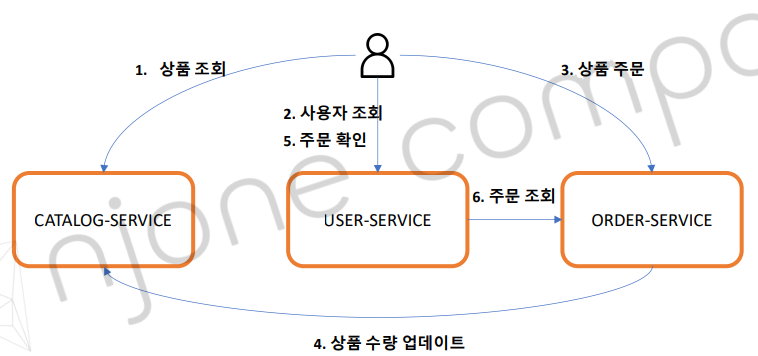
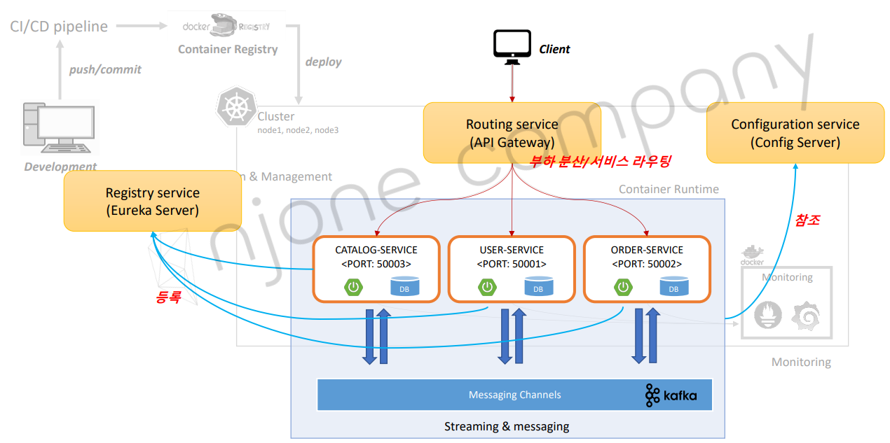
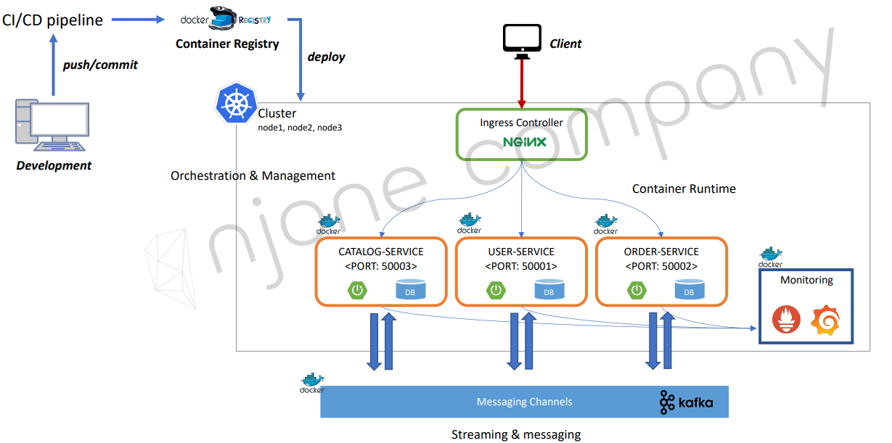

# 3 E-commerce 애플리케이션

- 애플리케이션 개요
- 애플리케이션 구성
- 애플리케이션 APIs

## 1. 애플리케이션 개요
### 개요
- 

- 

- 

## 2. 애플리케이션 구성

전체 애플리케이션 구성요소

|구성요소 |설명|
| :---- | :----|
|Git Repository |마이크로서비스 소스 관리 및 프로파일 관리|
|Config Server| Git 저장소에 등록된 프로파일 정보 및 설정 정보|
|Eureka Server| 마이크로서비스 등록 및 검색|
|API Gateway Server| 마이크로서비스 부하 분산 및 서비스 라우팅|
|Microservices| 회원 MS, 주문 MS, 상품(카테고리) MS|
|Queuing System| 마이크로서비스 간 메시지 발행 및 구독|

## 3. 애플리케이션 APIs

애플리케이션 APIs

|마이크로서비스 | RESTful API                                                                                                                            |
| :---- |:---------------------------------------------------------------------------------------------------------------------------------------|
|Catalog Service | /catalog-service/catalogs : 상품 목록 제공 (GET)                                                                                             |
|User Service | /user-service/users : 사용자 정보 등록(POST) /user-service/users : 전체 사용자 조회(get) /user-service/users/{user_id} : 사용자 정보, 주문 내역 조회(GET) |
|Order Service| /order-service/users/{user_id}/orders : 주문 등록(POST) /order-service/users/{user_id}/orders : 주문 확인(GET)                              |
