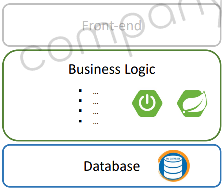
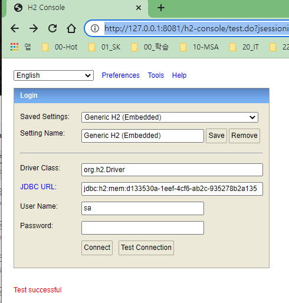
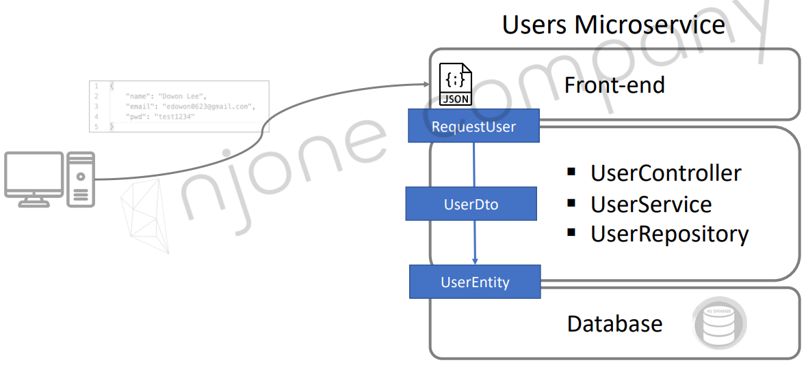
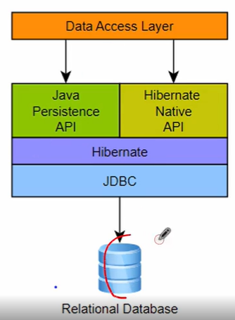
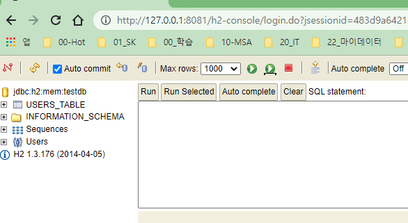
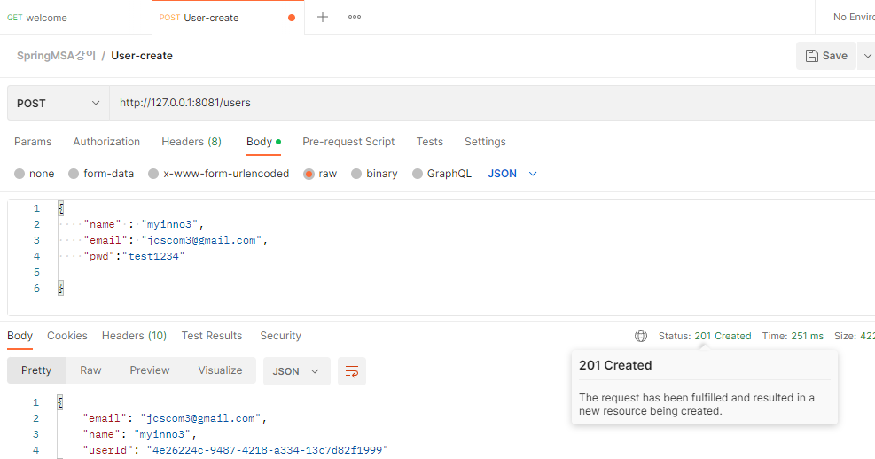

<style>
.burk {
    background-color: red;
    color: yellow;
    display:inline-block;
}
</style>

# 4. Users Microservice
1. Users Microservice 개요
2. Users Microservice - 프로젝트 생성
3. Users Microservice - DB
4. Users Microservice - 회원 가입
5. Users Microservice - Security

## 1. Users Microservice 개요
### Users Microservice
Features
- 신규 회원 등록
- 회원 로그인
- 상세 정보 확인
- 회원 정보 수정/삭제
- 상품 주문
- 주문 내역 확인
- 


APIs

| 기능              | URI (API Gateway 사용 시)| URI (API Gateway 미사용 시) | HTTP Method |
|:----------------| :---- | :---- |:-----------:|
| 사용자 정보 등록       | /user-service/users| /users|    POST     |
| 전체 사용자 조회       | /user-service/users| /users|     GET     |
| 사용자 정보, 주문내역 조회 | /user-service/users/{user_id}| /users/{user_id} |     GET     |
| 작동 상태 확인        | /user-service/users/health_check| /users/health_check |     GET     |
| 환영 메시지          | /user-service/users/welcome| /users/welcome| GET|

## 2. Users Microservice - 프로젝트 생성

Users Microservice project 프로젝트 생성 정보

Dependencies
- DevTools, Lombok, Web, Eureka Discovery Client
- Spring Boot: 2.4.2
- java: 11
- Spring cloud.version: 2020.0.0


## java-UserServiceApplication
- @EnableDiscoveryClient  추가

    ```java
    @SpringBootApplication                                        
    @EnableDiscoveryClient
    public class UserServiceApplication {
    
        public static void main(String[] args) {
            SpringApplication.run(UserServiceApplication.class, args);
        }
    
    
    }
    ```
### application.yml
- application.yml
  ```yaml
  server:
    port: 0   #Ramdom Port
  #  port: ${random.int(50000,50001)}
  
  spring:
    application:
      name: user-service
  
  eureka:
    instance:
      instance-id: ${spring.application.name}:${spring.application.instance_id:${random.value}}
  
    client:
      register-with-eureka: true
      fetch-registry: true
      service-url:
        defaultZone: http://localhost:8761/eureka
  ```

### RestController
RestController Class
- 상태 체크 à /health_check

    ```java
    @RestController
    @RequestMapping("/")
    public class UserController {
    
        @GetMapping("/health_check")
        public String status() {
            return "It's Working in User Service";
        }
    }
    ```
### 기타
1. Eureka Discovery Service 등록 여부 확인


### Configuration 정보 추가
1. application.yml 파일에 Welcome message 추가
    ```yaml
    greeting:
      message: Welcome to the Simple E-commerce.
    ```
2. 설정 정보를 사용하는 2가지 방법(application.yaml에 등록된 설정 정보 사용 방법)
   - Environment를 이용하는 방법
   - @Value 사용

      ```java
      @RestController
      @RequestMapping("/")
      public class UserController {
          private Environment env;
      
          @Autowired
          public UserController(Environment env) {
              this.env = env;
          }
      
          @GetMapping("/health_check")
          public String status() {
              return "It's Working";
          }
      
          @GetMapping("/welcome")
          public String welcome() {
              return env.getPropertity("greeting.message");  <== 여기가 설정값 가져오는 부분
          }
      }
      ```
3. @Value 사용
   - 별도 class 생성
    ```java
    @Data
    @Component
    public class Greeting {
    
        @Value("${greeting.message}")     <== 집중해서  보는 곳
        private String message;
    }
    ```

    ```java
    //사용하는 곳에서는 
    greeting.getMessage(); 
    ```
## 3. Users Microservice - DB연동
### H2 Database
1. H2 Database
   - 자바로 작성된 오픈소스 RDBMS
   - Embedded, Server-Client 가능
   - JPA 연동 가능

2. Dependency 추가
   - Project 생성 시 선택
   - https://mvnrepository.com/artifact/com.h2database/h2
   - 1.4.198이후 버전 부터는 보안 문제로 자동으로 데이터 베이스 생성하지 ㅇ낳음
      ```yaml
      <!-- https://mvnrepository.com/artifact/com.h2database/h2 -->
      <dependency>
        <groupId>com.h2database</groupId>
        <artifactId>h2</artifactId>
        <version>1.3.176</version>   // 수업의 편의상 버전 낮춤 (1.4.200)
        <scope>runtime</scope>      //test이면 실행시점 확인 불가
      </dependency>                                   
      ```
3. application.yaml에 설정 추가
   - 아래 상태를 DBEaver에서 직접 접속이 안됨 
    ```yaml
    spring:
      application:
        name: user-service
      h2:
        console:
          enabled: true
          settings:
            web-allow-others: true
          path: /h2-console
    ```
4. Database생성
   - h2 1.4.198 이후 버전부터는 보안 문제로 자동으로 데이터베이스 생성하지 않음
   - 1.4.198 이전 버전 사용
   - 데이터베이스 직접 생성
5. DB 젒혹 확인

    ```shell
    브라우저: http://127.0.0.1:8081/h2-console
    DB명은 user-service 기동시 console 확인
        2023-01-22 22:05:10.746  INFO 31864 --- [  restartedMain] o.s.b.a.h2.H2ConsoleAutoConfiguration    : H2 console available at '/h2-console'. Database available at 'jdbc:h2:mem:d133530a-1eef-4cf6-ab2c-935278b2a135'
    user
    ``` 
    - 
    - "DBEaver"에서는 확인 불가능

## 4. Users Microservice - 회원 가입

### 회원 가입
POST -> /users/

1. vo 객체 정의 및 Validation

    ```java
    @Data
    public class RequestUser {
    
        @NotNull(message = "Email cannot be null")
        @Size(min = 2, message = "Email은 2자 이상")
        @Email
        private String  email;
    
        @NotNull(message = "비밀번호 cannot be null")
        @Size(min = 8, message = "비밀번호 최소 8자 이상")
        private String  pwd;
    
        @NotNull(message = "이름 cannot be null")
        @Size(min = 2, message = "이름은 2자 이상")
        private String  name;
    }
    ```

2. 관련 Controller Method 추가
    ```java
        @PostMapping("/users")
        public String createUser(@RequestBody RequestUser users) {
            return "Create User method is called";
        }
    ```

3. 처리 흐름
   - 

4. ModelMapper
   - dependency
      ```yaml
      <dependency>
          <groupId>org.modelmapper</groupId>
          <artifactId>modelmapper</artifactId>
          <version>2.3.8</version>
      </dependency>
      ```
   - Vo --> Entity 객체로 변환

      ```java
      ModelMapper mapper = new ModelMapper();
      mapper.getConfiguration().setMatchingStrategy(MatchingStrategies.STRICT);
      UserEntity userEntity = mapper.map(userDto, UserEntity.class);
      
      userRepository.save(userEntity);
      
      UserDto returnUserDto = mapper.map(userEntity, UserDto.class);
      ```

5. UserController class
    ```java
        @PostMapping("/users")
        public ResponseEntity createUser(@RequestBody RequestUser user) {
            ModelMapper mapper = new ModelMapper();
            mapper.getConfiguration().setMatchingStrategy(MatchingStrategies.STRICT);
    
            UserDto userDto = mapper.map(user, UserDto.class);
            userService.createUser(userDto);
    
    //        return "Create User";
    //        return new ResponseEntity(HttpStatus.CREATED);
            ResponseUser responseUser = mapper.map(userDto, ResponseUser.class);
            return ResponseEntity.status(HttpStatus.CREATED).body(responseUser);
        }
    ```

6. JPA 설정

   - dependency 추가
   - 

      ```xml
      <!-- JPA 설정 추가-->
      <dependency>
          <groupId>org.springframework.boot</groupId>
          <artifactId>spring-boot-starter-data-jpa</artifactId>
      </dependency>
      ```

7. UserEntity, UserRepository
   - 테이블과 1:1

      ```java
      @Data
      @Entity
      @Table(name = "users")
      public class UserEntity {
          @Id
          @GeneratedValue
          private Long id;
      
          @Column(nullable = false, length = 50, unique = true)
          private String email;
      
          @Column(nullable = false, length = 50)
          private String name;
          @Column(nullable = false, unique = true)
          private String userId;
          @Column(nullable = false, unique = false)
          private String encryptedPwd;
      
      }
      ```
   - CrudRepository에 기본 CRUD는 포함되어 있음    
      ```java
      public interface UserRepository extends CrudRepository<UserEntity, Long> {
      //          UserEntity findByUserId(String userId);
      //          UserEntity findByEmail(String username);
      }
      ```

7. UserServiceImpl 비지니스 로직 추가
   - Mapper
      ```shell
      <!--ModelMapper-->
      <dependency>
          <groupId>org.modelmapper</groupId>
          <artifactId>modelmapper</artifactId>
          <version>2.3.8</version>
      </dependency>
      ```


    ```java
        public String createUser(UserDto userDto) {
            userDto.setUserId(UUID.randomUUID().toString());
            userDto.setEncryptedPwd("임시");
    
            ModelMapper mapper = new ModelMapper();
            mapper.getConfiguration().setMatchingStrategy(MatchingStrategies.STRICT);
            UserEntity userEntity = mapper.map(userDto, UserEntity.class);   //userDTO객체를  UserENtity format으로 변경
            userEntity.setEncryptedPwd("임시설정");
            userRepository.save(userEntity);
    
            return "OK"
        }
    
    ```
8. Controller 객체 수정
   - RequestUser --> UserDto 

     ```java
          @PostMapping("/users")
          public ResponseEntity createUser(@RequestBody RequestUser user) {
              ModelMapper mapper = new ModelMapper();
      
              UserDto userDto = mapper.map(user, UserDto.class);
              userService.createUser(userDto);
      
              return "Create User";
          }
     ```

### H2  console에 테이블이 보이지 않네요

1. application.yaml 수정
   - datasource 추가

    ```yaml
    spring:
      application:
        name: user-service
      h2:
        console:
          enabled: true
          settings:
            web-allow-others: true
          path: /h2-console
      datasource:
        driver-class-name: org.h2.Driver
        url: jdbc:h2:mem:testdb
    #    username: sa
    #    password: 1234
    
    ```
2. console 접속하여 확인
   -  
3. 실수한 부분
   - yaml 파일에서 "datasource"는 h2 하위 아님
   - 테이블 명 "users-table" --> "users_table"
   - "DBEaver"에서는 아직 접속 못하고 있음


### 응답코드 201
- 200 OK: 성공적으로 처리했을 때 쓰인다. 가장 일반적으로 볼 수 있는 HTTP 상태
- 201 Created: 요청이 성공적으로 처리되어서 리소스가 만들어졌음을 의미한다.

정상 생성시 201로 변경하기 위한 코드 수정 내용
        
1. UserController의 Return 부분                                      
    ```java
    //return "Create User";   ==> 200응답
    return new ResponseEntity(HttpStatus.CREATED);
    ```
2. 처리결과 (응답 = 201)
   -  

3. 응답코드에 처리결과도 포함
                             
    ```java
    //return "Create User";   ==> 200응답
    //return new ResponseEntity(HttpStatus.CREATED);
    return ResponseEntity.status(HttpStatus.CREATED).body(responseUser);
    ```

## 5. Users Microservice - Security
회원정보 암호화 하여 저장


Spring Security
- Authentication(인증) + Authorization(인가)

1. Step 1: 애플리케이션에 spring security jar을 Dependency에 추가
2. Step 2: WebSecurityConfigurerAdapter를 상속받는 Security Configuration 클래스 생성
3. Step 3: Security Configuration 클래스에 @EnableWebSecurity 추가
4. Step 4: Authentication à configure(AuthenticationManagerBuilder auth) 메서드를 재정의
5. Step 5: Password encode를 위한 BCryptPasswordEncoder 빈 정의
6. Step 6: Authorization à configure(HttpSecurity http) 메서드를 재정의

### 프로그램 수정

1. Dependency 추가

    ```yaml
    <!--Spring Security-->
    <dependency>
        <groupId>org.springframework.boot</groupId>
        <artifactId>spring-boot-starter-security</artifactId>
    </dependency>
    ```
 
2. 클래스 생성 (WebSecurity)
    ```java
    @Configuration   //기동시 생성됨
    @EnableWebSecurity
    public class WebSecurity extends WebSecurityConfigurerAdapter {
        //*
         * 권한 작업용 : 인증이 통과이후 할 수 있는 작업 정의
         */
        @Override
        protected void configure(HttpSecurity http) throws Exception {
            http.csrf().disable();
            http.authorizeRequests().antMatchers("/users/**").permitAll();     // "/users/**"는 모든 사용자에게 권한 부여
            http.headers().frameOptions().disable();
        }
    
    
    }
    ```   
   - "frameOptions()"을 제거하고 h2- console을 기동해 보자
   - !! http.header().frameOptions().disable()    추가하지 않으면, h2-console 접근 안됨
3. 비밀번호 처리 방법
   - BCryptPasswordEncoder
     - Password를 해싱하기 위해 Bcrypt 알고리즘 사용
     - 랜덤 Salt를 부여하여 여러번 Hash를 적용한 암호화 방식
   - UserServiceImpl.java

      ```java
      public UserDto createUser(UserDto userDto){
          userDto.setUserId(UUID.randomUUID().toString());
          userDto.setEncryptedPwd(passwordEncoder.encode(userDto.getPwd()));
          ...
      }
      ```
4. UserServiceApplication에 bean을 등록한 이유
   - UserServiceImpl의 생성자에   BCryptPasswordEncoder 사용 불가
   - 해당 클래스 생성이전에 Bean으로 등록하기 위하여 여기에 등록

      ```java
      @SpringBootApplication                                    
      @EnableDiscoveryClient
      public class UserServiceApplication {
      
          public static void main(String[] args) {
              SpringApplication.run(UserServiceApplication.class, args);
          }
      
          @Bean
          public BCryptPasswordEncoder passwordEncoder() {
              return new BCryptPasswordEncoder();
          }
      
      }
      ```
   - 동일한 Password값도 다르게 DB에 등록됨

                                            
## 6.  조회
- 다음 Section에서 조회 기능도 여기에 작성함
- Eureka와 연동 추가


### gateway연동
1. Gateway을 통합 접속 확인 
   - user-service의 port번호는 '0'으로 설정하고
   - apigateway의 설정 변경

       ```yaml
             routes:
               - id: user-service
                 url: lb://USER-SERVICE    
                 prefer-ip-address: true
                 predicates:
                   - Path=/user-service/**
       ```
   - prefer-ip-address:  없으면 USER-SERVICE을 찾지 못함  

2. user-service 수정
    ```yaml
    eureka:
      instance:
    #    hostname: localhost
        instance-id: ${spring.application.name}:${spring.application.instance_id:${random.value}}
        prefer-ip-address: true
    ```
3. 포트 확인을 위한 일부 프로그램 수정
    ```java
        @GetMapping("/health_check")
        public String status() {
            return String.format("It's Working in User Service in on port %s", env.getProperty("local.server.port"));
        }
    ```
4. 테스트
    ```shell
    http://127.0.0.1:12988/user-service/heath_check
    
    http://localhost:8000/user-service/welcomoe
    ```