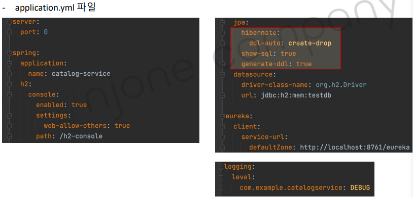
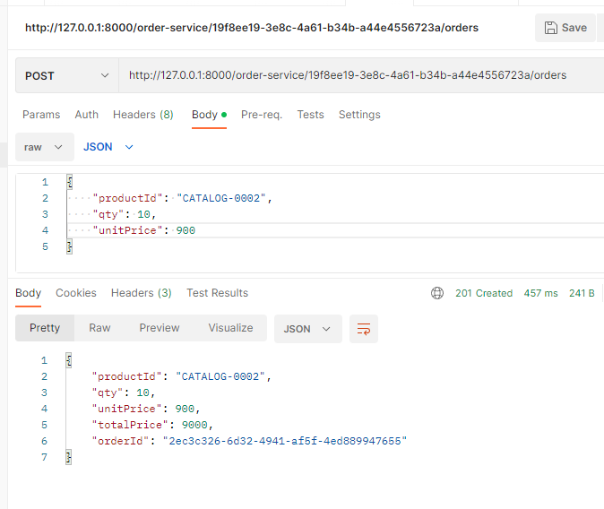

<style>
.burk {
    background-color: red;
    color: yellow;
    display:inline-block;
}
</style>

# 5. Catalogs, Orders Microservice
1. Catalogs Microservice 프로젝트 생성
2. Orders Microservice 프로젝트 생성

## 1. Catalogs Microservice 프로젝트 생성
Catalogs Microservice 추가
- 회원 로그인
- 회원 정보 수정/삭제
- 상품 주문

APIs

|기능 |마이크로서비스 |URI (API Gateway 사용 시) | HTTP Method |
| :----: | :---- | :---- |:------|
|상품 목록 조회| Catalogs Microservice| /catalog-service/catalogs |GET|
|사용자 별 상품 주문| Orders Microservice| /order-service/{user_id}/orders| POST|
|사용자 별 주문 내역 조회| Orders Microservice| /order-service/{user_id}/orders| GET|

### 프로젝트 생성
- Spring Boot: 2.4.2
- dependenceies
  -  Spring Boot DevTools
  - Lombok
  - Spring Web
  - Spring Data JPA
  - Wureka Discovery Client
  - h2
  - modelmapper

### application.yaml
- 
  - jpa 관련 
  - logging
  -  ddl-auto: create-drop  :  미리 데이터 추가하기 위하여

    ```yaml
    server:
      port: 8082     # 임시(최종 시점에 0으로 변경
    
    spring:
      application:
        name: catalog-service
      h2:
        console:
          enabled: true
          settings:
            web-allow-others: true
          path: /h2-console
      jpa:
        hibernate:
          ddl-auto: create-drop
        show-sql: true
        generate-ddl: true
      datasource:
        driver-class-name: org.h2.Driver
        url: jdbc:h2:mem:testdb
    #    username: sa
    #    password: 1234
    
    eureka:
      instance:
        instance-id: ${spring.application.name}:${spring.application.instance_id:${random.value}}
        prefer-ip-address: true
      client:
        register-with-eureka: true
        fetch-registry: true
        service-url:
          defaultZone: http://127.0.0.1:8761/eureka
    
    #여기서 처음 언급됨
    logging:
      level:
        com.example.catalogservice: DEBUG
    ```

### data.sql
Spring JDBC에는 DataSource 초기화 기능이 있습니다. 
- Spring Boot는 기본적으로 이를 활성화하고 표준 위치인 schema.sql 및 data.sql(클래스 경로의 루트에 있음)에서 SQL을 로드합니다. 
- 또한 Spring Boot는 schema-${platform}.sql 및 data-${platform}.sql 파일(있는 경우)을 로드합니다.

- data.sql
  ```shell
    insert into catalog(product_id, product_name, stock, unit_price)
    values('CATALOG-0001', 'Berlin', 100, 1500);
    insert into catalog(product_id, product_name, stock, unit_price)
    values('CATALOG-0002', 'Tokyo', 100, 900);
    insert into catalog(product_id, product_name, stock, unit_price)
    values('CATALOG-0003', 'Stockholm', 100, 1200);
  ```  
  
### etc 소스

1. CatalogEntity.java
2. CatalogRepository.java
3. CatalogDto.java
4. ResponseCatalog.java
5. CatalogService,  CatalogServiceImpl.java
6. CatalogController

### APIGateway 등록

```yaml
routes:
  - id: user-service
    uri: lb://USER-SERVICE
    predicates:
      - Path=/user-service/**
  - id: catalog-service
    uri: lb://CATALOG-SERVICE
    predicates:
      - Path=/catalog-service/**
```
## 2. Orders Microservice 프로젝트 생성

APIs

|기능| 마이크로서비스| URI (API Gateway 사용 시)| HTTP Method|
| :---- : | :---- | :---- | :---- |
|상품 목록 조회| Catalogs Microservice| /catalog-service/catalogs| GET|
|사용자 별 상품 주문| Orders Microservice| /order-service/{user_id}/orders| POST|
|사용자 별 주문 내역 조회| Orders Microservice| /order-service/{user_id}/orders| GET|


### 프로젝트 생성
                   
- Spring Boot: 2.4.2
- Dependencies 추가
  -  Spring Boot DevTools
  - Lombok
  - Spring Web
  - Spring Data JPA
  - Eureka Discovery Client
  - h2
  - modelmapper


1. application.yml 파일

    ```yaml
    server:
      port: 0
    
    spring:
      application:
        name: order-service
      h2:
        console:
          enabled: true
          settings:
            web-allow-others: true
          path: /h2-console
      jpa:
        hibernate:
          ddl-auto: update
      datasource:
        driver-class-name: org.h2.Driver
        url: jdbc:h2:mem:testdb
    #    username: sa
    #    password:
    
    eureka:
      instance:
        instance-id: ${spring.application.name}:${spring.application.instance_id:${random.value}}
      client:
        register-with-eureka: true
        fetch-registry: true
        service-url:
          defaultZone: http://127.0.0.1:8761/eureka
    
    logging:
      level:
        com.example.orderservice: DEBUG
    
    management:
      endpoints:
        web:
          exposure:
            include: health, httptrace, info, metrics, prometheus
    
    ```

2. OrderEntity.java, OrderRepository.java

    ```java
    @Data
    @Entity
    @Table(name="orders_table")
    public class OrderEntity implements Serializable {
        @Id
        @GeneratedValue(strategy = GenerationType.IDENTITY)
        private Long id;
    
        @Column(nullable = false, length = 120, unique = true)
        private String productId;
        @Column(nullable = false)
        private Integer qty;
        @Column(nullable = false)
        private Integer unitPrice;
        @Column(nullable = false)
        private Integer totalPrice;
    
        @Column(nullable = false)
        private String userId;
        @Column(nullable = false, unique = true)
        private String orderId;
    
        @Column(nullable = false, updatable = false, insertable = false)
        @ColumnDefault(value = "CURRENT_TIMESTAMP")
        private Date createdAt;
    }
    ```
    ```java
    public interface OrderRepository extends CrudRepository<OrderEntity, Long> {
        OrderEntity findByOrderId(String orderId);
        Iterable<OrderEntity> findByUserId(String userId);
    }
    ```

3. OrderDto.java, ResponseOrder.java


    ```java
    @Data
    public class OrderDto implements Serializable {
        private String productId;
        private Integer qty;
        private Integer unitPrice;
        private Integer totalPrice;
    
        private String orderId;
        private String userId;
    }
    ```
    ```java
    @Data
    public class RequestOrder {
        private String productId;
        private Integer qty;
        private Integer unitPrice;
    }
    ```

4. OrderService.java, OrderServiceImpl.java

5. OrderController.java
    
    ```java
    @PostMapping("/{userId}/orders")
    public ResponseEntity<ResponseOrder> createOrder(@PathVariable("userId") String userId,
                                                     @RequestBody RequestOrder orderDetails) {
    
    }
    ```
6. API Gatewway Service에 Service 등록
    
    ```yaml
    routes:
      - id: user-service
        uri: lb://USER-SERVICE
        predicates:
          - Path=/user-service/**
      - id: catalog-service
        uri: lb://CATALOG-SERVICE
        predicates:
          - Path=/catalog-service/**
      - id: order-service
        uri: lb://ORDER-SERVICE
        predicates:
          - Path=/order-service/**
    ```
7. 테스트
=======
4. OrderService


```java

```

5. 테스트
>>>>>>> origin/main
   -  
   - 상품 주문
     - POST : http://127.0.0.1:8000/order-service/{user_id}/orders

<<<<<<< HEAD
=======


Orders Microservice 추가
§ 프로젝트 생성

Orders Microservice 추가
§ OrderEntity.java, OrderRepository.java
Orders Microservice 추가
§ OrderDto.java, ResponseOrder.java
Orders Microservice 추가
§ OrderService.java, OrderServiceImpl.java
Orders Microservice 추가
§ OrderController.java
Orders Microservice 추가
§ OrderController.java
Orders Microservice 추가
§ API Gatewway Service에 Service 등록
§ Test
Orders Microservice 추가
§ Test

Orders Microservice 추가
§ Test
• 상품 주문 조회
- GET à http://127.0.0.1:8000/order-service/{user_id}/orders
```
>>>>>>> origin/main
