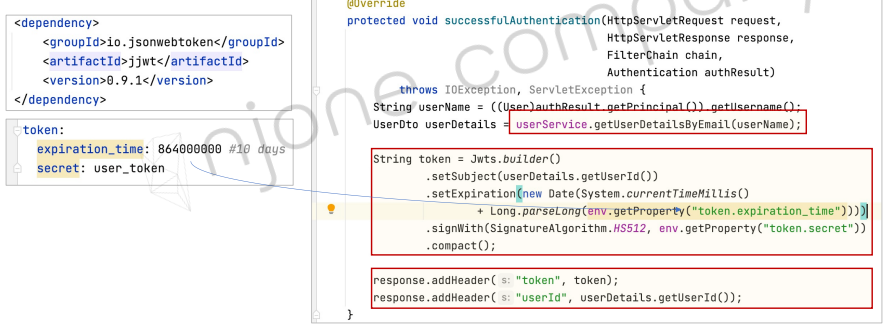

<style>
.burk {
    background-color: red;
    color: yellow;
    display:inline-block;
}
</style>

# 6. JWT

- Users Microservice – Login
- JWT (Json Web Token)
- API Gateway service – AuthorizationHeaderFilter

## 1. Login
회원 로그인

- 

### 서비스 수정

1. RequestLogin.java
   - 사용자 로그인 정보를 저장하기 위한 RequestLogin Model 클래스 추가

         ```java
         @Data
         public class RequestLogin {
            @NotNull(message = "Email cannot be null")
            @Size(min = 2, message = "Email not be less than two characters")
            @Email
            private String email;
            
            @NotNull(message = "Password cannot be null")
            @Size(min = 8, message = "Password must be equals or grater than 8 characters")
            private String password;
         }
         ```
2. AuthenticationFilter.java  (인증 처리용)
   - Spring Security를 이용한 로그인 요청 발생 시 작업을 처리해 주는 Custom Filter 클래스
   - UsernamePasswordAuthenticationFilter 상속
     - 참고: https://docs.spring.io/spring-security/site/docs/current/api/org/springframework/security/web/authentication/UsernamePasswordAuthenticationFilter.html
     - attemptAuthentication(), successfulAuthentication() 함수 구현


      ```java
      public class AuthenticationFilter extends UsernamePasswordAuthenticationFilter {
          @Override
          public Authentication attemptAuthentication(HttpServletRequest request,
                                                      HttpServletResponse response) throws AuthenticationException {
              try {
                  RequestLogin creds = new ObjectMapper().readValue(request.getInputStream(), RequestLogin.class);
      
                  return getAuthenticationManager().authenticate(
                          new UsernamePasswordAuthenticationToken(
                                  creds.getEmail(),
                                  creds.getPassword(),
                                  new ArrayList<>()
                          )
                  );
              } catch (IOException e) {
                  throw new RuntimeException(e);
              }
          }
      
          @Override
          protected void successfulAuthentication(HttpServletRequest request,
                                                  HttpServletResponse response,
                                                  FilterChain chain,
                                                  Authentication authResult) throws IOException, ServletException {
              String userName = ((User) authResult.getPrincipal()).getUsername();
              UserDto userDetails = userService.getUserDetailsByEmail(userName);
              String token = Jwts.builder()
                      .setSubject(userDetails.getUserId())
                      .setExpiration(new Date(System.currentTimeMillis() +
                              Long.parseLong(env.getProperty("token.expiration_time"))))
                      .signWith(SignatureAlgorithm.HS512, env.getProperty("token.secret"))
                      .compact();
      
              response.addHeader("token", token);
              response.addHeader("userId", userDetails.getUserId());
          }
      }
      ```
3. WebSecurity.java  (권한 : 인증이후)
   - 사용자 요청에 대해 AuthenticationFilter를 거치도록 수정

```java
    @Override
    protected void configure(HttpSecurity http) throws Exception {
        log.info("WebSecurity.configure()");
        http.csrf().disable();
        http.authorizeRequests().antMatchers("/users/**").permitAll();     // "/users/**"는 모든 사용자에게 권한 부여
        // 이 부분이 없으면 h2-conolse과 같이 frame기반은 서비스 되지 않음
        http.authorizeRequests().antMatchers("/**")
//                .hasIpAddress("127.0.0.1") // <- IP 변경  (직접은 되는데, Eureka를 경유하면 오류)
//                .hasIpAddress("10.200.0.1") // <- IP 변경
//                .hasIpAddress("skcc22n00521.skcc.net") // <- IP 변경
                .hasIpAddress("10.250.141.157") // <- IP 변경

//                .hasIpAddress(env.getProperty("gateway.ip")) // <- IP 변경
                .and()
                .addFilter(getAuthenticationFilter());

        http.headers().frameOptions().disable();
    }
```

### 테스트

1. 접속 IP
   - Eureka에서 gateway의 IP 확인 (http://skcc22n00521.skcc.net)
   - 해당 IP에 접근 권한 부여
   - WebSecurity.java


    ```java
    @Override
    protected void configure(HttpSecurity http) throws Exception {
        http.csrf().disable();
        http.authorizeRequests().antMatchers("/users/**").permitAll();     // "/users/**"는 모든 사용자에게 권한 부여
        // 이 부분이 없으면 h2-conolse과 같이 frame기반은 서비스 되지 않음
        http.authorizeRequests().antMatchers("/**")
    //                .hasIpAddress("127.0.0.1") // <- IP 변경  (직접은 되는데, Eureka를 경유하면 오류)
    //                .hasIpAddress("10.200.0.1") // <- IP 변경
                .hasIpAddress("skcc22n00521.skcc.net") // <- IP 변경
    //                .hasIpAddress(env.getProperty("gateway.ip")) // <- IP 변경
                .and()
                .addFilter(getAuthenticationFilter());
    
        http.headers().frameOptions().disable();
    }
    ```
2. 접속 테스트

    ```shell
    http://10.250.141.157:14463/user-service/welcome  ==> 성공
    http://127.0.0.1:14463/user-service/welcome  ==> 실폐
    ```
- 권한이 '/users/**'이므로 "/user-service"는 제거 되어야 함
- UserController.java에서 "@RequestMapping("/")" 으로 변경
- 사용자 등록
  - http://10.250.141.157:8000/user-service/users
- 

## 2. JWT (Json Web Token)

### Users Microservice 기능 추가 – Login
- 
  - 프로그램 처릴 Flow

AuthenticationFilter.java의 successfulAuthentication() 수정
- 인증 성공 시 사용자에게 Token 발생
- Authentication authResult에서 loginName가져오기
  - ((User))authResult.getPrincipal()).getUsername()


WebSecurity.java의 configure() 수정
- User Service 사용할 수 있도록 메소드 수정
- AuthenticationFilter()의 생성자 변경에 따른 수정


### getUserDetailsByEmail 메소드 관련

- 해당 메소드느느 UserDetailService에 구현된 메소드
  - Spring Security에서 제공

UserService.java, UserServiceImpl.java, UserRepository.java
- 사용자 인증을 위한 검색 메소드 추가
- 


### 토큰 생성을 위하여

dependency 추가
- io.jsonwebtoken
- jjwt
- 0.9.1
- 


테스트
1. 사용자 생성
   - http://[Gateway IP]:8000/user-service/users : 회원가입 
2. 로그인
   -  http://[Gateway IP]:8000/user-service/login : 로그인
3. 

## 3. API Gateway service – AuthorizationHeaderFilter

### 전통적인 인증 시스템

- 
- 문제점
  - 세션과 쿠키는 모바일 애플리케이션에서 유효하게 사용할 수 없음 (공유 불가)
  - 렌더링된 HTMl 페이지가 반환되지만, 모바일 애플리케이션에서는 JSON(or XML)과 같은 포멧 필요


Token 기반 인증 시스템
- 

### JWT (JSON Web Token)
- https://jwt.io/
- 인증 헤더 내에서 사용되는 토큰 포맷
- 두 개의 시스템끼리 안전한 방법으로 통신 가능

JWT (JSON Web Token) 장점
- 클라이언트 독립적인 서비스 (stateless)
- CDN (Content Delivery Metwork)
- No Cookie-Session (No CSRF, 사이트간 요청 위조)
- 지속적인 토큰 저장


API Gateway service에 Spring Security와 JWT Token 사용 추가
- AuthorizationHeaderFilter.java 추가
- Token 검사
- 인증정보 
- parse로 검증( 생성은 build)

AuthorizationHeaderFilter.java

§ AuthorizationHeaderFilter.java


application.yml
- 


### 테스트

Test
- Authorization Type : “No Auth” or “Inherit auth from parent” 
- Test: Authorization Type : “No Auth” or “Inherit auth from parent”


Test: Authorization Type à “Bearer Token”
- Bearer Authentication:
  • API에 접속하기 위해서는 access token을 API 서버에 제출해서 인증 처리.
  • OAuth를 위해서 고안된 방법, RFC 6750

- 
- token 값은 어디에 입력
  - 