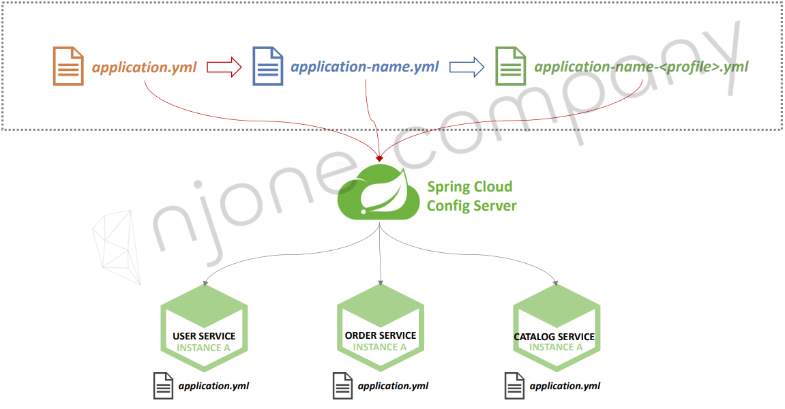

<style>
.burk {
    background-color: red;
    color: yellow;
    display:inline-block;
}
</style>

# 7 ConfigServer

1. Spring Cloud Config
2. Local Git Repository
3. Microservice에 적용
4. Spring Boot Actuator
5. Profiles 적용
6. Remote Git Repository
7. Native File Repository

## 1. Spring Cloud Config

Spring Cloud Config
- 분산 시스템에서 서버, 클라이언트 구성에 필요한 설정 정보(application.yml)를 외부 시스템에서 관리
- 하나의 중앙화 된 저장소에서 구성요소 관리 가능
- 각 서비스를 다시 빌드하지 않고, 바로 적응 가능
- 애플리케이션 배포 파이프라인을 통해 DEV–UAT–PROD 환경에 맞는 구성 정보 사용

## 2. Local Git Repository

'Git'에 "ecommerce.yml" 파일 등록
- d:\APP\@inflearn\inflearn-2022-SpringCloudMSA\git-local-repo\
- "ecommerce.yml" 생성
    ```yaml
    server:
      port: 8012
    
    spring:
      application:
        name: config-service
      cloud:
        config:
          server:
            git:
              uri: file:///D:/APP/@inflearn/inflearn-2022-SpringCloudMSA/git-local-repo
    ``` 
- token 관련하여 다른 yml파일의 정보는 삭제
  - apigateway-service
  - user-service
- git local Repository 등록  (아직 push는 하지 않음)
    ```shell
    git init
    git add   ecommerce.yml
    git commit -m "초기등록"
    ```

## 3. Microservice에 적용

### 프로젝트 생성(Spring cloud config Project)
1. Dependencies 추가
   - config-server

2. ConfigServiceApplication.java 파일 수정
   - **@EnableConfigServer**  지정

       ```java
       @SpringBootApplication
       @EnableConfigServer
       public class ConfigServiceApplication {
    
           public static void main(String[] args) {
               SpringApplication.run(ConfigServiceApplication.class, args);
           }
       }
       ```
3. application.yml

    ```shell
    server:
      port: 8888
    
    spring:
      application:
        name: config-service
      cloud:
        config:
          server:
            git:
              uri: file:///D:/APP/@inflearn/inflearn-2022-SpringCloudMSA/git-local-repo
    ``` 
4. 우선 순위
   - 
   1. 각각의 마이크로 서비스의 application.yaml
   2. 공통 Repository의 순서
      - application.yml
      - application-name.yml
      - application-name-<profile>.yml

5. 테스트
   - config 서버 기동
   - http://127.0.0.1:8888/ecommerce/default   (해당 디렉토리의 yaml 파일이 보여짐)
     - ecommerce: yaml 파일명
     - default: 프로파일을 명시하지 않은 경우
     - http://10.200.0.1:8012/ecommerce/dev  (ecommerce-dev.yaml)
   - 

### Users Microservice
1. Dependencies 추가 (config 서버를 사용하려면
   - spring-cloud-starter-config
   - spring-cloud-starter-bootstrap
   - or) spring.cloud.bootstrap.enabled=true   ==> application yaml에 설정

2. bootstrap.yml 추가
   - 최 우선  적용
      ```yaml
      spring.cloud.config:
        uri: http://127.0.0.1:8012     <== 이전에 8888을 8012로 변경
        name: ecommerce
      ```
3. UserController.java 수정

   ```java
    @GetMapping("/health_check")
    public String status() {
        return String.format("It's Working in User Service in on port "
                            + ", port(local.server.port)= " + env.getProperty("local.server.port")
                            + ", port(server.port)= " + env.getProperty("server.port")
                            + ", with token secret= " + env.getProperty("token.secret")
                            + ", with token time= " + env.getProperty("token.expiration_time")
        );
    }
   ```

4. 변경한 내용
   - user-service의 application.yml에서 token 관련 정보 주석 처리
   - 

## 4. Spring Boot Actuator
### Changed configuration values
1. Config 변견 적용 방법(3가지)
   1. 서버 재기동
   2. Actuator refresh
      - Spring Boot Actuator
         - Application 상태, 모니터링
         - Metric 수집을 위한 Http End point 제공
   3. Spring cloud bus 사용

Actuator을 통하여 적용하기

1. pom.xml (dependency 추가)
   ```yaml
   <dependency>
      <groupId>org.springframework.boot</groupId>
      <artifactId>spring-boot-starter-actuator</artifactId>
   </dependency>
   ```
2. WebSecurity.java 수정

   ```java
   http.authorizeRequests().antMatchers("/actuator/**").permitAll();
   ```
3. application.yaml 수정 (추가)

   ```yaml
      management:
        endpoints:
          web:
            exposure:
              include: refresh, health, beans
   ``` 
  
4. 테스트
  - properties 값 수정 후 반영 (commit)
  - http://[service ip]/actuator/refresh
  - 번거로운 작업으로 인해 Spring Cloud Bus를 사용

  - http://127.0.0.1:???/actuator/refresh
    - 
    - "post"메소드 주의   
    - ecommerce.yml 내용 수정
    - /actuator/refresh
    - http://127.0.0.1:8000/user-service/health_check  <-- 변경된 값 확인

### AppGateway ==> Config 사용하도록 수정
                        
1. Dependencies 수정
   - spring-cloud-starter-config
   - spring-cloud-starter-bootstrap
   - spring-boot-starter-actuator

2. bootstrap.yml 추가
    ```yaml
    spring.cloud.config:
      uri: http://127.0.0.1:8012
      name: ecommerce
    ```
3. application.yml

    ```shell
    management:
      endpoints:
        web:
          exposure:
            include: refresh, health, beans, httptrace
    ```
4. ApigatewayServiceApplication.java
   - httptrace을 사용하기 위하여 추가 
    ```java
        //application.yaml의 endpoint 등록 관련 추가
        @Bean
        public HttpTraceRepository httpTraceRepository() {
            return new InMemoryHttpTraceRepository();
        }
    ```
5. application.yml
   - USER-SERVICE의 Actuator 정보 추가  (routing 정보 추가)

    ```shell
    #      actuator관련  
            - id: user-service
              uri: lb://USER-SERVICE
              predicates:
                - Path=/user-service/actuator/**
                - Method=GET,POST
              filters:
                - RemoveRequestHeader=Cookie
                - RewritePath=/user-service/(?<segment>.*), /$\{segment}
    ```
6. 테스트

    ```shell
    GET http://10.200.0.1:8000/user-service/actuator/health
    result : {"status":"UP"}
    나머지:  
    http://10.200.0.1:8000/user-service/actuator/beans
    
    http://10.200.0.1:8000/actuator/httptrace
    http://10.200.0.1:8000/actuator/beans
    http://10.200.0.1:8000/actuator/health 
    ```
## 5. Profiles 적용
### Multiple environments
- ecommerce-dev.yml
- ecommerce-uat.yml
- ecommerce-prod.yml

1. ecommerce.yml 파일 3개로 분리

    ```shell
    token:
      expiration_time: 90000000
      secret: user_token_dev
    gateway.ip: 10.200.0.1

    ```
2. bootstrap.yaml 파일 수정
   - profiles.active 정보 추가
   
    ```yaml
    spring.cloud.config:
      uri: http://127.0.0.1:8012
      name: ecommerce
    
    spring.profiles.active: dev
    ```
   테스트를 위하여 apigateway의 bootstrap파일에는 prod로 입력

3. 테스트
   - 로그인 과정에서  env.getProperty("token.secret") 값을 확인한다
   - 실수한 부분 
     - profiles.active: dev ==> spring.profiles.active: dev

## 6. Remote Git Repository

1. Git에 commit

    ```shell
    - web 접속하여 "spring-cloud-config" Repository 생성
    
    $ git remote -v   : 어디에 연결되었는지 확인
    $ git remote add origin https://github.com/myinno/spring-cloud-config.git
    $ git push --set-upstream origin master     : 처음 할떄,이후 push는 --set..부분 생략
    
    $ git add *
    $ git commit -m "test"
    ```
    -  
2. config 서버의 appplication.yml Remote로 변경

    ```yaml
    server:
      port: 8012
    
    spring:
      application:
        name: config-service
      cloud:
        config:
          server:
            git:
    #          uri: file:///D:/APP/@inflearn/inflearn-2022-SpringCloudMSA/git-local-repo
              uri: https://github.com/myinno/spring-cloud-config
    ```


3. Test
   - http://127.0.0.1:8012/ecommerce/default
   - http://127.0.0.1:8012/ecommerce/dev
 
## 7. Native File Repository
설정 정보를 Git을 사용하지 않고, 로컬 시스템 사용
- 설정 정보를 nativve로 설정하고
  -  native.search-locations  설정

```yaml
  cloud:
    config:
      server:
        git:
#          uri: file:///Users/dowonlee/Desktop/Work/git-local-repo
          uri: https://github.com/joneconsulting/spring-cloud-config
#          basedir: /Users/dowonlee/Desktop/Work/tmp/config-repo
#          username: [username]
#          password: [password]
        native:
          search-locations: file:///Users/dowonlee/Desktop/Work/native-file-repo
```

