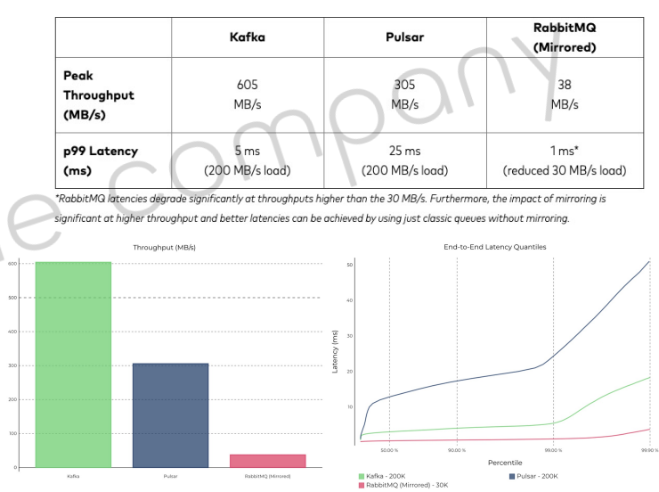
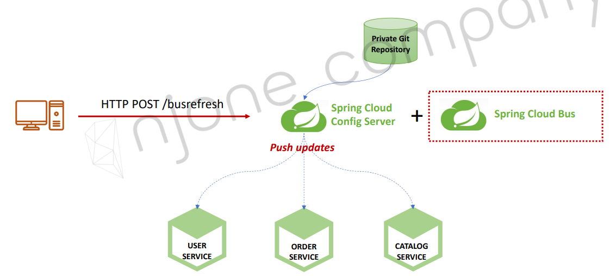

<style>
.burk {
    background-color: red;
    color: yellow;
    display:inline-block;
}
</style>

# 8 Spring Cloud Bus

1. Spring Cloud Bus
2. RabbitMQ 설치
3. 프로젝트 수정 – Actuator 추가
4. 테스트

## 1. Spring Cloud Bus
속성을 변경을 적용하기 위하여 Spring Cloud BUS 사용 가능
- 분산 시스템의 노드를 경량 메시지 브로커와 연결
- 상태 및 구성에 대한 변경 사항을 연결된 노드에게 전달(Broadcast)


AMQP (Advanced Message Queuing Protocol), 메시지 지향 미들웨어를 위한 개방형 표준 응용 계층 프로토콜
- 메시지 지향, 큐잉, 라우팅 (P2P, Publisher-Subcriber), 신뢰성, 보안
- Erlang, RabbitMQ에서 사용

Kafka 프로젝트
- Apache Software Foundation이 Scalar 언어로 개발한 오픈 소스 메시지 브로커 프로젝트
- 분산형 스트리밍 플랫폼
- 대용량의 데이터를 처리 가능한 메시징 시스템


Rabbit MQ vs. Kafka
1. RabbitMQ
   - 메시지 브로커
   - 초당 20+ 메시지를 소비자에게 전달
   - 메시지 전달 보장, 시스템 간 메시지 전달
   - 브로커, 소비자 중심
2. Kafka
   - 초당 100k+ 이상의 이벤트 처리
   - Pub/Sub, Topic에 메시지 전달
   - Ack를 기다리지 않고 전달 가능
   - 생산자 중심
3.  


### Actuator bus-refresh Endpoint
- 산 시스템의 노드를 경량 메시지 브로커와 연결
- 상태 및 구성에 대한 변경 사항을 연결된 노드에게 전달(Broadcast)
  - 


## 2. RabbitMQ 설치

Rabbit MQ 설치 – Windows 10
- Erlang 설치 (하지 않아도 됨)
  - https://www.erlang.org/downloads
  - otp_win64_25.2.1.exe
  - "c:\Program Files\Erlang OTP\bin" --> path 등록

- RabbitMQ
  - https://www.rabbitmq.com/download.html
  - choco install rabbitmq

```shell
$ choco install rabbitmq
Chocolatey v1.1.0
Installing the following packages:
rabbitmq
By installing, you accept licenses for the packages.
Progress: Downloading erlang 25.2... 100%
Progress: Downloading rabbitmq 3.11.7... 100%

```


Management Plugin 설치
- C:\Program Files\RabbitMQ Server\rabbitmq_server-3.11.7\sbin>rabbitmq-plugins.bat enable rabbitmq_management
- PC restart
- http://127.0.0.1:15672/
  - guest/guest
- RabbitMQ를 docker로 대체 검토


## 3. 프로젝트 수정 – Actuator 추가

1. Dependencies 추가
   - Config Server
     - AMQP for Spring Cloud Bus, Actuator
   - Users Microservice, Gateway Service
     - AMQP for Spring Cloud Bus

2. application.yml 수정
   - Config Server, Users Microservice, Gateway Service
     - Spring Cloud 2020.0.0에서 bus-env ==> busenv, bus-refresh ==> busrefresh
     - rabbitmq 추가,  management에 "busrefresh" 추가

          ```shell
          spring:
            application:
              name: config-service
            rabbitmq:
              host: 127.0.0.1
              port: 5672
              username: guest
              password: guest
          ...    
              
          management:
            endpoints:
              web:
                exposure:
                  include: health, busrefresh    
          ```

## 4. 테스트
1. 테스트 순서
    ```shell
    1) Start RabbitMQ Server
    2) Start Spring Cloud Config Service
    3) Start Eureka Discovery Service
    4) Start Spring Cloud Gateway Service
    5) Strat Users Microservice
    ```

2. 테스트


```shell
사용자 생성
로그인
설정 수정
http://127.0.0.1:8000/user-service/actuator/busrefresh
```

5. 1


```shell

```

6. 1


```shell

```
```shell

Spring Cloud Bus
RabbitMQ 설치
프로젝트 수정 – Actuator 추가
테스트
Section 8.
Spring Cloud Bus
§ 서버 재기동
§ Actuator refresh
§ Spring cloud bus 사용
Previous - Changed configuration values
§ 서버 재기동
§ Actuator refresh
§ Spring cloud bus 사용
§ Spring Boot Actuator
- Application 상태, 모니터링
- Metric 수집을 위한 Http End point 제공
Previous - Changed configuration values
§ 서버 재기동
§ Actuator refresh
§ Spring cloud bus 사용
§ 분산 시스템의 노드를 경량 메시지 브로커와 연결
§ 상태 및 구성에 대한 변경 사항을 연결된 노드에게 전달(Broadcast)
Push updates
Spring Cloud Bus
Spring Cloud
Config Server
USER
SERVICE
Private Git
Repository
Secure
Vault
Secure
File
Storage
CATALOG
SERVICE
ORDER
SERVICE
DEV
USER
SERVICE
CATALOG
SERVICE
ORDER
SERVICE
PROD
Spring Cloud Bus
AMQP
(Advanced Message Queuing Protocol)
+
Spring Cloud Bus
§ AMQP (Advanced Message Queuing Protocol), 메시지 지향 미들웨어를 위한 개방형 표준 응용 계층 프로토콜
- 메시지 지향, 큐잉, 라우팅 (P2P, Publisher-Subcriber), 신뢰성, 보안
- Erlang, RabbitMQ에서 사용
§ Kafka 프로젝트
- Apache Software Foundation이 Scalar 언어로 개발한 오픈 소스 메시지 브로커 프로젝트
- 분산형 스트리밍 플랫폼
- 대용량의 데이터를 처리 가능한 메시징 시스템
Spring Cloud Bus
§ vs.
- RabbitMQ
- 메시지 브로커
- 초당 20+ 메시지를 소비자에게 전달
- 메시지 전달 보장, 시스템 간 메시지 전달
- 브로커, 소비자 중심
- Kafka
- 초당 100k+ 이상의 이벤트 처리
- Pub/Sub, Topic에 메시지 전달
- Ack를 기다리지 않고 전달 가능
- 생산자 중심
https://www.confluent.io/blog/kafka-fastest-messaging-system/
Push updates
Actuator bus-refresh Endpoint
Spring Cloud
Config Server
USER
SERVICE
Private Git
Repository
CATALOG
SERVICE
ORDER
SERVICE
Spring Cloud Bus HTTP POST /busrefresh
+
§ 분산 시스템의 노드를 경량 메시지 브로커와 연결
§ 상태 및 구성에 대한 변경 사항을 연결된 노드에게 전달(Broadcast)
Rabbit MQ 설치
Rabbit MQ 설치
§ MacOS)
- $ brew update
- $ brew install rabbitmq
Rabbit MQ 설치
§ MacOS)
- $ brew update
- $ brew install rabbitmq
Rabbit MQ 설치
§ MacOS)
- $ export PATH=$PATH:/usr/local/sbin
- $ rabbitmq-server
Rabbit MQ 설치
Rabbit MQ 설치 – Windows 10
§ Erlang 설치
Rabbit MQ 설치 – Windows 10
Rabbit MQ 설치 – Windows 10
Rabbit MQ 설치 – Windows 10
§ RabbitMQ 설치
Rabbit MQ 설치 – Windows 10
Rabbit MQ 설치 – Windows 10
Rabbit MQ 설치 – Windows 10
Rabbit MQ 설치 – Windows 10
Rabbit MQ 설치 – Windows 10
§ Management Plugin 설치
Rabbit MQ 설치 – Windows 10
§ http://127.0.0.1:15672
Rabbit MQ 설치 – Windows 10
§ http://127.0.0.1:15672
Dependencies 추가
§ Config Server
- AMQP for Spring Cloud Bus, Actuator
§ Users Microservice, Gateway Service
- AMQP for Spring Cloud Bus
application.yml 수정
§ Config Server, Users Microservice, Gateway Service
Spring Cloud 2020.0.0에서 bus-env à busenv, bus-refresh à busrefresh
테스트
1) Start RabbitMQ Server
2) Start Spring Cloud Config Service
3) Start Eureka Discovery Service
4) Start Spring Cloud Gateway Service
5) Strat Users Microservice
테스트
§ Configuration values 변경
테스트
§ 이전 값 읽어 오기
테스트
§ Refresh Configuration Server
- HTTP POST http://127.0.0.1:8000/user-service/actuator/busrefresh
- Response code: 204 No Content
테스트
…
…
테스트
§ /health_check 이전 값 읽어 오기 à 401 Unauthorized
테스트
§ 다시 로그인
테스트
§ /health_check 값 다시 읽어 오기 à 200 OK
테스트
§ HTTP POST http://127.0.0.1:8000/actuator/busrefresh
§ HTTP GET http://127.0.0.1:8000/user-service/health_check
Change default RabbitMQ password
Actuator
§ Stop RabbitMQ server
§ Start RabbitMQ server again
```