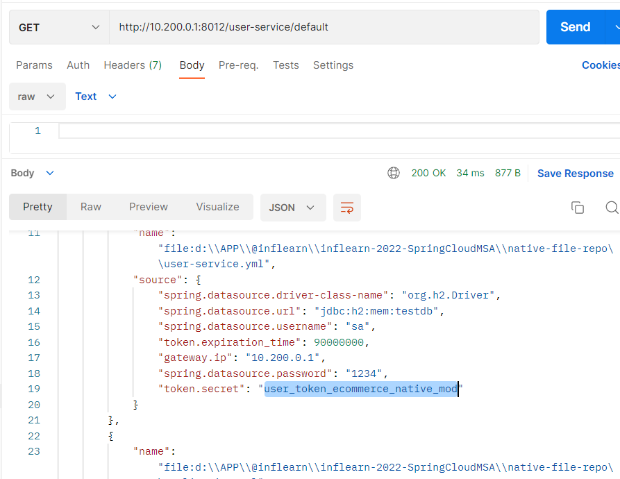

<style>
.burk {
    background-color: red;
    color: yellow;
    display:inline-block;
}
</style>

# 9. Encryption과 Decryption

- Encryption types
- JCE
- Symmetric Encryption
- Asymmetric Encryption


## 1. Encryption types

Encryption types
1. Symmetric Encryption (Shared)
   - Using the same key
2. Asymmetric Encryption (RSA Keypair)
   - Private and Public Key
   - Using Java keytool
## 2. JCE
Java Cryptography Extension (JCE)

JCE 사용 시에 다음과 같은 오류 발생할 때, 제한 없는 암호화 정책 파일로 교체
- Illegal key size or default parameters
- Unsupported keysize or algorithm parameters
  - https://www.oracle.com/java/technologies/javase-jce-all-downloads.html
  - 압축 해제 후, jre/lib/security 폴더로 복사
  - Oracle JDK
    - ${user.home}\Program Files\Java\jdk-13.0.2\conf\security

## 3. Symmetric Encryption
1. Config Server의 Dependencies 추가
   - bootstrap (이전 추가 한듯) (bootstrap.yaml이 적용되게 하기 위하여)

        ```xml
        <dependency>
           <groupId>org.springframework.cloud</groupId>
           <artifactId>spring-cloud-starter-bootstrap</artifactId>
        </dependency>
        ```
2. bootstrap.yml 파일에 key값 등록
   - 대칭키로 사용 
   
      ```yaml
      encrypt:
        key: abcdefghijklmnopqrstuvwxyz0123456789
      ```
3. 테스트                              \
   -  
     - 실행할 때마다 값이 변경
     ```shell
     - POST
     - URL: http://10.200.0.1:8012/encrypt
     - BODY:  임의 문자(myinno)   
     ```
4. Users Microservice의 application.yml, bootstrap.yml 수정 à Config Server의 user-service.yml로 이동
   - 
   - application.yaml의 H2관련 Database속성을 config로 이동
   - bootstrap.yaml 
      ```yaml
      spring:
        cloud.config:
          uri: http://10.200.0.1:8012
          name: user-service
      ```
   - user-service.yml  (d:\APP\@inflearn\inflearn-2022-SpringCloudMSA\native-file-repo\)
     - 여기에 위치하는 이유는 application.yml의 spring.cloud.server.native.search-locations  및 프로파일 확인 
     - password를 편집 '{cipher}암호문자열' 
      ```yaml
      spring:
        datasource:
          driver-class-name: org.h2.Driver
          url: jdbc:h2:mem:testdb
          username: sa
          # 1234를 암호화 해서 적용
          password: '{cipher}d9f39ceb8202865dcdb63b9a8bab5e8f687f40e2e5fe45816094f38b89d30bf5'
          
      token:
        expiration_time: 90000000
        secret: user_token_ecommerce_native_mod
      gateway.ip: 10.200.0.1
      ```                                   
     - config 서버 restart

5. Users Microservice의 H2 Database의 Password를 Encryption
   - http://10.200.0.1:8012/user-service/default  (get)
6. Spring Cloud Config Server에서 확인
   - http://10.200.0.1:8012/encrypt (post))
   - http://10.200.0.1:8012/decrypt (post))
   - 

7. Spring Cloud Config Server의 user-service.yml 변경 ->  invalid <n/a>
   - 임의 문자열 추가하여 잘못된 암호화 문자열로 수정하면 어찌 될까?
     -  변경전 --> password: '{cipher}d9f39ceb8202865dcdb63b9a8bab5e8f687f40e2e5fe45816094f38b89d30bf5'
     -  변경후 --> password: '{cipher}d9f39ceb8202865dcdb63b9a8bab5e8f687f40e2e5fe45816094f38b89d30bf5_wrong'
   - 
8. user-service을 기동하여 DB가 잘 작동되는지 확인
   -  
   - 비밀번호를 입력하지 않으면 오류


## 4. Asymmetric Encryption

1. Public, Private Key 생성 -> JDK keytool 이용
      ```shell
      $ cd /d/APP/@inflearn/inflearn-2022-SpringCloudMSA/keystore
      
      $ keytool -genkeypair -alias apiEncryptionKey -keyalg RSA \
        -dname "CN=myinno, OU=API Development, O=myinno.org, L=Seoul, C=KR" \
        -keypass "1q2w3e4r" -keystore apiEncryptionKey.jks -storepass "1q2w3e4r"
      # 강의에서는 별도 메시지가 있는데 window에서는 없네요
      $ ls
      apiEncryptionKey.jks    
   
      $ key정보 확인
      $ keytool -list -keystore apiEncryptionKey.jks -v
      
      #public 키 발취 (인증서 파일)
      $ keytool -export -alias apiEncryptionKey -keystore apiEncryptionKey.jks -rfc -file trustServer.cer
        키 저장소 비밀번호 입력:
        인증서가 <trustServer.cer> 파일에 저장되었습니다.
      ```   

      ```shell
      # 인증서 파일을 jks로 만들기
      $ keytool -import -alias trustServer -file trustServer.cer -keystore publicKey.jks
      키 저장소 비밀번호 입력:
      새 비밀번호 다시 입력:
      소유자: CN=myinno, OU=API Development, O=myinno.org, L=Seoul, C=KR
      발행자: CN=myinno, OU=API Development, O=myinno.org, L=Seoul, C=KR
      일련 번호: fa00fa5
      적합한 시작 날짜: Sun Jan 29 16:14:30 KST 2023 종료 날짜: Sat Apr 29 16:14:30 KST 2023
      인증서 지문:
               SHA1: 09:96:E9:C1:7E:83:E2:77:63:8E:08:3A:FB:C7:6F:EA:DC:84:73:D0
               SHA256: 60:E3:51:73:19:2C:EE:F7:4F:12:87:F5:45:EA:75:5E:33:E3:7A:07:0F:21:5A:40:A2:DC:89:29:2D:47:CB:E5
      서명 알고리즘 이름: SHA256withRSA
      주체 공용 키 알고리즘: 2048비트 RSA 키
      ```
      - key 비교 (같다)
     
      ```shell
      $ keytool -list -keystore apiEncryptionKey.jks
      키 저장소 비밀번호 입력:
      키 저장소 유형: PKCS12
      키 저장소 제공자: SUN
      
      키 저장소에 1개의 항목이 포함되어 있습니다.
      
      apiencryptionkey, 2023. 1. 29., PrivateKeyEntry,
      인증서 지문(SHA-256): 60:E3:51:73:19:2C:EE:F7:4F:12:87:F5:45:EA:75:5E:33:E3:7A:07:0F:21:5A:40:A2:DC:89:29:2D:47:CB:E5
      
      $ keytool -list -keystore publicKey.jks
      키 저장소 비밀번호 입력:
      키 저장소 유형: PKCS12
      키 저장소 제공자: SUN
      
      키 저장소에 1개의 항목이 포함되어 있습니다.
      
      trustserver, 2023. 1. 29., trustedCertEntry,
      인증서 지문(SHA-256): 60:E3:51:73:19:2C:EE:F7:4F:12:87:F5:45:EA:75:5E:33:E3:7A:07:0F:21:5A:40:A2:DC:89:29:2D:47:CB:E5
      ```

2. config-service\src\main\resources\bootstrap.yml
   - 수정
      ```shell
      encrypt:
      #  key: abcdefghijklmnopqrstuvwxyz0123456789
        key-store:
          location: file:///d:\APP\@inflearn\inflearn-2022-SpringCloudMSA\keystore\apiEncryptionKey.jks
          password: 1q2w3e4r
          alias: apiEncryptionKey
      ```
   - 
   - 
3. 테스트
   - ConfigServer  Restart
   - 암.복호화 테스트
   - 암호화
     - 
   - 복호화
     - 

4. H2 DB 암호도 변경
   - d:\APP\@inflearn\inflearn-2022-SpringCloudMSA\native-file-repo\user-service.yml
   - postman에서 '1234'를 암호화 해서 변경
   - 

5. token 값도 암호화로 변경
   - d:\APP\@inflearn\inflearn-2022-SpringCloudMSA\native-file-repo\user-service.yml
      ```shell
      token:
        expiration_time: 90000000
      #  secret: user_token_ecommerce_native_mod
        secret: '{cipher}AQCCysng0zOMsBxhwU9wEOx8IJGiAdr8Efk+s0oWVnbH1e3jjMS8mbCYXAbtXnzmwdGgcMQbFhRBTzsAdfixFWhiakoXEQeBPutrbp2vcalfoe39ViZdiLiRXgXY6MGGtv8qI9oxyO5FVnTdkbOHufU3JQVBJB57EY8wJ1kP+j7WOePY4i9sMPsP3wnQ7nQQ9Yv45mMlyhHtW9CbqaldrR8Ff6wNGEcpuJ2ghK2MG56xTHMi3wuz+dUiPRQO3BH6Ew+UCm9vWcfyVGKTZl5CesP0nykshJmLoJ/4RMgeIG4QUs/UZecr3KgU2VJsOB6U0NXHWk6GT0jWa6IFGKbDUZd6n8wzSOcGY1ZdvL35ooOJxkRXv4tTVw7ARd8hdLcklb/DkhqwZ+tlmRJFOPDDioi0'
      ```
   - 결과 확인
     - 
6. apiGateway 서비스 확인
   - user-service의 아무 서비스를 호출해도  apiGateway 호출됨
   - 
   - AuthorizationHeaderFilter.java

