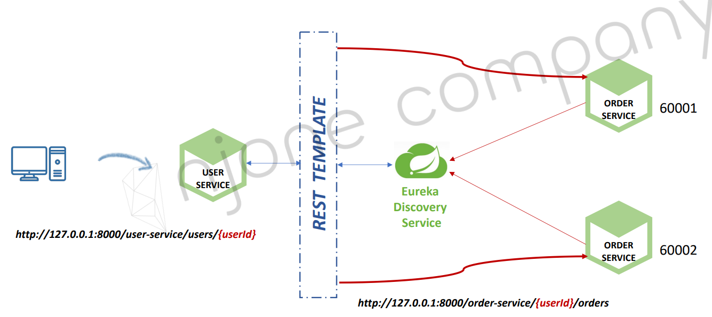

<style>
.burk {
    background-color: red;
    color: yellow;
    display:inline-block;
}
</style>

# 10. Sync Call

1. Communication types
2. RestTemplate
3. Feign Client - Log, Exception
4. ErrorDecoder
5. Multiple Orders service

## 1. Communication types

Communication types
- Synchronous HTTP communication
- Asynchronous communication over AMQP


## 2. RestTemplate
RestTemplate
- Spring Cloud 기술이 아니라, 전통적으로 사용하던 호출 방식
- java로 만들어진 web 어플이케이션간 Call하는 기술 
- 

1. Bean 생성
   - UserServiceApplication Bean 추가

    ```java
    public class UserServiceApplication {
    
        ...
        //
        @Bean
        public RestTemplate getRestTemplate() {
            return new RestTemplate();
        }
    }
    ```

2. UserController  확인
    ```java
    @GetMapping(value="/users/{userId}", produces = {MediaType.APPLICATION_JSON_VALUE})
    public ResponseEntity<ResponseUser> getUser(@PathVariable("userId") String userId) {
        UserDto userDto = userService.getUserByUserId(userId);
    
        ResponseUser returnValue = new ModelMapper().map(userDto, ResponseUser.class);
    
        return ResponseEntity.status(HttpStatus.OK).body(returnValue);
    }
    ```

3. user-service.yml
   - order-servicelURL 등록 

    ```yaml
    #RestTemplate를 위하여 추가
    order_service:
      url: http://127.0.0.1:8000/order_service/%s/orders
    ```

4. Order Service 호출

    ```java
    public class UserServiceImpl implements UserService {
    
        RestTemplate restTemplate;
        //  생성자에 restTemplate  추가 
        
        @Override
        public UserDto getUserByUserId(String userId) {
            ...
    
            //Order Service 호출
            //url: http://127.0.0.1:8000/order_service/%s/orders
            String  orderURL = String.format(env.getProperty("order_service.url"), userId);
            ResponseEntity<List<ResponseOrder>> orderListResponse = restTemplate.exchange(orderURL,
                    HttpMethod.GET, null, new ParameterizedTypeReference<List<ResponseOrder>>() {
                    });
            List<ResponseOrder> ordersList = orderListResponse.getBody();
    
            userDto.setOrders(ordersList);
    
            return userDto;
        }
    ```

5. 서비스 호출 URL 변경  [native-file-repo\user-service.yml]
   - 변경전: url: http://127.0.0.1:8000/order_service/%s/orders
   - 변경후: url: http://ORDER-SERVICE/order-service/%s/orders

6. @LoadBalanced  추가 [UserServiceApplication.java]

      ```java
      @Bean
      @LoadBalanced
      public RestTemplate getRestTemplate() {
        return new RestTemplate();
      }
      ```
7. 테스트
   - user 등록 : http://10.200.0.1:8000/user-service/users
   - 로그인    : http://10.200.0.1:8000/user-service/login 
   - 주문      : http://127.0.0.1:8000/order-service/47ecf4fa-8bf8-4bb8-88e9-cf0e3b048be1/orders
   - 주문 조회 : http://10.200.0.1:8000/user-service/users/1b0ab69e-fbd4-4c6e-a1ac-e459bb1386a5

## 3. Feign Client - Log, Exception

### Feign Web Service Client
FeignClient -> HTTP Client
- REST Call을 추상화 한 Spring Cloud Netflix 라이브러리

사용방법
- 호출하려는 HTTP Endpoint에 대한 Interface를 생성
- @FeignClient 선언

Load balanced 지원

### Feign Client 적용

1. Spring Cloud Netflix 라이브러리 추가
   - user-service에서 수정

      ```xml
      <!--     Sync Call   -->
      <dependency>
         <groupId>org.springframework.cloud</groupId>
         <artifactId>spring-cloud-starter-openfeign</artifactId>
      </dependency>
      ```
2. OrderServiceClient  [user-service에 생성]

      ```java
      @FeignClient(name="order-service")
      public interface OrderServiceClient {
      
          @GetMapping("/order-service/{userId}/orders")
          List<ResponseOrder> getOrders(@PathVariable String userId);
      
      }
      ```
3. UserServiceImpl.java에서 Feign Client 사용
   - 생성자 추가(OrderServiceClient orderServiceClient)
   - 해당 서비스 호출: orderServiceClient.getOrders(userId);

      ```java
      public class UserServiceImpl implements UserService {
         OrderServiceClient orderServiceClient;
         
         //    @Autowired
         private BCryptPasswordEncoder passwordEncoder;
         
         @Autowired
         public UserServiceImpl(UserRepository userRepository,
                                Environment env,
                                RestTemplate restTemplate,
                                OrderServiceClient orderServiceClient,
                                BCryptPasswordEncoder passwordEncoder) {
            this.orderServiceClient = orderServiceClient;
         }
         
         
         @Override
         public UserDto getUserByUserId(String userId) {
             ...
            //Order Service 호출 ==> RestTemplate
            //url: http://127.0.0.1:8000/order_service/%s/orders
      //        String  orderURL = String.format(env.getProperty("order_service.url"), userId);
      //        log.info("orderURL= {}", orderURL);
      //        ResponseEntity<List<ResponseOrder>> orderListResponse = restTemplate.exchange(orderURL,
      //                HttpMethod.GET, null, new ParameterizedTypeReference<List<ResponseOrder>>() {
      //                });
      //        List<ResponseOrder> ordersList = orderListResponse.getBody();
            
            //Feign Client
            List<ResponseOrder> ordersList = orderServiceClient.getOrders(userId);
            
            userDto.setOrders(ordersList);
            
            return userDto;
         }
      }    
      ```
   - <span class=burk>Feign으로 호출하면 Return 값이  ResponseEntity가 아니라,  getBody()의 값임 </span>
4. 테스트
   - 설정 변경 적용: http://127.0.0.1:8000/user-service/actuator/busrefresh    
   ```shell
   유저 생성: http://10.200.0.1:8000/user-service/users
   로그인:    http://10.200.0.1:8000/user-service/login
   주문:      http://127.0.0.1:8000/order-service/1e255839-e2c4-4cc4-891a-0608c0ed0ab1/orders
   유저조회:  http://10.200.0.1:8000/user-service/users/1e255839-e2c4-4cc4-891a-0608c0ed0ab1
   ```

### Feign Client에서 로그 사용
1. application.yml
      ```shell
      logging:
        level:
      # Feign Client 용    
          com.example.userservice.client: DEBUG
          com.example.userservice: DEBUG
      ```

2. @Bean 추가

      ```java
      public class UserServiceApplication {
         
         @Bean
         public Logger.Level feignLoggerLevel() {
            return Logger.Level.FULL;
         }
      }    
      ```

3. 테스트 (로그)

      ```shell
      2023-01-30 20:27:04.062  INFO 34552 --- [o-auto-1-exec-4] c.e.u.security.AuthenticationFilter      : env.getProperty("token.expiration_time") ==> 90000000
      2023-01-30 20:28:52.162 DEBUG 34552 --- [o-auto-1-exec-8] c.e.u.client.OrderServiceClient          : [OrderServiceClient#getOrders] ---> GET http://order-service/order-service/34b75955-9145-4375-9257-bc48c3aa7f4f/orders HTTP/1.1
      2023-01-30 20:28:52.163 DEBUG 34552 --- [o-auto-1-exec-8] c.e.u.client.OrderServiceClient          : [OrderServiceClient#getOrders] ---> END HTTP (0-byte body)
      2023-01-30 20:28:52.363 DEBUG 34552 --- [o-auto-1-exec-8] c.e.u.client.OrderServiceClient          : [OrderServiceClient#getOrders] <--- HTTP/1.1 200 (199ms)
      2023-01-30 20:28:52.363 DEBUG 34552 --- [o-auto-1-exec-8] c.e.u.client.OrderServiceClient          : [OrderServiceClient#getOrders] connection: keep-alive
      2023-01-30 20:28:52.363 DEBUG 34552 --- [o-auto-1-exec-8] c.e.u.client.OrderServiceClient          : [OrderServiceClient#getOrders] content-type: application/json
      2023-01-30 20:28:52.363 DEBUG 34552 --- [o-auto-1-exec-8] c.e.u.client.OrderServiceClient          : [OrderServiceClient#getOrders] date: Mon, 30 Jan 2023 11:28:52 GMT
      2023-01-30 20:28:52.363 DEBUG 34552 --- [o-auto-1-exec-8] c.e.u.client.OrderServiceClient          : [OrderServiceClient#getOrders] keep-alive: timeout=60
      2023-01-30 20:28:52.363 DEBUG 34552 --- [o-auto-1-exec-8] c.e.u.client.OrderServiceClient          : [OrderServiceClient#getOrders] transfer-encoding: chunked
      2023-01-30 20:28:52.363 DEBUG 34552 --- [o-auto-1-exec-8] c.e.u.client.OrderServiceClient          : [OrderServiceClient#getOrders] 
      2023-01-30 20:28:52.363 DEBUG 34552 --- [o-auto-1-exec-8] c.e.u.client.OrderServiceClient          : [OrderServiceClient#getOrders] [{"productId":"CATALOG-0002","qty":10,"unitPrice":900,"totalPrice":9000,"createdAt":"2023-01-30T11:28:31.451+00:00","orderId":"47e707b4-c64d-489d-96d5-7cb289169e56"}]
      2023-01-30 20:28:52.363 DEBUG 34552 --- [o-auto-1-exec-8] c.e.u.client.OrderServiceClient          : [OrderServiceClient#getOrders] <--- END HTTP (166-byte body)
      ```
### FeignException

1. Feign 호출시 catch.

      ```java
      //Feign Client
      List<ResponseOrder> ordersList = null;
      try {
         ordersList = orderServiceClient.getOrders(userId);
      } catch (FeignException e) {
         log.error(e.getMessage(), e);
      }
      userDto.setOrders(ordersList);
      ```
## 4. ErrorDecoder
ErrorDecoder 구현

1. FeignErrorDecoder.java

      ```java
      @Component
      public class FeignErrorDecoder implements ErrorDecoder {
          Environment env;
      
          @Autowired
          public FeignErrorDecoder(Environment env) {
              this.env = env;
          }
      
          @Override
          public Exception decode(String methodKey, Response response) {
              switch(response.status()) {
                  case 400:
                      break;
                  case 404:
                      if (methodKey.contains("getOrders")) {
                          return new ResponseStatusException(HttpStatus.valueOf(response.status()),
                                  env.getProperty("order_service.exception.orders_is_empty"));
                      }
                      break;
                  default:
                      return new Exception(response.reason());
              }
      
              return null;
          }
      }
      ```

2. Application 클래스에 ErrorDecoder 빈 등록

      ```java
      public class UserServiceApplication {
         
         @Bean
         public FeignErrorDecoder getFeignErrorDecoder() {
            return new FeignErrorDecoder();
         }
      }
      ```

3. UsersServiceImpl.java
   - try ~ catch  ==> 제거

     ```java
              //Feign Client
      //        List<ResponseOrder> ordersList = null;
      //        try {
      //            ordersList = orderServiceClient.getOrders(userId);
      //        } catch (FeignException e) {
      //            log.error(e.getMessage(), e);
      //        }
      
              List<ResponseOrder> ordersList = orderServiceClient.getOrders(userId);
      ```

## 5. Multiple Orders service
- 작성하지 않음

