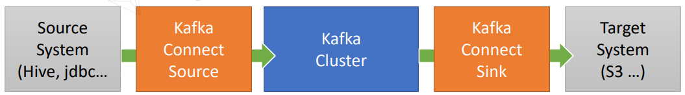
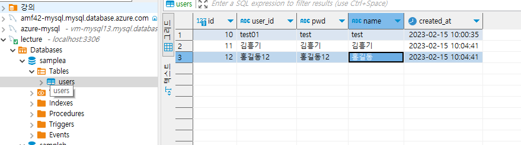
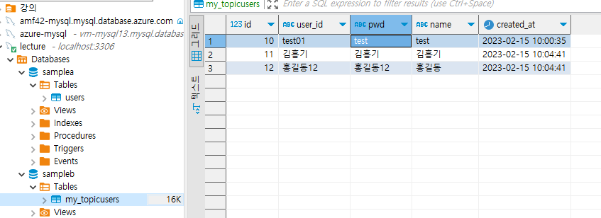

<style>
.burk {
    background-color: red;
    color: yellow;
    display:inline-block;
}
</style>

# 11 데이터동기화 Kafka1

1. Kafka란?
2. Kafka 설치
3. Kafka Producer/Consumer
4. Kafka Connect

## 1. Kafka란?  

Kafka란
- Apache Software Foundation의 Scalar 언어로 된 오픈 소스 메시지 브로커 프로젝트
  - Open Source Message Broker Project
- 링크드인(Linked-in)에서 개발, 2011년 오픈 소스화
  - 2014년 11월 링크드인에서 Kafka를 개발하던 엔지니어들이 Kafka개발에 집중하기 위해 Confluent라는 회사 창립 
- 실시간 데이터 피드를 관리하기 위해 통일된 높은 처리량, 낮은 지연 시간을 지닌 플랫폼 제공
- Apple, Netflix, Shopify, Yelp, Kakao, New York Times, Cisco, Ebay, Paypal, Hyperledger Fabric, Uber,  Salesforce.com 등이 사용

Kafka 특징
- Producer/Consumer 분리
- 메시지를 여러 Consumer에게 허용
- 높은 처리량을 위한 메시지 최적화
- Scale-out 가능
- Eco-system

Kafka Broker
- 실행 된 Kafka 애플리케이션 서버
- 3대 이상의 Broker Cluster 구성
- Zookeeper 연동
  - 역할: 메타데이터 (Broker ID, Controller ID 등) 저장
  - Controller 정보 저장
- n개 Broker 중 1대는 Controller 기능 수행
  - Controller 역할
  - 각 Broker에게 담당 파티션 할당 수행
  - Broker 정상 동작 모니터링 관리


## 2. Kafka 설치

별도 설치하지 않고 docker로 진행함
- docker-compose-kafka.yml
   ```yaml
   version: '2'
   
   services:
     zookeeper:
       image: confluentinc/cp-zookeeper:latest
       mem_limit: 200m
       environment:
         ZOOKEEPER_CLIENT_PORT: 2181
         ZOOKEEPER_TICK_TIME: 2000
       ports:
         - 22181:2181
   
     kafka:
       image: confluentinc/cp-kafka:latest
       mem_limit: 500m
       depends_on:
         - zookeeper
       ports:
         - 9092:9092
       environment:
         KAFKA_BROKER_ID: 1
         KAFKA_ZOOKEEPER_CONNECT: zookeeper:2181
   # Docker용
   #      KAFKA_ADVERTISED_LISTENERS: PLAINTEXT://kafka:9092
   #Local 용
         KAFKA_ADVERTISED_LISTENERS: PLAINTEXT://localhost:9092
   
         KAFKA_LISTENER_SECURITY_PROTOCOL_MAP: PLAINTEXT:PLAINTEXT
         KAFKA_INTER_BROKER_LISTENER_NAME: PLAINTEXT
         KAFKA_OFFSETS_TOPIC_REPLICATION_FACTOR: 1
         KAFKA_ADVERTISED_HOST_NAME: kafka
   ```

### 기본 명령어

docker exec -it docker-kafka-1 bash
- /bin에서 실행

1. Topic 생성
   ```shell
   $ /bin/kafka-topics --create --topic quickstart-events --bootstrap-server localhost:9092 --partitions 1
   Created topic quickstart-events.
   ```
2. Topic 목록 확인
   ```shell
   $ kafka-topics --bootstrap-server localhost:9092 --list
   quickstart-events
   ```
3. Topic 정보 확인
   ```shell
   $ kafka-topics --describe --topic quickstart-events --bootstrap-server localhost:9092
   Topic: quickstart-events        TopicId: EoWQNSQKRJKlLSBnDnG_9w PartitionCount: 1       ReplicationFactor: 1    Configs:
           Topic: quickstart-events        Partition: 0    Leader: 1       Replicas: 1     Isr: 1
   ```


## 3. Kafka Producer/Consumer

Kafka Producer/Consumer 테스트

1. 메시지 생산
   ```shell
   $ kafka-console-producer --broker-list localhost:9092 --topic quickstart-events
   >hello World!
   >Hi there
   >myinno
   ```
2. 메시지 소비
   ```shell
   $ kafka-console-consumer --bootstrap-server localhost:9092 --topic quickstart-events --from-beginning
   hello World!
   Hi there
   myinno
   ```

## 4. Kafka Connect

Ecosystem ② - Kafka Connect
- Kafka Connect를 통해 Data를 Import/Export 가능
- 코드 없이 Configuration으로 데이터를 이동
- Standalone mode, Distribution mode 지원
  - RESTful API 통해 지원
  - Stream 또는 Batch 형태로 데이터 전송 가능
  - 커스텀 Connector를 통한 다양한 Plugin 제공 (File, S3, Hive, Mysql, etc …)
- 


테스트용 테이블 생성
    ```shell
    create table users (
    id 			int auto_increment primary key,
    user_id     varchar(20) not null,
    pwd         varchar(20) not null,
    name		varchar(20) not null,
    created_at  datetime default NOW());
    ```

### Kafka Connect 설치 – Windows

1. Kafka Connect 설치
    ```shell   
    cd "d:\APP\@inflearn\inflearn-2022-SpringCloudMSA\kafkaConnect"
    #curl -O http://packages.confluent.io/archive/5.5/confluent-community-5.5.2-2.12.tar.gz
    curl -O http://packages.confluent.io/archive/6.1/confluent-community-6.1.0.tar.gz
    tar xvf confluent-community-6.1.0.tar.gz
    ```

2. Kafka Connect 실행
   - log4j 관련 수정 (kafkaConnect\confluent-6.1.0\bin\windows\connect-distributed.bat)

    ```shell
    # 변경전
    IF ["%KAFKA_LOG4J_OPTS%"] EQU [""] (
      set KAFKA_LOG4J_OPTS=-Dlog4j.configuration=file:%BASE_DIR%/config..../tools-log4j.properties
    )
    
    # 변경후
    IF ["%KAFKA_LOG4J_OPTS%"] EQU [""] (
      set KAFKA_LOG4J_OPTS=-Dlog4j.configuration=file:%BASE_DIR%/etc/kafka/tools-log4j.properties
    )
    
    ``` 

   - Connect 기동
    ```shell
    cd "d:\APP\@inflearn\inflearn-2022-SpringCloudMSA\kafkaConnect\confluent-6.1.0"
    ./bin/windows/connect-distributed.bat ./etc/kafka/connect-distributed.properties
    ```
    - connect-standalone.bat는 실행중 오류 발생 (잠시 댜기_ 2023-02-04)

3. ClassNotFoundException이 발생하면
   - .\bin\windows\kafka-run-class.bat 파일에서

      ```shell
      rem Classpath addition for release
      for %%i in ("%BASE_DIR%\libs\*") do (
        call :concat "%%i"
      )
      
      # 추가된 부분 -start
      rem Classpath add for LSB style path
      if exist %BASE_DIR%\share\java\kafka\* (
        call :concat %BASE_DIR%\share\java\kafka\*
      )
      # 추가된 부분 -end
      ```

4. JDBC Connector 설정
   -  .\etc\kafka\connect-distributed.properties

    ```shell
    #plugin.path=/usr/share/java
    plugin.path=\d:\\APP\\@inflearn\\inflearn-2022-SpringCloudMSA\\Temp\\confluentinc-kafka-connect-jdbc-10.6.0\\lib
    ```    

5.  JdbcSourceConnector에서 MariaDB(MySQL) JDBC driver 복사
    - 위치: kafkaConnect\confluent-6.1.0\share\java\kafka\

6. Kafka Source Connect 테스트
   - my.json   (d:\APP\@inflearn\inflearn-2022-SpringCloudMSA\kafkaConnect\confluent-6.1.0\)

    ```shell
    {                                                                                     
      "name" : "my-source-connect1",                                                         
      "config" : {                                                                          
        "connector.class" : "io.confluent.connect.jdbc.JdbcSourceConnector",
        "connection.url" : "jdbc:mysql://localhost:3306/samplea?useUnicode=true&serverTimezone=Asia/Seoul",                         
        "connection.user" : "user",
        "connection.password" : "pwd",    
        "mode" : "incrementing",    
        "incrementing.column.name" : "id",    
        "table.whitelist": "test", 
        "topic.prefix" : "my_topic",
        "tasks.max" : "1" 
      }                                                                                     
    }
    ```

    ```shell
    curl -X POST http://localhost:8083/connectors -H "Content-Type: application/json" -d @./my.json
    ```
7. Kafka target Connect 테스트

   - mySink.json   (d:\APP\@inflearn\inflearn-2022-SpringCloudMSA\kafkaConnect\confluent-6.1.0\)

      ```shell
     {                                                                                         
       "name" : "my-sink-connect",                                                         
       "config" : {                                                                          
         "connector.class" : "io.confluent.connect.jdbc.JdbcSinkConnector",              
         "connection.url" : "jdbc:mysql://localhost:3306/sampleb?useUnicode=true&serverTimezone=Asia/Seoul",		
         "connection.user" : "user",                                                       
         "connection.password" : "pwd",                                                    
         "auto.create" : "true",
         "auto.evolve" : "true",
         "delete.enabled" : "false",
         "tasks.max" : "1",                                                                 
         "topics" : "my_topicusers"                                                      
       }                                                                                     
     }
     ```

     ```shell
     curl -X POST http://localhost:8083/connectors -H "Content-Type: application/json" -d @./mySink.json
     ```

8. 테스트

   - 도커 기동 (kafka, mysql)
   - samplea.users 테이블을 sampleb.my_topicusers로 이동 복사

      ```shell
      $ docker-compose -f docker-compose-kafka.yml up
      $ docker-compose -f docker-compose-mysql.yml up
      ```

    ```shell
    
    #1> Connector 삭제 (수정이 필요한 경우)
    curl -X DELETE http://localhost:8083/connectors/my-source-connect1
     
    #2> Source/Target 기동 
    curl -X POST http://localhost:8083/connectors -H "Content-Type: application/json" -d @./my.json
    curl -X POST http://localhost:8083/connectors -H "Content-Type: application/json" -d @./mySink.json
    
    #3>  Connector 리스트
    curl http://localhost:8083/connectors | jq 
    
    #4> Kafka 토픽 확인 (kafka docker에 접속하여)
    kafka-topics --bootstrap-server localhost:9092 --list
    
    #5> Kafka 대이터 확인  (kafka docker에 접속하여)
    kafka-console-consumer --bootstrap-server localhost:9092 --topic my_topicusers --from-beginning
    ``` 
   
9. 결과 (원인, 소스 테이블)

   - 
   - 