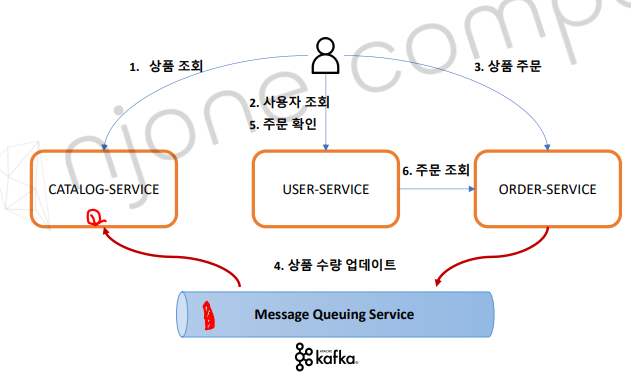
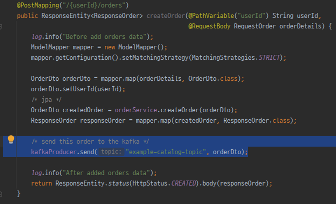
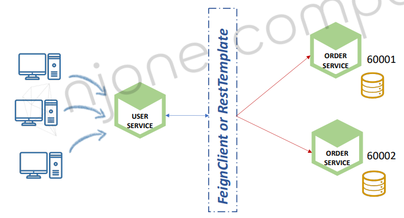
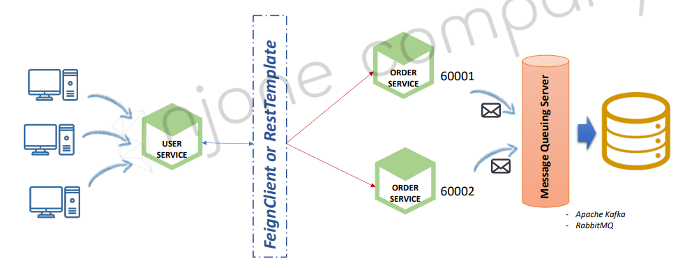
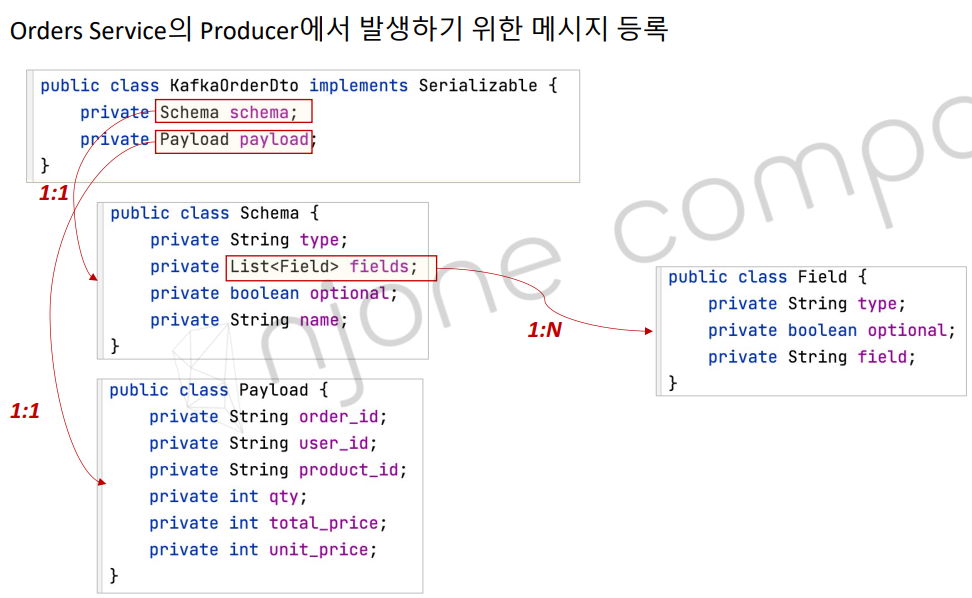
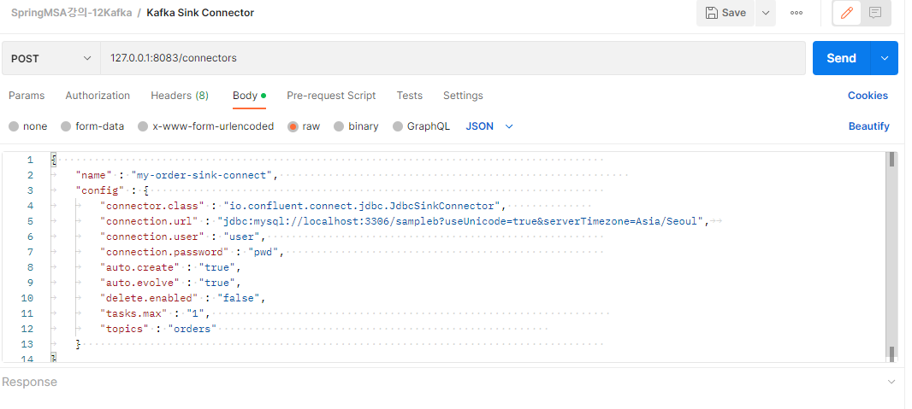
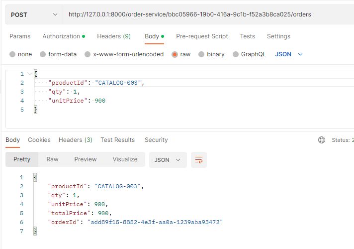
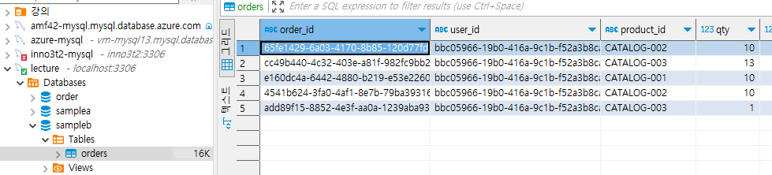

<style>
.burk {
    background-color: red;
    color: yellow;
    display:inline-block;
}
</style>

# 12: 데이터 동기화를 위한 Kafka 활용 ②

- Kafka 적용 – Orders + Catalogs Service
- Kafka 적용 – Multiple Orders Service


## 1. Kafka 적용 – Orders + Catalogs Service

### 데이터 동기화 ① - Orders -> Catalogs
- Orders Service에 요청 된 주문의 수량 정보를 Catalogs Service에 반영
- Orders Service에서 Kafka Topic으로 메시지 전송 -> Producer
- Catalogs Service에서 Kafka Topic에 전송 된 메시지 취득 -> Consumer
- 

### 프로그램 반영(Consumer --> Catalog)

1. pom.xml에 kafka 반영

    ```xml
    <!-- Kafka -->
    <dependency>
        <groupId>org.springframework.kafka</groupId>
        <artifactId>spring-kafka</artifactId>
    </dependency>
    ```
 
2. Catalogs: KafkaConsumerConfig.java(신규)

      ```java
      @EnableKafka
      @Configuration
      public class KafkaConsumerConfig {
          @Bean
          public ConsumerFactory<String, String> consumerFactory() {
              Map<String, Object> properties = new HashMap<>();
              properties.put(ConsumerConfig.BOOTSTRAP_SERVERS_CONFIG, "172.18.208.1:9092");  //localhost
              properties.put(ConsumerConfig.GROUP_ID_CONFIG, "consumerGroupId");
              properties.put(ConsumerConfig.KEY_DESERIALIZER_CLASS_CONFIG, StringDeserializer.class);
              properties.put(ConsumerConfig.VALUE_DESERIALIZER_CLASS_CONFIG, StringDeserializer.class);
      
              return new DefaultKafkaConsumerFactory<>(properties);
          }
      
          @Bean
          public ConcurrentKafkaListenerContainerFactory<String, String> kafkaListenerContainerFactory() {
              ConcurrentKafkaListenerContainerFactory<String, String> kafkaListenerContainerFactory
                      = new ConcurrentKafkaListenerContainerFactory<>();
              kafkaListenerContainerFactory.setConsumerFactory(consumerFactory());
      
              return kafkaListenerContainerFactory;
          }
      }
      ```
3. Kafka Listener  : CofkaConsumer
   - Service로 등록

      ```java
      @Service
      @Slf4j
      public class KafkaConsumer {
          CatalogRepository repository;
      
          @Autowired
          public KafkaConsumer(CatalogRepository repository) {
              this.repository = repository;
          }
      
          @KafkaListener(topics = "example-catalog-topic")
          public void updateQty(String kafkaMessage) {
              log.info("Kafka Message: ->" + kafkaMessage);
      
              Map<Object, Object> map = new HashMap<>();
              ObjectMapper mapper = new ObjectMapper();
              try {
                  map = mapper.readValue(kafkaMessage, new TypeReference<Map<Object, Object>>() {});
              } catch (JsonProcessingException ex) {
                  ex.printStackTrace();
              }
      
              CatalogEntity entity = repository.findByProductId((String)map.get("productId"));
              if (entity != null) {
                  entity.setStock(entity.getStock() - (Integer)map.get("qty"));
                  repository.save(entity);
              }
          }
      }
      ```
### 프로그램 반영(Product --> Order)
주문내역을 Kafka로 전달

1. pom.xml

    ```kafka
    <!-- Kafka -->
    <dependency>
       <groupId>org.springframework.kafka</groupId>
       <artifactId>spring-kafka</artifactId>
    </dependency>
    ```
2. KafkaProducerConfig.java

    ```java
    @EnableKafka
    @Configuration
    public class KafkaProducerConfig {
        @Bean
        public ProducerFactory<String, String> producerFactory() {
            Map<String, Object> properties = new HashMap<>();
    //        properties.put(ProducerConfig.BOOTSTRAP_SERVERS_CONFIG, "172.18.0.101:9092");
            properties.put(ConsumerConfig.BOOTSTRAP_SERVERS_CONFIG, "172.18.208.1:9092");  //localhost
            properties.put(ProducerConfig.KEY_SERIALIZER_CLASS_CONFIG, StringSerializer.class);
            properties.put(ProducerConfig.VALUE_SERIALIZER_CLASS_CONFIG, StringSerializer.class);
    
            return new DefaultKafkaProducerFactory<>(properties);
        }
    
        @Bean
        public KafkaTemplate<String, String> kafkaTemplate() {
            return new KafkaTemplate<>(producerFactory());
        }
    }
    ```
3. KafkaProducer.java (service)

      ```java
      @Service
      @Slf4j
      public class KafkaProducer {
          private KafkaTemplate<String, String> kafkaTemplate;
      
          @Autowired
          public KafkaProducer(KafkaTemplate<String, String> kafkaTemplate) {
              this.kafkaTemplate = kafkaTemplate;
          }
      
          public OrderDto send(String topic, OrderDto orderDto) {
              ObjectMapper mapper = new ObjectMapper();
              String jsonInString = "";
              try {
                  jsonInString = mapper.writeValueAsString(orderDto);
              } catch(JsonProcessingException ex) {
                  ex.printStackTrace();
              }
      
              kafkaTemplate.send(topic, jsonInString);
              log.info("Kafka Producer sent data from the Order microservice: " + orderDto);
      
              return orderDto;
          }
      }
      ```
4. OrderController에서 Kafka 호출
   - 

### 테스트

테스트를 위한 기본 환경 구성
1. 테스트 환경

      ```shell
      1. 기동 서비스
         DiscoveryServiceApplication
         ApigatewayServiceApplication
         ConfigServiceApplication
         UserServiceApplication
         OrderServiceApplication
         CatalogServiceApplication
      
      2. kafka docker 기동
      ```

2. 테스트 시나리오

      ```shell
      1. user 등록
         http://10.200.0.1:8000/user-service/users
         
      2. 주문
         http://127.0.0.1:8000/order-service/fc30137b-2a97-49f4-8c47-462983020b4c/orders    
      ```

3. 주요 로그

      ```shell
      order
         http://127.0.0.1:8000/order-service/fc30137b-2a97-49f4-8c47-462983020b4c/orders
      
      CatalogServiceApplication
         Kafka Message: ->{"productId":"CATALOG-0003","qty":10,"unitPrice":900,"totalPrice":9000,"orderId":"ac8f90f9-d24c-477b-9c78-c3648d4c3166","userId":"fc30137b-2a97-49f4-8c47-462983020b4c"}
      ```

4. kafka 로그

      ```shell
      $ kafka-console-consumer --bootstrap-server localhost:9092 --topic example-catalog-topic --from-beginning
      {"productId":"CATALOG-0002","qty":10,"unitPrice":900,"totalPrice":9000,"orderId":"d4768805-bf50-4c66-b276-835e15d9fb69","userId":"fc30137b-2a97-49f4-8c47-462983020b4c"}
      {"productId":"CATALOG-0001","qty":10,"unitPrice":900,"totalPrice":9000,"orderId":"988418cf-7a98-458d-a0b9-3460a6ef7cbd","userId":"fc30137b-2a97-49f4-8c47-462983020b4c"}
      {"productId":"CATALOG-0003","qty":10,"unitPrice":900,"totalPrice":9000,"orderId":"ac8f90f9-d24c-477b-9c78-c3648d4c3166","userId":"fc30137b-2a97-49f4-8c47-462983020b4c"}
      ```

## 2. Kafka 적용 – Multiple Orders Service

### Multiple Orders Service에서의 데이터 동기화

Orders Service 2개 기동
- Users의 요청 분산 처리
- Orders 데이터도 분산 저장 -> 동기화 문제
- 

대안
- Orders Service에 요청 된 주문 정보를 DB가 아니라 Kafka Topic으로 전송
- Kafka Topic에 설정 된 Kafka Sink Connect를 사용해 단일 DB에 저장 -> 데이터 동기화
- 


Orders Service의 JPA 데이터베이스 교체
- H2 DB -> MariaDB
   ```shell
   create table orders (
     id int auto_increment primary key,
     user_id varchar(50) not null, 
     product_id varchar(20) not null,
     order_id varchar(50) not null,
     qty int default 0,
     unit_price int default 0,
     total_price int default 0,
     created_at datetime default now()
   )   
   ```

처리 방안
1. 주문 내역을 Kafka에 저장 (Message 형식을 JDBC Connector 형식으로)
   - Schems. Payload  
2. 토픽에 등록된 내역은 sink-connector 이용하여 반영(11장에서 학습)


### 프로그램 수정 (kafka에 등록)

1. OrderController.java
   - 주문 내역을 Kafka로 전송 (DB save 대신) 

   ```java
       @PostMapping("/{userId}/orders")
       public ResponseEntity<ResponseOrder> createOrder(@PathVariable("userId") String userId,
                                                        @RequestBody RequestOrder orderDetails) {
           log.info("Before add orders data");
           ModelMapper mapper = new ModelMapper();
           mapper.getConfiguration().setMatchingStrategy(MatchingStrategies.STRICT);
   
           OrderDto orderDto = mapper.map(orderDetails, OrderDto.class);
           orderDto.setUserId(userId);
           /* jpa */
   //        OrderDto createdOrder = orderService.createOrder(orderDto);
   //        ResponseOrder responseOrder = mapper.map(createdOrder, ResponseOrder.class);
   
           /* order 내역도 kafka 이용 */
           orderDto.setOrderId(UUID.randomUUID().toString());
           orderDto.setTotalPrice(orderDetails.getQty() * orderDetails.getUnitPrice());
           ResponseOrder responseOrder = mapper.map(orderDto, ResponseOrder.class);
           orderProducer.send("orders", orderDto);  //주문내역 kafka로 전송
   
           /* send this order to the kafka -- catalog로 전달용*/
           kafkaProducer.send("example-catalog-topic", orderDto);
           
           log.info("After added orders data");
           return ResponseEntity.status(HttpStatus.CREATED).body(responseOrder);
       }
   ```

2. JDBC Connector를 위한 DTO 설정
   - 

   - Kafka 입력데이터 예제를 추가 

3. OrderProducer

   ```java
   @Service
   @Slf4j
   public class OrderProducer {
       private KafkaTemplate<String, String> kafkaTemplate;
   
       List<Field> fields = Arrays.asList(new Field("string", true, "order_id"),
               new Field("string", true, "user_id"),
               new Field("string", true, "product_id"),
               new Field("int32", true, "qty"),
               new Field("int32", true, "unit_price"),
               new Field("int32", true, "total_price"));
       Schema schema = Schema.builder()
               .type("struct")
               .fields(fields)
               .optional(false)
               .name("orders")
               .build();
   
       @Autowired
       public OrderProducer(KafkaTemplate<String, String> kafkaTemplate) {
           this.kafkaTemplate = kafkaTemplate;
       }
   
       public OrderDto send(String topic, OrderDto orderDto) {
           Payload payload = Payload.builder()
                   .order_id(orderDto.getOrderId())
                   .user_id(orderDto.getUserId())
                   .product_id(orderDto.getProductId())
                   .qty(orderDto.getQty())
                   .unit_price(orderDto.getUnitPrice())
                   .total_price(orderDto.getTotalPrice())
                   .build();
   
           KafkaOrderDto kafkaOrderDto = new KafkaOrderDto(schema, payload);
   
           ObjectMapper mapper = new ObjectMapper();
           String jsonInString = "";
           try {
               jsonInString = mapper.writeValueAsString(kafkaOrderDto);
           } catch(JsonProcessingException ex) {
               ex.printStackTrace();
           }
   
           kafkaTemplate.send(topic, jsonInString);
           log.info("Order Producer sent data from the Order microservice: " + kafkaOrderDto);
   
           return orderDto;
       }
   }
   ```
### 테스트
1. 서비스 기동
   - DiscoveryserviceApplicaiotn
   - Apigateway
   - Catalog
   - Order
   - Catalog

2. docker 및 kafka
   - docker-compose -f docker-commnpose-kafka.yml up
   - docker-compose -f docker-commnpose-mysql.yml up
3. kafka Connector

    ```shell
    cd "d:\APP\@inflearn\inflearn-2022-SpringCloudMSA\kafkaConnect\confluent-6.1.0"
    ./bin/windows/connect-distributed.bat ./etc/kafka/connect-distributed.properties
    ```
    - 
```kafka
# 리스트
$ docker exec -it kafka bash
[appuser@c9fddc1688a7 ~]$ /bin/kafka-topics --bootstrap-server localhost:9092 --list
```
4. 주문 및 처리 결과 확인
   - 
   - 
   - kafka Queue 

   ```shell
   [appuser@c9fddc1688a7 ~]$ /bin/kafka-console-consumer --bootstrap-server localhost:9092 --topic orders --from-beginning
   
   {"schema":{"type":"struct","fields":[{"type":"string","optional":true,"field":"order_id"},{"type":"string","optional":true,"field":"user_id"},{"type":"string","optional":true,"field":"product_id"},{"type":"int32","optional":true,"field":"qty"},{"type":"int32","optional":true,"field":"unit_price"},{"type":"int32","optional":true,"field":"total_price"}],"optional":false,"name":"orders"},"payload":{"order_id":"4541b624-3fa0-4af1-8e7b-79ba39316829","user_id":"bbc05966-19b0-416a-9c1b-f52a3b8ca025","product_id":"CATALOG-002","qty":10,"unit_price":900,"total_price":9000}}
   
   {"schema":{"type":"struct","fields":[{"type":"string","optional":true,"field":"order_id"},{"type":"string","optional":true,"field":"user_id"},{"type":"string","optional":true,"field":"product_id"},{"type":"int32","optional":true,"field":"qty"},{"type":"int32","optional":true,"field":"unit_price"},{"type":"int32","optional":true,"field":"total_price"}],"optional":false,"name":"orders"},"payload":{"order_id":"add89f15-8852-4e3f-aa0a-1239aba93472","user_id":"bbc05966-19b0-416a-9c1b-f52a3b8ca025","product_id":"CATALOG-003","qty":1,"unit_price":900,"total_price":900}}
   ```
