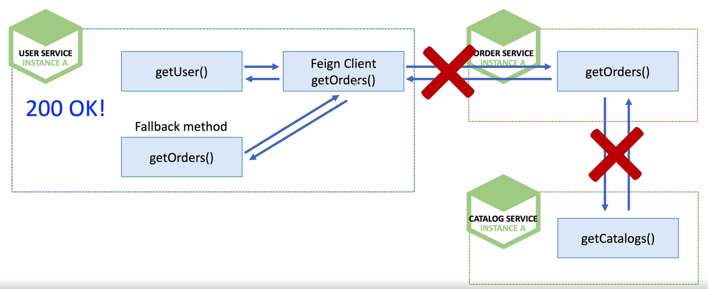
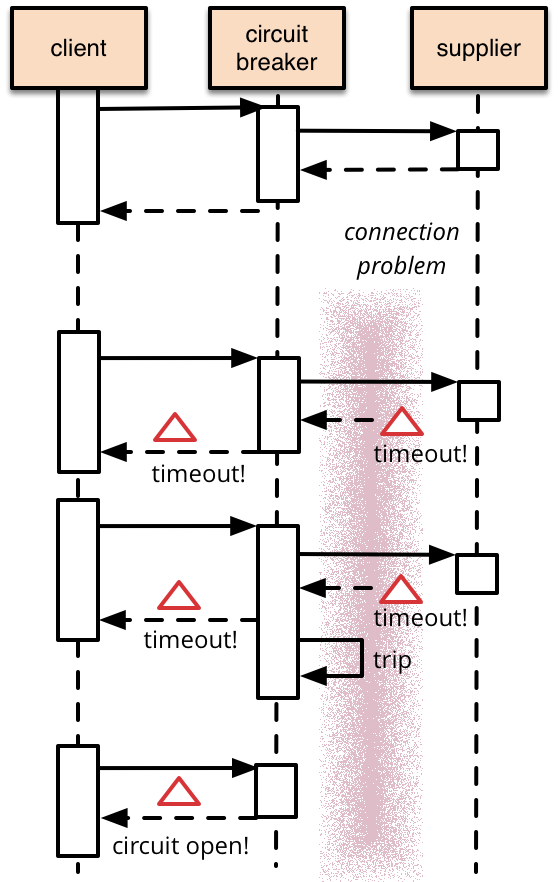
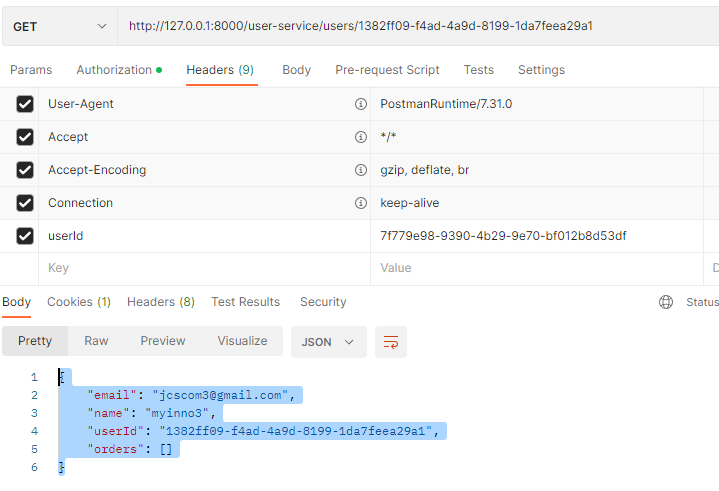
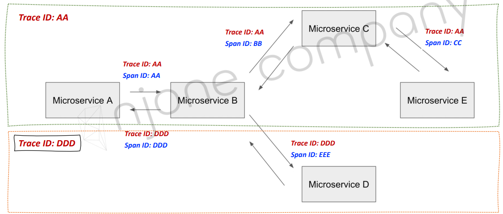
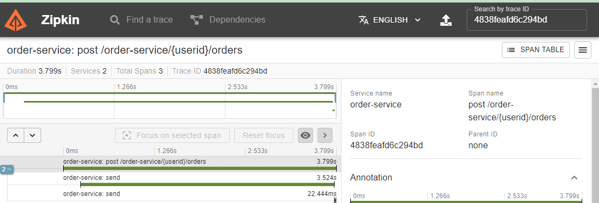
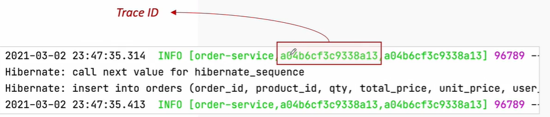

<style>
.burk {
    background-color: red;
    color: yellow;
    display:inline-block;
}
</style>

# 13: 장애 처리와 Microservice 분산 추적

- CircuitBreaker  
- Resilience4j  
- Distributed Tracing  
- Trace ID and Span ID  
- Zipkin server 활용

## 1. CircuitBreaker
### Microservice 통신 시 연쇄 오류
장애 확산 방지
- 
- OrderService에서 오류가 발생하면 더이상 호출하지 않고 Fallback_method() 호출

CircuitBreaker  - https://martinfowler.com/bliki/CircuitBreaker.html
- 
- 장애가 발생하는 서비스에 반복적인 호출이 되지 못하게 차단  
- 특정 서비스가 정상적으로 동작하지 않을 경우 다른 기능으로  대체 수행 -> 장애 회피


### Hystrix
Spring Boot 2.3 이하 까지만 지원
 

Spring Cloud Replacement

|          Current          | Replacement  |
|:-------------------------|:------------|
|          Hystrix          | Resilience4j|
| Htstrix Dashboard/Turbine | Micrometer + Monitoring System |
|          Ribbon           | Spring Cloud Loandbalancer|
|Zuul1 | Spring cloud Gateway|
|archaius 1| Spring Boot external config + Spring Cloud Config|

## 2. Resilience4j

Resilience4j  
- resilience4j-circuitbreaker: Circuit breaking  
- resilience4j-ratelimiter: Rate limiting  
- resilience4j-bulkhead: Bulkheading  
- resilience4j-retry: Automatic retrying (sync and async)  
- resilience4j-timelimiter: Timeout handling  
- resilience4j-cache: Result caching  
- https://resilience4j.readme.io/docs/getting-started  
- https://github.com/resilience4j/resilience4j


### 구현해보기  [Resilience4j – CircuitBreaker]

1. DefaultConfiguration (pom.xml)
   - UserService 
       ```shell
       <!-- resilience4j -->
       <dependency>
           <groupId>org.springframework.cloud</groupId>
           <artifactId>spring-cloud-starter-circuitbreaker-resilience4j</artifactId>
       </dependency>
       ```
2. UserServiceImpl.java
   -  getUserByUserId 수정
   - "orderServiceClient.getOrders"를 Circuit으로 변경

      ```shell
          @Override
          public UserDto getUserByUserId(String userId) {
              //사용자 정보
              UserEntity userEntity = userRepository.findByUserId(userId);
      
              if (userEntity == null)
                  throw new UsernameNotFoundException("User not found");
      
              //UserEntity ==> UserDto
              UserDto userDto = new ModelMapper().map(userEntity, UserDto.class);
      
              //Order Service 호출 ==> RestTemplate
              //url: http://127.0.0.1:8000/order_service/%s/orders
      
              /* ErrorDecoder */
      //        List<ResponseOrder> ordersList = orderServiceClient.getOrders(userId);
              log.info("Before call orders microservice");
              CircuitBreaker circuitBreaker = circuitBreakerFactory.create("circuitbreaker");
              List<ResponseOrder> ordersList = circuitBreaker.run(() -> orderServiceClient.getOrders(userId),
                      throwable -> new ArrayList<>());
              log.info("After called orders microservice");
      
              userDto.setOrders(ordersList);
      
              return userDto;
          }
      ```

3. Customize CircuitBreakerFactory -> Resilience4JCircuitBreakerFactory

    ```java
    @Configuration
    public class Resilience4JConfig {
        @Bean
        public Customizer<Resilience4JCircuitBreakerFactory> globalCustomConfiguration() {
            CircuitBreakerConfig circuitBreakerConfig = CircuitBreakerConfig.custom()
                    .failureRateThreshold(4)      //CirucitBreaker를 열지 결정하는 failure rate  threshold percentage  • default: 50
                    //CircuitBreaker를 open한 상태를 유지하는  지속 기간을 의미  • 이 기간 이후에 half-open 상태  • default: 60seconds
                    .waitDurationInOpenState(Duration.ofMillis(1000))
                     //CircuitBreaker가 닫힐 때 통화 결과를 기록하는 데  사용되는 슬라이딩 창의 유형을 구성  • 카운트 기반 또는 시간 기반
                    .slidingWindowType(CircuitBreakerConfig.SlidingWindowType.COUNT_BASED)
                    //CircuitBreaker가 닫힐 때 호출 결과를 기록하는 데  사용되는 슬라이딩 창의 크기를 구성  • default: 100
                    .slidingWindowSize(2)
                    .build();
    
            TimeLimiterConfig timeLimiterConfig = TimeLimiterConfig.custom()
                    //TimeLimiter는 future supplier의 time limit을  정하는 API  • default: 1초
                    .timeoutDuration(Duration.ofSeconds(4))
                    .build();
    
            return factory -> factory.configureDefault(id -> new Resilience4JConfigBuilder(id)
                    .timeLimiterConfig(timeLimiterConfig)
                    .circuitBreakerConfig(circuitBreakerConfig)
                    .build()
            );
    
        }
    }
    ```    

4. Order Service을 이전의 JPA버전으로 임시 변경
   - Application.yaml
   - 
###  테스트
1. 기동한 서비스
   - Order Service를 기동하지 않고, user 정보 조회
2. 테스트 절차
   - user 등록
   - User 상세 내역 조회
2. 결과
   -  


## 3. Distributed Tracing
Microservice 분산 추적  
- Zipkin  
  - https://zipkin.io/  
  - Twitter에서 사용하는 분산 환경의 Timing 데이터 수집, 추적 시스템 (오픈소스)  
  - Google Drapper에서 발전하였으며, 분산환경에서의 시스템 병목 현상 파악  
  - Collector, Query Service, Databasem WebUI로 구성  
  - Span  
    - 하나의 요청에 사용되는 작업의 단위  
    - 64 bit unique ID  
  - Trace  
    - 트리 구조로 이뤄진 Span 셋  
    - 하나의 요청에 대한 같은 Trace ID 발급


- Spring Cloud Sleuth  
  - 스프링 부트 애플리케이션을 Zipkin과 연동  
  - 요청 값에 따른 Trace ID, Span ID 부여  
  - Trace와 Span Ids를 로그에 추가 가능  
    - servlet filter  
    - rest template  
    - scheduled actions  
    - message channels  
    - feign client

- Microservice 분산 추적
  - Spring Cloud Sleuth + Zipkin
    -  
## 4. Trace ID and Span ID
## 5. Zipkin server 활용

1. 설치
   - Docker

      ```shell
      docker run -d -p 9411:9411 openzipkin/zipkin
      ```
   - java

      ```shell
      curl -sSL https://zipkin.io/quickstart.sh | bash -s
      java -jar zipkin.jar
      ```
2. 관련 설정 수정 (dependency)
   - User/Order 서비스에 추가
    ```xml
    <!-- zipkin -->
    <dependency>
        <groupId>org.springframework.cloud</groupId>
        <artifactId>spring-cloud-starter-sleuth</artifactId>
    </dependency>
    <dependency>
        <groupId>org.springframework.cloud</groupId>
        <artifactId>spring-cloud-starter-zipkin</artifactId>
        <version>2.2.3.RELEASE</version>
    </dependency>
    ```

3. 관련 설정 수정(application.yaml)

    ```yaml
    spring:
      application:
        name: user-service
      zipkin:
        base-url: http://127.0.0.1:9411
        enabled: true
      sleuth:
        sampler:
          probability: 1.0   //발생내역 모두 수집
    
    ```

### 테스트
1. 주문 등록
   - 2023-02-17 15:35:30.247  INFO [order-service,4838feafd6c294bd,4838feafd6c294bd] 31480 --- [o-auto-1-exec-1] o.a.kafka.common.utils.AppInfoParser     : Kafka version: 2.6.0
   - 

   - 

2. 사용자 정보 조회

3. Error 테스트
  4.  