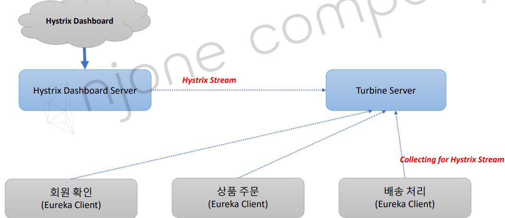
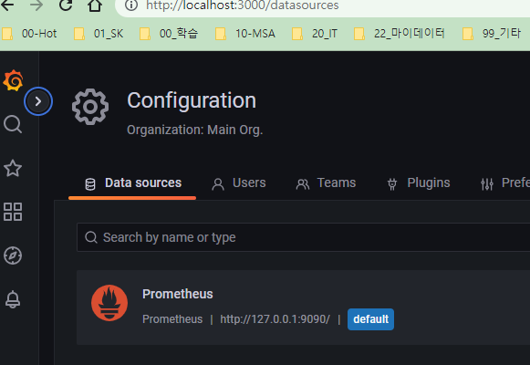
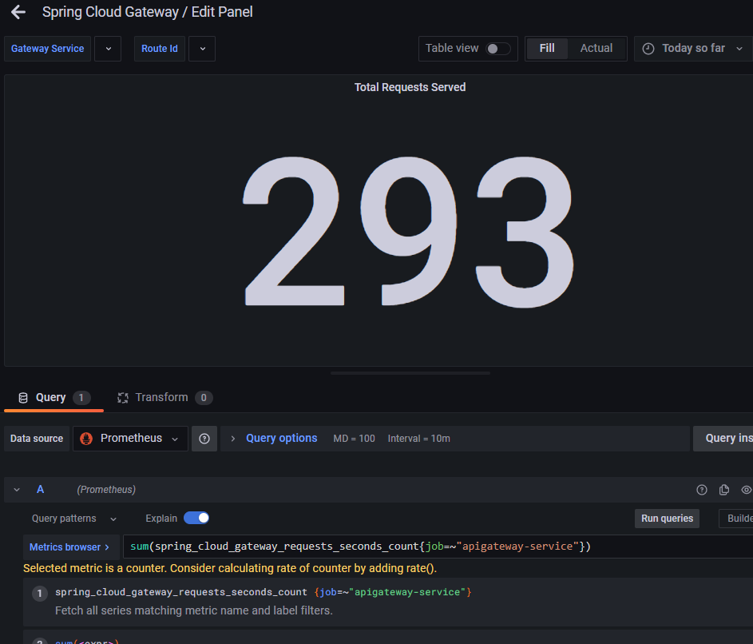

<style>
.burk {
    background-color: red;
    color: yellow;
    display:inline-block;
}
</style>

# 14. Microservice 모니터링 

- Hystrix Dashboard + Turbine Server 
- Micrometer 
- Prometheus 
- Grafana

## 1. Hystrix Dashboard + Turbine Server
1.23 이전 버전에서 사용

1. Turbine Serve
   - 마이크로서비스에 설치된 Hystrix 클라이언트의 스트림을 통합 
     - 마이크로서비스에서 생성되는 Hystrix 클라이언트 스트림 메시지를 터빈 서버로 수집

2. Hystrix Dashboard
   - Hystrix 클라이언트에서 생성하는 스트림을 시각화 
     - Web Dashboard
   - 

   - Hystrix Dashboard: 

## 2. Micrometer
현재 사용...

1. Micrometer 
   - https://micrometer.io/ 
   - JVM기반의 애플리케이션의 Metrics 제공 
   - Spring Framework 5, Spring Boot 2부터 Spring의 Metrics 처리 
   - Prometheus등의 다양한 모니터링 시스템 지원 
2. Timer 
   - 짧은 지연 시간, 이벤트의 사용 빈도를 측정 
   - 시계열로 이벤트의 시간, 호출 빈도 등을 제공 
   - @Timed 제공

### 사용 방법 [ Microservice 수정]
 apiGateway, Order Service, UserService에 추가
1. pom.xml 

    ```xml
    <dependency>
        <groupId>io.micrometer</groupId>
        <artifactId>micrometer-registry-prometheus</artifactId>
    </dependency>
    ```

2. application.yml (Users microservice)
   - info, metrics, prometheus  추가

      ```yaml
      management:
        endpoints:
          web:
            exposure:
              include: refresh, health, beans, busrefresh, info, metrics, prometheus
      ```

3. 소스 수정 
   - @Timed 관련 추가

      ```java
          @GetMapping("/health_check")
          @Timed(value="users.status", longTask = true)
          public String status() {
              return String.format("It's Working in User Service"
                      + ", port(local.server.port)=" + env.getProperty("local.server.port")
                      + ", port(server.port)=" + env.getProperty("server.port")
                      + ", gateway ip=" + env.getProperty("gateway.ip")
                      + ", message=" + env.getProperty("greeting.message")
                      + ", token secret=" + env.getProperty("token.secret")
                      + ", token expiration time=" + env.getProperty("token.expiration_time"));
          }
      
          @GetMapping("/welcome")
          @Timed(value="users.welcome", longTask = true)
          public String welcome(HttpServletRequest request, HttpServletResponse response) {
      
              return greeting.getMessage();
          }
      ```
4. 지표 확인
   - http://127.0.0.1:8000/user-service/actuator/metrics
   - "users.status", "users.welcome"  이 보이지 않네 (2023-02-17)
     - 사용해야 보임 (거래 호출하면 보임)
   - http://127.0.0.1:8000/user-service/actuator/prometheus
   - http://127.0.0.1:8000/order-service/actuator/prometheus 
     - api-gateway의 라우팅이 설정되어 있지 않으면 추가
   - http://127.0.0.1:8000/actuator/prometheus

    ```note
    "actuator/prometheus"가 정상 작동하기 위해서는  아래 2개 모두 있어야 함
    - micrometer-registry-prometheus
    - spring-boot-starter-actuator 
    ```

## 3. Prometheus
1. Prometheus 
   - Metrics를 수집하고 모니터링 및 알람에 사용되는 오픈소스 애플리케이션 
   - 2016년부터 CNCF에서 관리되는 2번째 공식 프로젝트 
     - Level DB -> Time Series Database(TSDB) 
   - Pull 방식의 구조와 다양한 Metric Exporter 제공 
   - 시계열 DB에 Metrics 저장 -> 조회 가능 (Query) 
2. Grafana 
   - 데이터 시각화, 모니터링 및 분석을 위한 오픈소스 애플리케이션 
   - 시계열 데이터를 시각화하기 위한 대시보드 제공

### Prometheus 설치 
Prometheus 다운로드 
- https://prometheus.io/download/ 
- d:\APP\@inflearn\inflearn-2022-SpringCloudMSA\sw\prometheus-2.37.5.windows-amd64\
## 4. Grafana
다운로드
- https://grafana.com/grafana/download?pg=get&plcmt=selfmanaged-box1-cta1&platform=windows
- zip 파일 다운로드
- d:\APP\@inflearn\inflearn-2022-SpringCloudMSA\sw\grafana-9.3.6\


Grafana Dashboard
- JVM(Micrometer) 
- Prometheus 
- Spring Cloud Gateway

                                        
###  그라피니 Dashboard 수정

1. prometheus 기동을 위한 설정 변경
   - d:\APP\@inflearn\inflearn-2022-SpringCloudMSA\sw\prometheus-2.37.5.windows-amd64\
   - prometheus.yml 

    ```yaml
    ...
    scrape_configs:
      # The job name is added as a label `job=<job_name>` to any timeseries scraped from this config.
      - job_name: "prometheus"
    
        # metrics_path defaults to '/metrics'
        # scheme defaults to 'http'.
    
        static_configs:
          - targets: ["127.0.0.1:9090"]
      - job_name: 'user-service'
        scrape_interval: 15s
        metrics_path: '/user-service/actuator/prometheus'
        static_configs: 
        - targets: ['127.0.0.1:8000']
      - job_name: 'order-service'
        scrape_interval: 15s
        metrics_path: '/order-service/actuator/prometheus'
        static_configs: 
        - targets: ['l127.0.0.1:8000']     
      - job_name: 'apigateway-service'
        scrape_interval: 15s
        metrics_path: '/actuator/prometheus'
        static_configs: 
        - targets: ['127.0.0.1:8000']
    ```
   
2. prometheus 기동
   -  prometheus.exe

3. Grafana 기동
   -  d:\APP\@inflearn\inflearn-2022-SpringCloudMSA\sw\grafana-9.3.6\
   - bin/grafana-server.exe

4. Grafana 설정- DataSoure 추가
   - 

5. DdashBoard 추가
   - Spring Cloud Gateway
   - JVM
6. Import한 값이 보이지 않는 경우 수정' 
   -  


 


