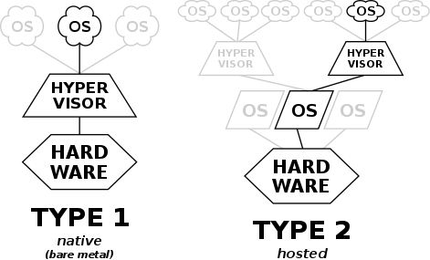
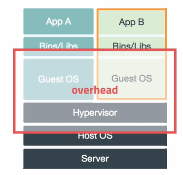
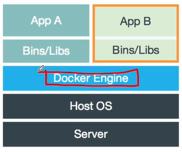
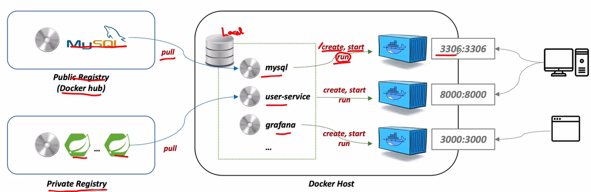

<style>
.burk {
    background-color: red;
    color: yellow;
    display:inline-block;
}
</style>

#  15: 애플리케이션 배포를 위한 컨테이너 가상화

- Container Virtualization  
- Docker Desktop  
- Docker 실행

## 1. Container Virtualization

Virtualization

1. 물리적인 컴퓨터 리소스를 다른 시스템이나 애플리케이션에서 사용할 수 있도록 제공  
   - 플랫폼 가상화  
   - 리소스 가상화  
2. 하이퍼바이저 (Hypervisor)  
   - Virtual Machine Manager (VMM)  
   - 다수의 운영체제를 동시에 실행하기 위한 논리적 플랫폼  
   - Type 1: Native or Bare-metal  
   - Type 2: Hosted

3. https://ko.wikipedia.org/wiki/하이퍼바이저
   - 

Container Virtualization

1. OS Virtualization  
   - Host OS(최초 기동되는 OS) 위에 Guest OS 전체를 가상화  
   - VMWare, VirtualBox  
   - 자유도가 높으나, 시스템에 부하가 많고 느려짐  
   - 
2. Container Virtualization  
   - Host OS가 가진 리소스를 적게 사용하며, 필요한 프로세스 실행  
   - 최소한의 라이브러리와 도구만 포함  
   - Container의 생성 속도 빠름
   - 


Container Image  (이미지란?)

1. Container 실행에 필요한 설정 값  
   - 상태값 X, Immutable
2. Image를 가지고 실체화 -> Container
   - 

Dockerfile
1. Docker Image를 생성하기 위한 스크립트 파일  
2. 자체 DSL(Domain-Specific language) 언어 사용 -> 이미지 생성과정 기술  

   ```Dockerfile
   FROM centos:8
   
   RUN yum -y update; yum clean all
   RUN yum -y install systemd; yum clean all; 
   
   
   VOLUME ["/sys/fs/cgroup"]
   
   RUN sed -i 's/mirrorlist/#mirrorlist/g' /etc/yum.repos.d/CentOS-Linux-*
   RUN sed -i 's|#baseurl=http://mirror.centos.org|baseurl=http://vault.centos.org|g' /etc/yum.repos.d/CentOS-Linux-*
   
   # install sshd
   RUN yum install -y epel-release
   RUN yum install -y openssh-server \
     && sed 's/#PermitRootLogin yes/PermitRootLogin yes/' -i /etc/ssh/sshd_config \
     && echo 'root:root' | chpasswd \
     && ssh-keygen -f /etc/ssh/ssh_host_rsa_key -N '' -t rsa
   RUN yum install -y openssh-clients
   
   RUN yum update -y
   RUN yum install -y iptables
   
   RUN yum install -y yum-utils
   RUN yum-config-manager --add-repo https://download.docker.com/linux/centos/docker-ce.repo
   RUN yum install -y --allowerasing docker-ce docker-ce-cli containerd.io
   
   RUN yum install -y python38
   RUN pip3 install --upgrade --ignore-installed pip setuptools
   RUN pip3 install ansible
   
   WORKDIR /root
   COPY ./Dockerfile_ansible ./Dockerfile_ansible
   
   EXPOSE 22
   
   #ENTRYPOINT ["/usr/sbin/init", "systemctl", "start", "sshd"]
   #CMD [""]
   
   ENTRYPOINT ["/usr/sbin/init", "systemctl", "start", "docker"]
   CMD ["/usr/sbin/sshd", "-D"]
   ```

## 2. Docker Deskto

Docker Desktop  Docker 실행
- https://www.docker.com/products/docker-desktop


- docker info

- docker container ls

Docker 실행

- 컨테이너 실행  
  - $ docker run [OPTIONS] IMAGE[:TAG|@DIGEST] [COMMAND] [ARG…]  
  - $ docker run ubuntu:16.04  
   
   |   옵션   |설명|
   |:------:| :----|
   |   -d   | detached mode, 백그라운드 모드|
   |   -p   | 포트 포워딩|
   |   -v   | 호스트와 컨테이너의 디렉토리를 연결|
   |   -e   |  환경변수 설정|
   | --name | 컨테이너 이름|
   |  --rm  | 프로세스 종료시 컨테이너 자동 제거|
   |  -it   | 터미널 입력을 위한 옵션|
   | --link | 컨테이너 연결[컨테이너 별칭]|
  

http://hub.docker.com                                       


## 3. Docker 실행

Docker 실행
```shell
$ docker run -d -p 3306:3306 -e MYSQL_ALLOW_EMPTY_PASSWORD=true --name mysql mysql:5.7
$ docker exec –it mysql bash

```

```shell
       §         Dockerfile for Users Microservice  FROM openjdk:8-jdk-alpine  VOLUME /tmp  COPY target/users-ws-0.1.jar users-service.jar  ENTRYPOINT ["java",  "-Djava.security.egd=file:/dev/./urandom",  "-jar",  "users-service.jar"]  § https://hub.docker.com  $ docker build -t edowon0623/users-service:1.0 .  $ docker push edowon0623/user-service:1.0  $ docker pull edowon0623/user-service:1.0
```