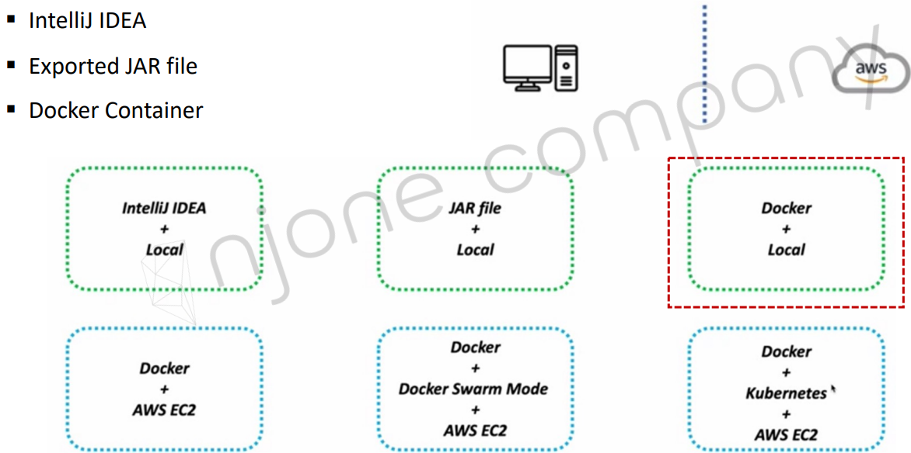
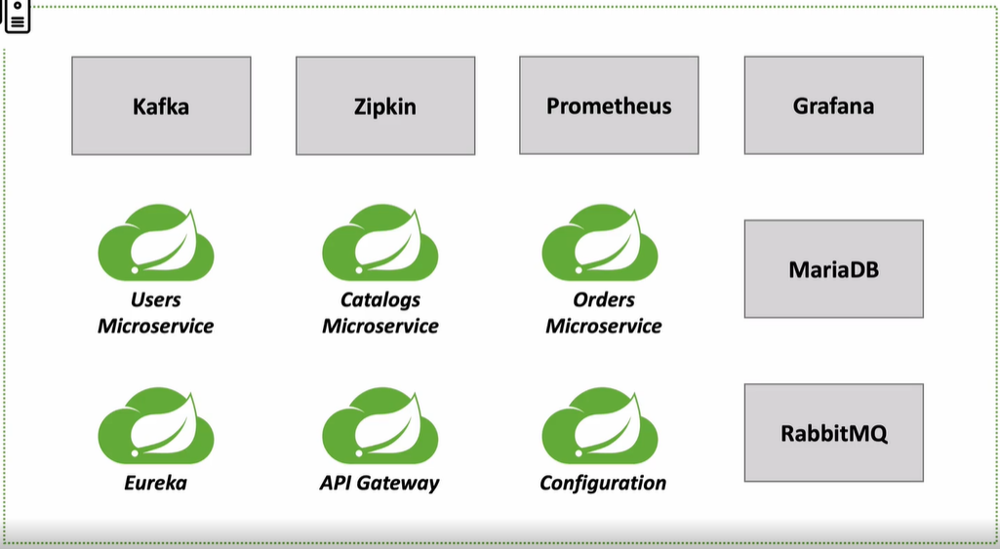
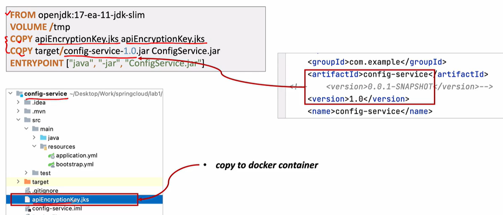
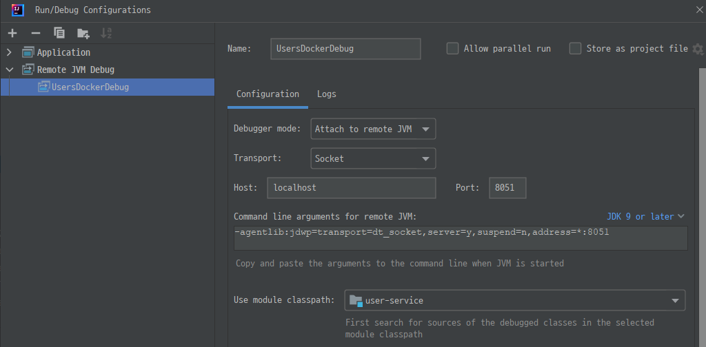
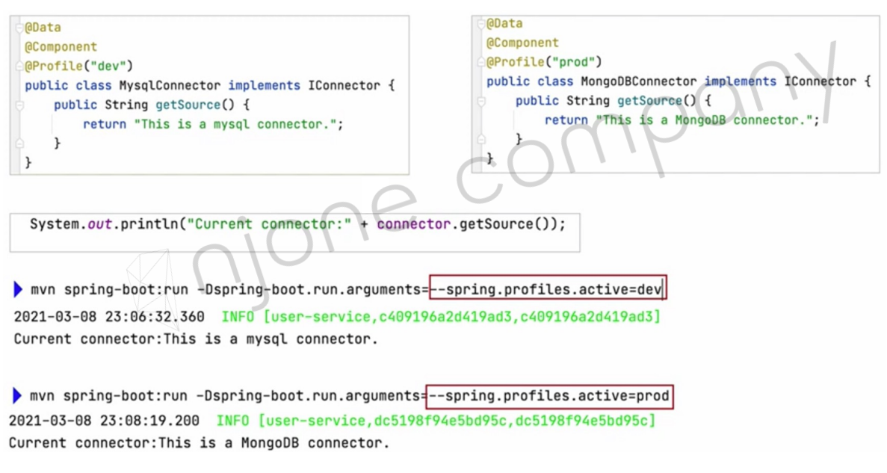

<style>
.burk {
    background-color: red;
    color: yellow;
    display:inline-block;
}
</style>

# 16. 애플리케이션 배포 – Docker Container

- Design Deployment  
- Configuration server  
- Eureka Discovery  
- API Gateway  
- MariaDB  
- Kafka  
- Zipkin  
- Monitorin   
- Microservices  
- Multiple Environments

## 1. Design Deployment

### Running Microservices

- 일단은 Local에 Docker로 기동
- 이후는 해당 이미지를 사용하여 다양한 환경으로 전이 가능




### Create Bridge Network
Docker network 생성 

1. Bridge network
   - 가상의 네크워크 (Host와 독립)
    ```shell
    $ docker network create --driver bridge [브릿지 이름]
    ```
2. Host Network
   - 네크워크르르 호스트로 설정하면 호스트의 네트워크 환경을 그대로 사용
   - 포트 포워딩 없이 내부 어플리케이션 사용

3. None Network
   - 네크워크를 사용하지 않음
   - lo 네트워크만 사용, 외부와 단절


```shell
#Bridge network 생성

# $ docker network create --gateway 172.18.0.1 --subnet 172.18.0.0/16 ecommerce-network
Error response from daemon: Pool overlaps with other one on this address space

$ docker network create --gateway 172.19.0.1 --subnet 172.19.0.0/16 ecommerce-network
8c2bb9adcc781f4fafd89f1619c116fdd948cf3f7d4a6686404006074f057909
$ docker network ls

# 네크워크 상태 확인
$ docker network inspect ecommerce-network
[
    {
        "Name": "ecommerce-network",
        "Id": "8c2bb9adcc781f4fafd89f1619c116fdd948cf3f7d4a6686404006074f057909",
        "Created": "2023-02-19T00:44:01.989798246Z",
        "Scope": "local",
        "Driver": "bridge",
        "EnableIPv6": false,
        "IPAM": {
            "Driver": "default",
            "Options": {},
            "Config": [
                {
                    "Subnet": "172.19.0.0/16",
                    "Gateway": "172.19.0.1"
                }
            ]
        },
        "Internal": false,
        "Attachable": false,
        "Ingress": false,
        "ConfigFrom": {
            "Network": ""
        },
        "ConfigOnly": false,
        "Containers": {},
        "Options": {},
        "Labels": {}
    }
]
```

**같은 Container 네크워크 안에서는 이름으로도 연결 가능**


  ```note
  $ docker system prune
  WARNING! This will remove:
    - all stopped containers
    - all networks not used by at least one container
    - all dangling images
    - all dangling build cache
  
  Are you sure you want to continue? [y/N] Y
  Total reclaimed space: 0B
  ```

## 2. Configuration server
### Run RabbitMQ
Config Server에서 사용

1. rabbitmq 기동
    ```shell
    $ docker run -d --name rabbitmq --network ecommerce-network \
      -p 15672:15672 -p 5672:5672 -p 15671:15671 -p 5671:5671 -p 4369:4369 \
      -e RABBITMQ_DEFAULT_USER=guest \
      -e RABBITMQ_DEFAULT_PASS=guest \
      rabbitmq:3.11-management
    ```
   
   네크워크 확인
    ```shell
    $ docker network inspect ecommerce-network
    ```
   로그인(접속
    ```shell
    http://127.0.0.1:15672/
    ```

### Config Server

1. DockerFile
   - 

   ```shell
   FROM openjdk:17-ea-11-jdk-slim
   VOLUME /tmp     # 가상의 볼륨
   COPY apiEncryptionKey.jks apiEncryptionKey.jks
   COPY target/config-service-1.0.jar ConfigServer.jar
   ENTRYPOINT ["java","-jar","ConfigServer.jar"]
   ```

2. Key 파일 위치 변경
   - d:\APP\@inflearn\inflearn-2022-SpringCloudMSA\keystore\apiEncryptionKey.jks ==>  configserver/.
   
   - src/resource/bootstrap.yml 
      ```shell
      encrypt:
      #  key: abcdefghijklmnopqrstuvwxyz0123456789
        key-store:
      #    location: file:///d:\APP\@inflearn\inflearn-2022-SpringCloudMSA\keystore\apiEncryptionKey.jks
          location: file:/apiEncryptionKey.jks
          password: 1q2w3e4r
          alias: apiEncryptionKey
      ```

3. 빌드

   ```shell
   $ cd  /d/APP/@inflearn/inflearn-2022-SpringCloudMSA/workspace/config-service
   $ mvn clean package -DskipTests
   $ docker build -t jcscom13/config-service:1.0 .
   ```
4. applicatiomn.yaml 수정
   - host명을 수정하지 않고, 환경설정으로 해보자
   ```yaml
   spring:
     application:
       name: config-service
     rabbitmq:
       host: 127.0.0.1
   #    host: rabbitmq
   ```
5. run
   - spring.rabbitmq.host: spplication.yml의 경로
   -  "spring.profiles.active=default" ==> application.yaml에서 적용할 파일을 git으로 변경
   ```shell
   $ docker run --rm -d -p 8888:8888 --network ecommerce-network \
     -e "spring.rabbitmq.host=rabbitmq" \
     -e "spring.profiles.active=default" \
     --name config-service jcscom13/config-service:1.0
   ```

6. 확인
   - docker network inspect ecommerce-network
   - http://127.0.0.1:8888/ecommerce/default
   - http://127.0.0.1:8888/application/default

7. 로그 확인
   - docker logs rabbitmq
## 3. Eureka Discovery

1. Dockefile

   ```shell
   FROM openjdk:17-ea-11-jdk-slim
   VOLUME /tmp
   COPY target/discoveryservice-1.0.jar DiscoveryService.jar
   ENTRYPOINT ["java", "-jar", "DiscoveryService.jar"]
   ```
2. docker Build

   ```shell
   $ cd /d/APP/@inflearn/inflearn-2022-SpringCloudMSA/workspace/discoveryservice
   $ docker build -t jcscom13/discovery-service:1.0 .
   ```

3. run

   ```shell
   $ docker run -d -p 8761:8761 --network ecommerce-network \
     -e "spring.cloud.config.uri=http://config-service:8888" \
     --name discovery-service jcscom13/discovery-service:1.0
   ```

4. 로그 확인

   ```shell
   $ docker logs discovery-service
   ```

5. 참고: 이미지 push
   
   ```shell
   $ docker push  jcscom13/discovery-service:1.0
   The push refers to repository [docker.io/jcscom13/discovery-service]
   14efac8af754: Pushing [==================>                                ]  16.52MB/44.59MB
   3d3fdb9815af: Mounted from library/openjdk
   ```

6. 네트워크 확인

   ```shell
   # 3개 등록 확인
   $ docker network inspect
   ```

## 4. API Gateway

1. DockerFile

   ```shell
   FROM openjdk:17-ea-11-jdk-slim
   VOLUME /tmp
   COPY target/apigateway-service-1.0.jar ApigatewayService.jar
   ENTRYPOINT ["java", "-jar", "ApigatewayService.jar"]
   ```
2.  Application.yaml에 Config서버 추가 (당장 사용하는 부분은 없음)
   ```yaml
     cloud:
       config:
         uri: http://127.0.0.1:8888
         name: ecommerce
   ```

3. docker build

   ```shell
   $ cd "d:\APP\@inflearn\inflearn-2022-SpringCloudMSA\workspace\apigateway-service"
   $ mvn clean package -DskipTests
   $ docker build -t jcscom13/apigateway-service:1.0 .   
   $ docker push jcscom13/apigateway-service:1.0
   ```
                 
4. docker run
   - 

   ```shell
   $ docker run -d -p 8000:8000 --network ecommerce-network \
     -e "spring.cloud.config.url=http://config-service:8888" \
     -e "spring.rabbitmq.host=rabbitmq" \
     -e "eureka.client.service-url.defaultZone=http://discovery-service:8761/eureka/" \
     --name apigateway-service jcscom13/apigateway-service:1.0
   ```
5. Network, Logs 확인

   ```shell
   $ docker network inspect ecommerce-network
   ...
   "b15c76511d30820c0faed80d2413f03cce8c12dd8b46c2ce7e6b43aeb9e06ce4": {
                   "Name": "apigateway-service",
                   "EndpointID": "7a6a53023cedf0d90dbdc294fd6f2911e384ae3411a22fa95570753ed3a42488",
   
   ```

   ```shell
   $ docker logs apigateway-service
   ```

## 5. MariaDB

1. DockerFile
   - Dockerfile-MariaDB 

   ```shell
   FROM mariadb:10.3
   ENV MYSQL_ROOT_PASSWORD rootpwd
   
   WORKDIR /etc/mysql
   RUN mkdir setDB
   WORKDIR /etc/mysql/setDB
   
   #초기 세팅 SQL 파일 Docker로 Copy
   COPY ./setDB.sql /etc/mysql/setDB/setDB.sql
   
   #MariaDB Config Setting (table 소문자, 한국 시간, 한글 깨짐 수정 등)
   RUN echo lower_case_table_names=1 >> /etc/mysql/conf.d/docker.cnf
   RUN echo default-time-zone='+9:00' >> /etc/mysql/conf.d/docker.cnf
   RUN echo collation-server = utf8mb4_unicode_ci >> /etc/mysql/conf.d/docker.cnf
   RUN echo collation-server = utf8mb4_0900_ai_ci >> /etc/mysql/conf.d/docker.cnf
   RUN echo character-set-server = utf8mb4 >> /etc/mysql/conf.d/docker.cnf
   RUN echo skip-character-set-client-handshake >> /etc/mysql/conf.d/docker.cnf
   
   #ENTRYPOINT ["mysqld"]
   ```

2. 빌드

   ```shell
   $ docker build -t jcscom13/my-mariadb:1.0 -f Dockerfile-MariaDB .
   ```

3. docker run

   ```shell
   $ docker run -d -p 3306:3306 --network ecommerce-network \
     --name my-mariadb jcscom13/my-mariadb:1.0
   ```

4. 빌드 이후 초기 Database 생성

   ```shell
   $ docker exec -it my-mariadb bash
   
   # mysql -uroot -prootpwd
   
   CREATE DATABASE orderdb ;
   
   create user 'sa'@'%' identified by '1234';
   grant all privileges on orderdb.* to 'sa'@'%' identified by '1234';
   flush privileges;
   ```
 
   ```shell
      create table orders (
        id int auto_increment primary key,
        user_id varchar(50) not null, 
        product_id varchar(20) not null,
        order_id varchar(50) not null,
        qty int default 0,
        unit_price int default 0,
        total_price int default 0,
        created_at datetime default now()
      ) 
   
   ```  
   
5. DB  

   ```shell
   $ docker exec -it my-mariadb bash
   
   # mysql -hlocalhost -uroot -prootpwd
   
   > show databases;
   > use my_db
   > select * from orders;
   
   > grant all privileges on *.* to 'root'@'%' identified by 'rootpwd';
   > flush privileges;
   
   ```
## 6. Kafka
docker-compose를 이용한 설정
- 참고: https://github.com/wurstmeister/kafka-docker
- $ docker-compose -f docker-compose-single-broker.yml up -d
 

1. docker-compose-kafka.yml
   - d:\APP\@inflearn\inflearn-2022-SpringCloudMSA\workspace\kafka\
   - 'networks' 잘 확인하자
   - IP 설정은 처음 보는 부분
      ```yaml
      version: '2'
      services:
        zookeeper:
          image: wurstmeister/zookeeper
          ports:
            - "2181:2181"
          networks: 
            my-network:
              ipv4_address: 172.19.0.100
        kafka:
          # build: .
          image: wurstmeister/kafka
          ports:
            - "9092:9092"
          environment:
            KAFKA_ADVERTISED_HOST_NAME: 172.19.0.101
            KAFKA_CREATE_TOPICS: "test:1:1"
            KAFKA_ZOOKEEPER_CONNECT: zookeeper:2181
          volumes:
            - /var/run/docker.sock:/var/run/docker.sock
          depends_on: 
            - zookeeper
          networks: 
            my-network:
              ipv4_address: 172.19.0.101
      
      networks: 
        my-network:
          external: true
          name: ecommerce-network
      ```
2. 실행

   ```shell
   $ docker-compose -f docker-compose-kafka.yml up
   ```
3. Network 확인

   ```shell
      "00b1563662154e0514bf8f50e168029113aea590840d01927e9fcbe9af675424": {
          "Name": "config-service",
          "IPv4Address": "172.19.0.3/16",
      },
      "290d27e16b43a7efd89283b91287fe4cf12dfb688d4656b8fde2d85b96025cff": {
          "Name": "kafka-zookeeper-1",
          "IPv4Address": "172.19.0.100/16",
      },
      "4538230e07cffa5eda1b649f775bfc5c86ff2e9629a92230b917a05b64f9acda": {
          "Name": "kafka-kafka-1",
          "IPv4Address": "172.19.0.101/16",
      },
      "4f33ddab844c97da538e41955a49eeb4a03e17cd6ae6db43ea6551007ad0d6e8": {
          "Name": "my-mariadb",
          "MacAddress": "02:42:ac:13:00:05",
          "IPv4Address": "172.19.0.5/16",
      },
      "7af8d363c50809056ec58f09b949903c79577b7f8a999438e27fc990093f0bba": {
          "Name": "discovery-service",
          "IPv4Address": "172.19.0.4/16",
      },
      "b15c76511d30820c0faed80d2413f03cce8c12dd8b46c2ce7e6b43aeb9e06ce4": {
          "Name": "apigateway-service",
          "IPv4Address": "172.19.0.2/16",
      }
   },
   ```

## 7. Zipkin
- https://zipkin.io/pages/quickstart

   ```shell
   docker run -d -p 9411:9411  \
      --network ecommerce-network \
      --name zipkin \
       openzipkin/zipkin
   ```

## 8. Monitorin

### prometheus
prometheus.yml의 설정 내용을 docker에 전달 필요
- 참조: https://prometheus.io/docs/prometheus/latest/installation/#using-docker

   ```shell
   docker run -p 9090:9090 \
       --network ecommerce-network \
       -v "d:\APP\@inflearn\inflearn-2022-SpringCloudMSA\workspace\docker-prometheus\prometheus-docker.yml":/etc/prometheus/prometheus.yml \
       --name prometheus   \
       prom/prometheus
   ```

참고: prometheus-docker.yml 
```yaml
    static_configs:
      - targets: ["prometheus:9090"]
  - job_name: 'user-service'
    scrape_interval: 15s
    metrics_path: '/user-service/actuator/prometheus'
    static_configs: 
    - targets: ['apigateway-service:8000']
  - job_name: 'order-service'
    scrape_interval: 15s
    metrics_path: '/order-service/actuator/prometheus'
    static_configs: 
    - targets: ['apigateway-service:8000']     
  - job_name: 'apigateway-service'
    scrape_interval: 15s
    metrics_path: '/actuator/prometheus'
    static_configs: 
    - targets: ['apigateway-service:8000']    
```

### Grafana
- https://grafana.com/grafana/download?platform=docker
- docker run -d --name=grafana -p 3000:3000 grafana/grafana-enterprise

   ```shell
   docker run  -p 3000:3000 \
       --network ecommerce-network \
       --name=grafana \
       grafana/grafana
   ```

- 초기 비밀번호: admin/admin
## 9. Microservices

### users-service
         
1. Dockfile
   ```shell
   FROM openjdk:17-ea-11-jdk-slim
   VOLUME /tmp
   COPY target/user-service-1.0.jar UserService.jar
   ENTRYPOINT ["java", "-jar", "UserService.jar"]
   ```

   **Debug 용**
   ```shell
   FROM openjdk:17-ea-11-jdk-slim
   VOLUME /tmp
   COPY target/user-service-1.0.jar UserService.jar
   #ENTRYPOINT ["java", "-jar", "UserService.jar"]
   ENTRYPOINT ["java","-agentlib:jdwp=transport=dt_socket,address=*:8051,server=y,suspend=n","-Djava.security.egd=file:/dev/./urandom","-jar","UserService.jar"]
   
   #8051 port는 Remote Debug용으로 추가함 (추가시 space로 구분함)
   EXPOSE 8051 
   ```

3. build
   ```shell
   $ cd user-service/
   $ mvn clean package -DskipTests
   $ docker build -t=jcscom13/user-service:1.0 -f Dockerfile .
   ```        
4. run
   - 8051 Debug용도로 Port forward했음
   ```shell
   $ docker run --rm  -d --network ecommerce-network \
     --name user-service \
     -p 8051:8051 \
     -e "spring.cloud.config.uri=http://config-service:8888" \
     -e "spring.rabbitmq.host=rabbitmq" \
     -e "spring.zipkin.base-url=http://zipkin:9411" \
     -e "eureka.client.serviceUrl.defaultZone=http://discovery-service:8761/eureka/" \
     -e "logging.file=/api-logs/users-ws.log" \
     jcscom13/user-service:1.0
   ``` 
   - 2023-02-24 : 로그 파일 설정에 대하여 추가 확인 필요 (어디에 생성되나...)

   - 참고 (대문자 와 '-')
   ```shell
   eureka.client.serviceUrl.defaultZone
   
   eureka:
     client:
       service-url:
         defaultZone: http://localhost:8761/eureka
   ```
5. 기동 이후
   - 접속한 Config 서버 URL
   - Gateway 등 docker log를 꼭 확인하자
6. 참고
   - Debug 기동
   - 
### order-service

1. kafka 서버 정보 관련 변경

   ```java
   @EnableKafka
   @Configuration
   public class KafkaProducerConfig {
   
       Environment env;
   
       public KafkaProducerConfig (Environment env) {
           this.env    =   env;
       }
   
       @Bean
       public ProducerFactory<String, String> producerFactory() {
           String  BOOTSTRAP_SERVERS = String.format(env.getProperty("user.KafkaProducerConfig.BOOTSTRAP_SERVERS_CONFIG"), "127.0.0.1:9092");
           Map<String, Object> properties = new HashMap<>();
   //        properties.put(ProducerConfig.BOOTSTRAP_SERVERS_CONFIG, "10.200.0.1:9092");
           properties.put(ConsumerConfig.BOOTSTRAP_SERVERS_CONFIG, BOOTSTRAP_SERVERS);  //localhost
   
       }
   
      ...
   }
   ```
   - application.yaml
   ```yaml
   #kafka 서버 정보
   user:
     KafkaProducerConfig:
       BOOTSTRAP_SERVERS_CONFIG: 10.200.0.1:9092
   #    BOOTSTRAP_SERVERS_CONFIG: 172.19.0.101:9092
   ```
2. OrderController.java
   - 주문 내역을 kafka로 전달하는 부분을 직접DB Update하는 것으로 변경
   - ResponseEntity() 메소드에서 JPA사용하는 버전으로 변경
   ```java
       @PostMapping("/{userId}/orders")
       public ResponseEntity<ResponseOrder> createOrder(@PathVariable("userId") String userId,
                                                        @RequestBody RequestOrder orderDetails) {
           log.info("Before add orders data");
           ModelMapper mapper = new ModelMapper();
           mapper.getConfiguration().setMatchingStrategy(MatchingStrategies.STRICT);
   
           OrderDto orderDto = mapper.map(orderDetails, OrderDto.class);
           orderDto.setUserId(userId);
           /* jpa */
           OrderDto createdOrder = orderService.createOrder(orderDto);
           ResponseOrder responseOrder = mapper.map(createdOrder, ResponseOrder.class);
   
   //        /* order 내역도 kafka 이용 */
   //        orderDto.setOrderId(UUID.randomUUID().toString());
   //        orderDto.setTotalPrice(orderDetails.getQty() * orderDetails.getUnitPrice());
   //        ResponseOrder responseOrder = mapper.map(orderDto, ResponseOrder.class);
   //        orderProducer.send("orders", orderDto);  //주문내역 kafka로 전송
   
           /* send this order to the kafka -- catalog로 전달용*/
           kafkaProducer.send("example-catalog-topic", orderDto);
           
           log.info("After added orders data");
           return ResponseEntity.status(HttpStatus.CREATED).body(responseOrder);
       }
   ```

3. Dockerfile

   ```shell
   FROM openjdk:17-ea-11-jdk-slim
   VOLUME /tmp
   COPY target/order-service-1.0.jar OrderService.jar
   ENTRYPOINT ["java", "-jar", "OrderService.jar"]
   ```

4. build
   ```shell
   $ cd order-service/
   $ mvn clean package -DskipTests
   $ docker build -t=jcscom13/order-service:1.0 -f Dockerfile .
   ```        
5. run
   - 기동후 로그 및 ereka 확인해 보자
   ```shell
   $ docker run --rm -d --network ecommerce-network \
     --name order-service \
     -e "spring.zipkin.base-url=http://zipkin:9411" \
     -e "eureka.client.serviceUrl.defaultZone=http://discovery-service:8761/eureka/" \
     -e "spring.datasource.url=jdbc:mariadb://my-mariadb:3306/mydb" \
     -e "user.KafkaProducerConfig.BOOTSTRAP_SERVERS_CONFIG=172.19.0.101:9092" \
     -e "logging.file=/api-logs/orders-ws.log" \
     jcscom13/order-service:1.0
   ```
6. mariadb에서 특정 IP가 접속 오류가 발생하는 경우

   ```shell
   $> docker exec -it mariadb bash
   Mysql> mysql -h127.0.0.1 -uroot -p
   $> use mydb;
   $> grant all privileges on *.* to 'root'@'%' identified by 'test1357'
   $> flush privileges
   ```


### Catalog-service

1. kafka 서버 정보 관련 변경
   - order 서비스와 동일한 방식으로 수정  (강의에서는 hardcoding으로 ip변경했음)
   ```java
   @EnableKafka
   @Configuration
   public class KafkaProducerConfig {
   
       Environment env;
   
       public KafkaProducerConfig (Environment env) {
           this.env    =   env;
       }
   
       @Bean
       public ProducerFactory<String, String> producerFactory() {
           String  BOOTSTRAP_SERVERS = String.format(env.getProperty("user.KafkaProducerConfig.BOOTSTRAP_SERVERS_CONFIG"), "127.0.0.1:9092");
           Map<String, Object> properties = new HashMap<>();
   //        properties.put(ProducerConfig.BOOTSTRAP_SERVERS_CONFIG, "10.200.0.1:9092");
           properties.put(ConsumerConfig.BOOTSTRAP_SERVERS_CONFIG, BOOTSTRAP_SERVERS);  //localhost
   
       }
   
      ...
   }
   ```
   - application.yaml
   ```yaml
   #kafka 서버 정보
   user:
     KafkaProducerConfig:
       BOOTSTRAP_SERVERS_CONFIG: 10.200.0.1:9092
   #    BOOTSTRAP_SERVERS_CONFIG: 172.19.0.101:9092
   ```
2. Dockerfile

   ```shell
   FROM openjdk:17-ea-11-jdk-slim
   VOLUME /tmp
   COPY target/catalog-service-1.0.jar CatalogService.jar
   ENTRYPOINT ["java", "-jar", "CatalogService.jar"]
   ```

3. build
   ```shell
   $ cd catalog-service/
   $ mvn clean package -DskipTests
   $ docker build -t=jcscom13/catalog-service:1.0 -f Dockerfile .
   ```        
4. run

   ```shell
   $ docker run --rm -d --network ecommerce-network \
     --name catalog-service \
     -e "eureka.client.serviceUrl.defaultZone=http://discovery-service:8761/eureka/" \
     -e "user.KafkaProducerConfig.BOOTSTRAP_SERVERS_CONFIG=172.19.0.101:9092" \
     -e "logging.file=/api-logs/catalogs-ws.log" \
     jcscom13/catalog-service:1.0
   ``` 


### 테스트
Postman으로 테스트

- user 등록
- 로그인 
- Health (token)
- Welcome
- 주문 등록

## 10. Multiple Environments

프로파일 변경
```shell
$> mvn spring-boot:run -Dspring-boot.run.arguments=--spring.profiles.active=production
$> java -DSpring.profiles.active=default ????.jar
```




## A.  Spring Boot 최신 3.XX 버전 Security 설정 공유드립니다.

Spring Security Configuration 설정 내용이 변경되었습니다. WebSecurityConfigurerAdapter 클래스가 deprecated되었는데요. 해당 클래스를 상속 받아 config 메소드를 구현하는 대신 SecurityFilterChain을 반환하고 직접 Bean으로 등록하도록 설정 방법이 바뀌었습니다.

- 이강민   2023.02.17 오전 11:10
```java
package com.example.userservice.security;

import org.springframework.context.annotation.Bean;
import org.springframework.context.annotation.Configuration;
import org.springframework.security.config.annotation.web.builders.HttpSecurity;
import org.springframework.security.config.annotation.web.configuration.EnableWebSecurity;
import org.springframework.security.web.SecurityFilterChain;

@Configuration
@EnableWebSecurity
public class WebSecurity {

    private static final String[] WHITE_LIST = {
            "/users/**",
            "/**"
    };

    @Bean
    protected SecurityFilterChain config(HttpSecurity http) throws Exception {
        http.csrf().disable();
        http.headers().frameOptions().disable();
        http.authorizeHttpRequests(authorize -> authorize
                        .requestMatchers(WHITE_LIST).permitAll());
        return http.build();
    }

}
```
- (참고자료:https://docs.spring.io/spring-boot/docs/current/reference/html/data.html#data.sql.h2-web-console.custom-path)
```java
@Bean
protected SecurityFilterChain config(HttpSecurity http) throws Exception {
    http.csrf().disable();
    http.headers().frameOptions().disable();
    http.authorizeHttpRequests(authorize -> authorize
        .requestMatchers("/users/**").permitAll()
          .requestMatchers(PathRequest.toH2Console()).permitAll()
    );
    return http.build();
}
```


