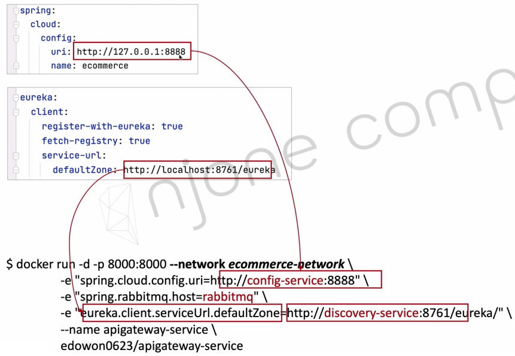

# Linux 서버 기동
팀 장비(inno3t2: 10.250.141.146)에서 기동
- 강의 내용과 동일 방식으로 linux에서 기동
- 원격에서 접속하기 위하야 Port Forward는 4100 ~ 4199번호 구간으로 매핑

## 1. 네트워크 Mapping

외부에서 접속용

| 이름                | 기본 포트 | 설정한 포트 | URL                                             |
|:------------------|:-----:|:------:|:------------------------------------------------|
| rabbitmq          | 15672 |  4101  | http://inno3t2:4101   <BR>(id:guest/pswd:guest) |
| rabbitmq          | 5672  |  4102  ||
| rabbitmq          | 15671 |  4103  ||
| rabbitmq          | 5671  |  4104  ||
| rabbitmq          | 4369  |  4105  ||
| config-service    | 8888  |  4111  | http://inno3t2:4111/ecommerce/default           |
| apigateway-service| 8000  |  4112  | http://inno3t2:4100/           |
| discovery-service | 8761  |  4116  | http://inno3t2:4116/                            |             |
| MariaDB           | 3306  |  4121  | jdbc:mariadb://inno3t2:4121/my-db               |
| Zipkin            | 9411  |  4126  | http://inno3t2:4126/zipkin/                     |
| prometheus        | 9090  |  4131  | http://inno3t2:4131/                            |
| Grafana           | 3000  |  4133  | http://inno3t2:4133/ <BR?admin/admin            |
| user-service      | 8051  |  4151  | user-service debug(별도 확인 필요)                    |


###  centos jdk 버전 변경

1. yum 으로 설치 가능한 jdk 확인
   ```shell
   yum list java*jdk-devel
   ```
2. java-11-openjdk-devel.x86_64 설치
   ```shell
   yum install java-11-openjdk-devel.x86_64
   ```
3. JAVA_HOME 설정
   ```shell
   vi /etc/profile
   
   export JAVA_HOME=/lib/jvm/java-11-openjdk-11.0.10.0.9-1.el7_9.x86_64
   
   source /etc/profile
   
   echo $JAVA_HOME
   
   update-alternatives --config java
   update-alternatives --config javac
   ```

## 2. Centos에서 환경설정한 내용
### 2.1 RabbitMQ 
- 도커 기동
   ```shell
   docker run -d --name rabbitmq --network ecommerce-network \
         -p 4101:15672 -p 4102:5672 -p 4103:15671 -p 4104:5671 -p 4105:4369 \
         -e RABBITMQ_DEFAULT_USER=guest \
         -e RABBITMQ_DEFAULT_PASS=guest \
         rabbitmq:3.11-management
   ```

- 접속 확인
   ```shell
   http://127.0.0.1:15672/
   http://inno3t2:4101/
   guest/guest
   ```
### 2.2 Config Server

1. Maven 설치
   ```shell
   $> sudo yum update
   $> sudo yum install -y maven
   ```

2. 빌드

   ```shell
   $ cd /home/msa2023/inflearn-2022-SpringCloudMSA/workspace/config-service
   $ mvn clean package -DskipTests
   $ docker build -t jcscom13/config-service:1.0 .
   ```

3. run
   ```shell
   $ docker run --rm -d -p 4111:8888 --network ecommerce-network \
     -e "spring.rabbitmq.host=rabbitmq" \
     -e "spring.profiles.active=default" \
     --name config-service jcscom13/config-service:1.0
   ```

4. 확인
   - docker network inspect ecommerce-network
   - http://inno3t2:4111/ecommerce/default
   - http://inno3t2:4111/application/default

### 2.3 Eureka Discovery

1. Dockefile
   ```shell
   FROM openjdk:17-ea-11-jdk-slim
   VOLUME /tmp
   COPY target/discoveryservice-1.0.jar DiscoveryService.jar
   ENTRYPOINT ["java", "-jar", "DiscoveryService.jar"]
   ```
2. docker Build

   ```shell
   $ cd /home/msa2023/inflearn-2022-SpringCloudMSA/workspace/discoveryservice
   $ mvn clean package -DdkipTests
   $ docker build -t jcscom13/discovery-service:1.0 .
   ```

3. run

   ```shell
   $ docker run -d -p 4116:8761 --network ecommerce-network \
     -e "spring.cloud.config.uri=http://config-service:8888" \
     --name discovery-service jcscom13/discovery-service:1.0
   ```
### 2.4 API Gateway

1. DockerFile

   #8051 port는 Remote Debug용으로 추가함 (추가시 space로 구분함)
   EXPOSE 8051
   - 일반영 DockerFile
      ```shell
      FROM openjdk:17-ea-11-jdk-slim
      VOLUME /tmp
      COPY target/apigateway-service-1.0.jar ApigatewayService.jar
      ENTRYPOINT ["java", "-jar", "ApigatewayService.jar"]
      ```

   - Debug용 DockerFileDebug
      ```shell
      FROM openjdk:17-ea-11-jdk-slim
      VOLUME /tmp
      COPY target/apigateway-service-1.0.jar ApigatewayService.jar
      ENTRYPOINT ["java","-agentlib:jdwp=transport=dt_socket,address=*:8051,server=y,suspend=n","-jar","ApigatewayService.jar"]
      EXPOSE 8051
      ```
2. Application.yaml에 Config서버 추가 (당장 사용하는 부분은 없음)
   - 추가 하지 말자 (boot.yaml에 이미 있음-- 혼동) 
   ```yaml
   cloud:
   ##  config:
   #    uri: http://127.0.0.1:8888
   #    name: ecommerce
   ```

3. docker build

   ```shell
   $ mvn clean package -DskipTests
   #일반용
   $ docker build -t jcscom13/apigateway-service:1.0 .   

   # Debug용
   $ docker build -t jcscom13/apigateway-service:1.0  -f DockerfileDebug .   
   ```

4. docker run
   - 
   - 4152 debug 용
   ```shell
   $ docker run -d -p 4112:8000 --network ecommerce-network \
     -p 4152:8051 \
     -e "spring.cloud.config.uri=http://config-service:8888" \
     -e "spring.rabbitmq.host=rabbitmq" \
     -e "eureka.client.service-url.defaultZone=http://discovery-service:8761/eureka/" \
     --name apigateway-service jcscom13/apigateway-service:1.0
   ```
### 2.5 MariaDB

1. DockerFile
   - Dockerfile-MariaDB
   - /home/msa2023/inflearn-2022-SpringCloudMSA/workspace/MariaDB

   ```shell
   FROM mariadb:10.3
   ENV MYSQL_ROOT_PASSWORD rootpwd
   
   WORKDIR /etc/mysql
   RUN mkdir setDB
   WORKDIR /etc/mysql/setDB
   
   #초기 세팅 SQL 파일 Docker로 Copy
   COPY ./setDB.sql /etc/mysql/setDB/setDB.sql
   
   #MariaDB Config Setting (table 소문자, 한국 시간, 한글 깨짐 수정 등)
   RUN echo lower_case_table_names=1 >> /etc/mysql/conf.d/docker.cnf
   RUN echo default-time-zone='+9:00' >> /etc/mysql/conf.d/docker.cnf
   RUN echo collation-server = utf8mb4_unicode_ci >> /etc/mysql/conf.d/docker.cnf
   RUN echo collation-server = utf8mb4_0900_ai_ci >> /etc/mysql/conf.d/docker.cnf
   RUN echo character-set-server = utf8mb4 >> /etc/mysql/conf.d/docker.cnf
   RUN echo skip-character-set-client-handshake >> /etc/mysql/conf.d/docker.cnf
   
   #ENTRYPOINT ["mysqld"]
   ```

2. 이미지 빌드

   ```shell
   $ docker build -t jcscom13/my-mariadb:1.0 -f Dockerfile-MariaDB .
   ```

3. docker run

   ```shell
   $ docker run -d -p 4121:3306 --network ecommerce-network \
     --name my-mariadb jcscom13/my-mariadb:1.0
   ```

4. 빌드 이후 초기 Database 생성

   ```shell
   $ docker exec -it my-mariadb bash
   
   # mysql -hlocalhost -uroot -prootpwd
   CREATE DATABASE my_db ;
   > show databases;
   > use my_db
   > select * from orders;
   
   > grant all privileges on *.* to 'root'@'%' identified by 'rootpwd';
   > flush privileges;
   
   ```

   ```shell
      create table orders (
        id int auto_increment primary key,
        user_id varchar(50) not null, 
        product_id varchar(20) not null,
        order_id varchar(50) not null,
        qty int default 0,
        unit_price int default 0,
        total_price int default 0,
        created_at datetime default now()
      ) 
   
   ```  
### 2.6 Kafka
docker-compose를 이용한 설정
- 참고: https://github.com/wurstmeister/kafka-docker
- $ docker-compose -f docker-compose-single-broker.yml up -d


1. docker-compose-kafka.yml
    - /home/msa2023/inflearn-2022-SpringCloudMSA/workspace/kafka
    - 'networks' 잘 확인하자
    - IP 설정은 처음 보는 부분
       ```yaml
       version: '2'
       services:
         zookeeper:
           image: wurstmeister/zookeeper
           ports:
             - "2181:2181"
           networks: 
             my-network:
               ipv4_address: 172.19.0.100
         kafka:
           # build: .
           image: wurstmeister/kafka
           ports:
             - "9092:9092"
           environment:
             KAFKA_ADVERTISED_HOST_NAME: 172.19.0.101
             KAFKA_CREATE_TOPICS: "test:1:1"
             KAFKA_ZOOKEEPER_CONNECT: zookeeper:2181
           volumes:
             - /var/run/docker.sock:/var/run/docker.sock
           depends_on: 
             - zookeeper
           networks: 
             my-network:
               ipv4_address: 172.19.0.101
       
       networks: 
         my-network:
           external: true
           name: ecommerce-network
       ```
2. 실행

   ```shell
   $ docker-compose -f docker-compose-kafka.yml up -d
   ```

### 2.7 Zipkin
- https://zipkin.io/pages/quickstart

   ```shell
   docker run -d -p 4126:9411  \
      --network ecommerce-network \
      --name zipkin \
       openzipkin/zipkin
   ```

### 2.8 Monitorin

#### prometheus
   ```shell
   docker run --rm -d -p 4131:9090 \
       --network ecommerce-network \
       -v "/home/msa2023/inflearn-2022-SpringCloudMSA/workspace/docker-prometheus/prometheus-docker.yml":/etc/prometheus/prometheus.yml \
       --name prometheus   \
       prom/prometheus
   ```

#### Grafana
- https://grafana.com/grafana/download?platform=docker

   ```shell
   docker run  -d -p 4133:3000 \
       --network ecommerce-network \
       --name=grafana \
       grafana/grafana
   ```

- 초기 비밀번호: admin/admin
### 2.9 Microservices

#### users-service

1. Dockfile
   ```shell
   FROM openjdk:17-ea-11-jdk-slim
   VOLUME /tmp
   COPY target/user-service-1.0.jar UserService.jar
   ENTRYPOINT ["java", "-jar", "UserService.jar"]
   ```

   **Debug 용**
   ```shell
   FROM openjdk:17-ea-11-jdk-slim
   VOLUME /tmp
   COPY target/user-service-1.0.jar UserService.jar
   #ENTRYPOINT ["java", "-jar", "UserService.jar"]
   ENTRYPOINT ["java","-agentlib:jdwp=transport=dt_socket,address=*:8051,server=y,suspend=n","-Djava.security.egd=file:/dev/./urandom","-jar","UserService.jar"]
   
   #8051 port는 Remote Debug용으로 추가함 (추가시 space로 구분함)
   EXPOSE 8051 
   ```

2. build
   ```shell
   $ cd user-service/
   $ mvn clean package -DskipTests
   $ docker build -t=jcscom13/user-service:1.0 -f Dockerfile .
   ```        
3 run
   - 8051 Debug용도로 Port forward했음
   ```shell
   $ docker run --rm  -d --network ecommerce-network \
     --name user-service \
     -p 4151:8051 \
     -e "spring.cloud.config.uri=http://config-service:8888" \
     -e "spring.rabbitmq.host=rabbitmq" \
     -e "spring.zipkin.base-url=http://zipkin:9411" \
     -e "eureka.client.serviceUrl.defaultZone=http://discovery-service:8761/eureka/" \
     -e "logging.file=/api-logs/users-ws.log" \
     jcscom13/user-service:1.0
   ``` 

#### order-service

1. Dockerfile

   ```shell
   FROM openjdk:17-ea-11-jdk-slim
   VOLUME /tmp
   COPY target/order-service-1.0.jar OrderService.jar
   ENTRYPOINT ["java", "-jar", "OrderService.jar"]
   ```

2. build
   ```shell
   $ cd order-service/
   $ mvn clean package -DskipTests
   $ docker build -t=jcscom13/order-service:1.0 -f Dockerfile .
   ```        
3. run
    - 기동후 로그 및 ereka 확인해 보자
   ```shell
   $ docker run --rm --network ecommerce-network \
     --name order-service \
     -e "spring.zipkin.base-url=http://zipkin:9411" \
     -e "eureka.client.serviceUrl.defaultZone=http://discovery-service:8761/eureka/" \
     -e "spring.datasource.url=jdbc:mariadb://my-mariadb:3306/my_db" \
     -e "user.KafkaProducerConfig.BOOTSTRAP_SERVERS_CONFIG=172.19.0.101:9092" \
     -e "logging.file=/api-logs/orders-ws.log" \
     jcscom13/order-service:1.0
   ```
4. mariadb에서 특정 IP가 접속 오류가 발생하는 경우

   ```shell
   $> docker exec -it mariadb bash
   Mysql> mysql -h127.0.0.1 -uroot -p
   $> use mydb;
   $> grant all privileges on *.* to 'root'@'%' identified by 'test1357'
   $> flush privileges
   ```

#### Catalog-service

1. kafka 서버 정보 관련 변경
   - order 서비스와 동일한 방식으로 수정  (강의에서는 hardcoding으로 ip변경했음)
   ```java
   @EnableKafka
   @Configuration
   public class KafkaProducerConfig {
   
       Environment env;
   
       public KafkaProducerConfig (Environment env) {
           this.env    =   env;
       }
   
       @Bean
       public ProducerFactory<String, String> producerFactory() {
           String  BOOTSTRAP_SERVERS = String.format(env.getProperty("user.KafkaProducerConfig.BOOTSTRAP_SERVERS_CONFIG"), "127.0.0.1:9092");
           Map<String, Object> properties = new HashMap<>();
   //        properties.put(ProducerConfig.BOOTSTRAP_SERVERS_CONFIG, "10.200.0.1:9092");
           properties.put(ConsumerConfig.BOOTSTRAP_SERVERS_CONFIG, BOOTSTRAP_SERVERS);  //localhost
   
       }
   
      ...
   }
   ```
    - application.yaml
   ```yaml
   #kafka 서버 정보
   user:
     KafkaProducerConfig:
       BOOTSTRAP_SERVERS_CONFIG: 10.200.0.1:9092
   #    BOOTSTRAP_SERVERS_CONFIG: 172.19.0.101:9092
   ```
2. Dockerfile

   ```shell
   FROM openjdk:17-ea-11-jdk-slim
   VOLUME /tmp
   COPY target/catalog-service-1.0.jar CatalogService.jar
   ENTRYPOINT ["java", "-jar", "CatalogService.jar"]
   ```

3. build
   ```shell
   $ cd catalog-service/
   $ mvn clean package -DskipTests
   $ docker build -t=jcscom13/catalog-service:1.0 -f Dockerfile .
   ```        
4. run

   ```shell
   $ docker run --rm -d --network ecommerce-network \
     --name catalog-service \
     -e "eureka.client.serviceUrl.defaultZone=http://discovery-service:8761/eureka/" \
     -e "user.KafkaProducerConfig.BOOTSTRAP_SERVERS_CONFIG=172.19.0.101:9092" \
     -e "logging.file=/api-logs/catalogs-ws.log" \
     jcscom13/catalog-service:1.0
   ``` 


### 테스트
Postman으로 테스트 ()

- user 등록
- 로그인
- Health (token)
- Welcome
- 주문 등록


##3. Docker-Compopse로 변경