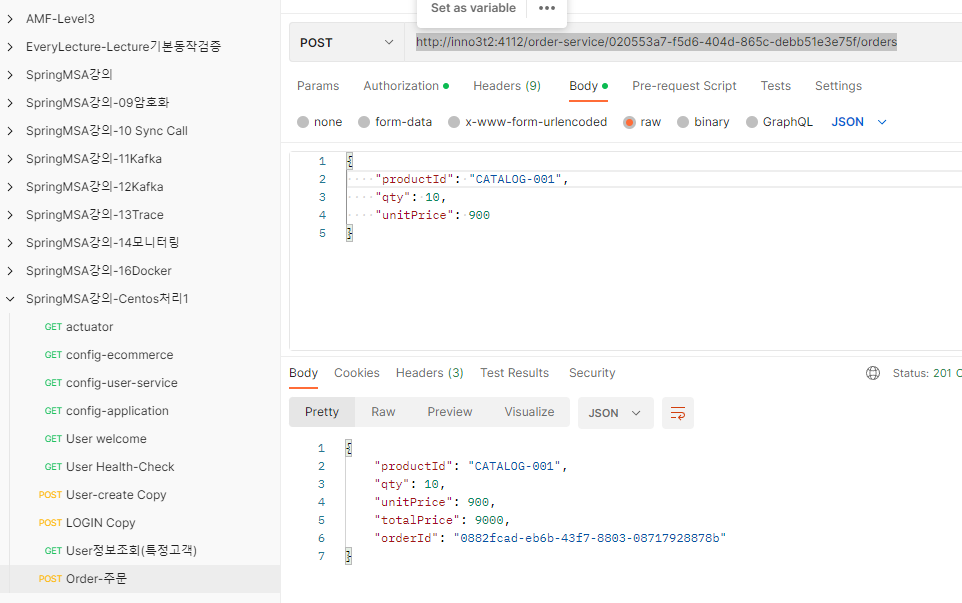

# DockerCompose로 통합
각 환경별 설정이 상이한 부분은 하나의 yaml파일에서 profile로 구분
- default모든 환경에 적용되는 내용
- local, docker, k8s, aws로 구분하여 설정예정
- 개별profile + default를 적용함

## 1. 네트워크 Mapping

외부에서 접속용(변경 내용 없음)

| 이름                 | 기본 포트 | 설정한 포트 | URL                                             |
|:-------------------|:-----:|:------:|:------------------------------------------------|
| rabbitmq           | 15672 |  4101  | http://inno3t2:4101   <BR>(id:guest/pswd:guest) |
| rabbitmq           | 5672  |  4102  ||
| rabbitmq           | 15671 |  4103  ||
| rabbitmq           | 5671  |  4104  ||
| rabbitmq           | 4369  |  4105  ||
| config-service     | 8888  |  4111  | http://inno3t2:4111/ecommerce/default           |
| apigateway-service | 8000  |  4112  | http://inno3t2:4112/???                         |
| discovery-service  | 8761  |  4116  | http://inno3t2:4116/                            | 
| MariaDB            | 3306  |  4121  | jdbc:mariadb://inno3t2:4121/my-db               |
| Zipkin             | 9411  |  4126  | http://inno3t2:4126/zipkin/                     |
| prometheus         | 9090  |  4131  | http://inno3t2:4131/                            |
| Grafana            | 3000  |  4133  | http://inno3t2:4133/ <BR>admin/admin            |
| user-service       | 0(가변) |0(가변)| user-service debug(별도 확인 필요)      |
| order-service      | 0(가변) |0(가변)|       |
| catalog-service    | 0(가변) |0(가변)|       |

## 2. Centos에서 환경설정한 내용
### 2.1 RabbitMQ 
1. docker-compose-rabbitmq.yml
      ```yaml
      version: '2'
      services:
        rabbitmq:
          container_name: rabbitmq
          image: rabbitmq:management
          ports:
            - "4101:15672"
            - "4102:5672"
            - "4103:15671"
            - "4104:5671"
            - "4105:4369"
          environment:
            RABBITMQ_DEFAULT_USER: guest
            RABBITMQ_DEFAULT_PASS: guest
          networks: 
            my-network:
      ```
2. 기동

   ```shell
   $ docker-compose -f docker-compose-rabbitmq.yml up -d
   ```

3. 접속 확인
   ```shell                 
   #해당서버
   http://127.0.0.1:15672/  
   #노트북(or 외부)
   http://inno3t2:4101/
   guest/guest
   ```
### 2.2 Config Server

1. Maven 설치(한번만)
   ```shell
   $ sudo yum update
   $ sudo yum install -y maven
   ```

2. 설정 내용
   - application.yml 
      ```yaml
      spring:
        profiles:
          group:
            "docker": "docker_profile, default_profile"
            "local": "local_profile, default_profile"
      ---
      spring.config.activate.on-profile: default_profile
      server:
        port: 8888
      
      spring:
        application:
          name: config-service
        rabbitmq:
          host: 127.0.0.1
        cloud:
          config:
            server:
              git:
                uri: https://github.com/myinno/spring-cloud-config
      ---
      #Local Exec
      spring.config.activate.on-profile: local_profile
      
      spring:
        rabbitmq:
          host: 127.0.0.1
      ---
      #Docker
      spring.config.activate.on-profile: docker_profile
      
      spring:
        rabbitmq:
          host: rabbitmq
      ```
   - bootstrap.yml
      ```yaml
      spring:
         profiles:
            group:
               "docker": "docker_profile, default_profile"
               "local": "local_profile, default_profile"
      ---
      spring.config.activate.on-profile: default_profile
      ---
      spring.config.activate.on-profile: local_profile
      
      encrypt:
         #  key: abcdefghijklmnopqrstuvwxyz0123456789
         key-store:
            location: file:///d:\APP\@inflearn\inflearn-2022-SpringCloudMSA\keystore\apiEncryptionKey.jks
      ---
      spring.config.activate.on-profile: docker_profile
      
      encrypt:
         #  key: abcdefghijklmnopqrstuvwxyz0123456789
         key-store:
            location: file:///apiEncryptionKey.jks
      ```  

3. 빌드

   ```shell
   $ cd /home/msa2023/inflearn-2022-SpringCloudMSA/workspace/config-service
   $ mvn clean package -DskipTests
   $ docker build -t msa2023/config-service:1.0 .
   $ docker push msa2023/config-service:1.0 
   ```
4. run
   ```shell
   $ docker-compose -f docker-compose-config.yml up
   ```
5. 확인
   - docker network inspect ecommerce-network
   - http://inno3t2:4111/ecommerce/default
   - http://inno3t2:4111/application/default

### 2.3 Eureka Discovery

1. Dockefile
   ```shell
   FROM openjdk:17-ea-11-jdk-slim
   VOLUME /tmp
   COPY target/discoveryservice-1.0.jar DiscoveryService.jar
   ENTRYPOINT ["java", "-jar", "DiscoveryService.jar"]
   ```
2. Application.yaml
      ```yaml
      spring:
        profiles:
          group:
            "docker": "docker_profile, default_profie"
            "local": "local_profile, default_profie"
      ---
      spring.config.activate.on-profile: default_profie
      server:
        port: 8761
      
      spring:
        application:
          name: discoveryservice
      ---
      #Local Exec
      spring.config.activate.on-profile: local_profie
      
      spring:
        cloud:
          config:
            uri: http://127.0.0.1:8888
            name: ecommerce
      ---
      #Docker
      spring.config.activate.on-profile: docker_profie
      spring:
        cloud:
          config:
            uri: http://config-service:8888
            name: ecommerce
      ```

3. docker Build

   ```shell
   $ cd /home/msa2023/inflearn-2022-SpringCloudMSA/workspace/discoveryservice
   $ mvn clean package -DskipTests
   $ docker build -t msa2023/discovery-service:1.0 . 
   $ docker push msa2023/discovery-service:1.0
   ```
3. run

   ```shell
   $ docker-compose -f docker-compose-discovery.yml up -d
   ```

### 2.4 API Gateway

1. DockerFile

   #8051 port는 Remote Debug용으로 추가함 (추가시 space로 구분함)
   EXPOSE 8051
   - 일반용 DockerFile
      ```shell
      FROM openjdk:17-ea-11-jdk-slim
      VOLUME /tmp
      COPY target/apigateway-service-1.0.jar ApigatewayService.jar
      ENTRYPOINT ["java", "-jar", "ApigatewayService.jar"]
      ```

   - Debug용 DockerFileDebug
      ```shell
      FROM openjdk:17-ea-11-jdk-slim
      VOLUME /tmp
      COPY target/apigateway-service-1.0.jar ApigatewayService.jar
      ENTRYPOINT ["java","-agentlib:jdwp=transport=dt_socket,address=*:8051,server=y,suspend=n","-jar","ApigatewayService.jar"]
      EXPOSE 8051
      ```
2. application.yaml 
   ```yaml
   spring:
      profiles:
         group:
            "docker": "docker_profile, default_profie"
            "local": "local_profile, default_profie"
   ---
   spring.config.activate.on-profile: default_profie
   
   server:
      port: 8000
   spring:
      application:
         name: apigateway-service
      cloud:
         gateway:
            default-filters:
               - name: GlobalFilter
                 args:
                    baseMessage: Spring Cloud BaseMessage GlobalFilter
                    preLogger: true
                    postLogger: true
            routes:
               - id: user-service
                 uri: lb://USER-SERVICE
                 predicates:
                    - Path=/user-service/login
                    - Method=POST
                 filters:
                    - RemoveRequestHeader=Cookie
                    - RewritePath=/user-service/(?<segment>.*), /$\{segment}
               ....
   ---
   #Local Exec
   spring.config.activate.on-profile: local_profile
   spring:
      rabbitmq:
         host: 127.0.0.1
   eureka:
      client:
         service-url:
            defaultZone: http://localhost:8761/eureka
   ---
   #Docker
   spring.config.activate.on-profile: docker_profile
   
   spring:
      rabbitmq:
         host: rabbitmq
   eureka:
      client:
         service-url:
            defaultZone: http://discovery-service:8761/eureka/
   ```
3. docker build

   ```shell
   $ mvn clean package -DskipTests
   #일반용
   $ docker build -t msa2023/apigateway-service:1.0 .     
   $ docker push msa2023/apigateway-service:1.0
   

   # Debug용
   $ docker build -t msa2023/apigateway-service:1.0  -f DockerfileDebug .   
   $ docker push msa2023/apigateway-service:1.0
   ```
5. docker-compose
   - Run: docker-compose -f docker-compose-apigateway.yml up   
      ```yaml
      version: '2'
      services:
        apigateway-service:
          container_name: apigateway-service
          image: msa2023/apigateway-service:1.0
          ports:
            - "4112:8000"
          environment:
            - spring.profiles.active=docker
      ```
### 2.5 MariaDB

1. DockerFile
   - Dockerfile-MariaDB
   - /home/msa2023/inflearn-2022-SpringCloudMSA/workspace/MariaDB

   ```shell
   FROM mariadb:10.3
   ENV MYSQL_ROOT_PASSWORD rootpwd
   
   WORKDIR /etc/mysql
   RUN mkdir setDB
   WORKDIR /etc/mysql/setDB
   
   #초기 세팅 SQL 파일 Docker로 Copy
   COPY ./setDB.sql /etc/mysql/setDB/setDB.sql
   
   #MariaDB Config Setting (table 소문자, 한국 시간, 한글 깨짐 수정 등)
   RUN echo lower_case_table_names=1 >> /etc/mysql/conf.d/docker.cnf
   RUN echo default-time-zone='+9:00' >> /etc/mysql/conf.d/docker.cnf
   RUN echo collation-server = utf8mb4_unicode_ci >> /etc/mysql/conf.d/docker.cnf
   RUN echo collation-server = utf8mb4_0900_ai_ci >> /etc/mysql/conf.d/docker.cnf
   RUN echo character-set-server = utf8mb4 >> /etc/mysql/conf.d/docker.cnf
   RUN echo skip-character-set-client-handshake >> /etc/mysql/conf.d/docker.cnf
   
   #ENTRYPOINT ["mysqld"]
   ```

2. 이미지 빌드

   ```shell
   $ docker build -t msa2023/my-mariadb:1.0 -f Dockerfile-MariaDB .  
   $ docker push  msa2023/my-mariadb:1.0
   ```
3. DockerCompose

      ```yaml
      version: '2'
      
      #DB내용을 유지하기 위하여
      volumes:
        mariadb-volume: {}
      
      services:
        mariadb:
          image: msa2023/my-mariadb:1.0
          ports:
            - "4121:3306"
          volumes:
            - mysql-volume:/var/lib/mysql
          networks:
            my-network:
      ```
4. docker run

   ```shell
   $ docker-compose -f docker-compose-mariadb.yaml up -d
   ```

5. 빌드 이후 초기 Database 생성

   ```shell
   $ docker exec -it my-mariadb bash
   
   # mysql -hlocalhost -uroot -prootpwd
   CREATE DATABASE my_db ;
   > show databases;
   > use my_db
   > select * from orders;
   
   > grant all privileges on *.* to 'root'@'%' identified by 'rootpwd';
   > flush privileges;
   
   ```

   ```shell
      create table orders (
        id int auto_increment primary key,
        user_id varchar(50) not null, 
        product_id varchar(20) not null,
        order_id varchar(50) not null,
        qty int default 0,
        unit_price int default 0,
        total_price int default 0,
        created_at datetime default now()
      ) 
   
   ```  
### 2.6 Kafka
docker-compose를 이용한 설정
- 참고: https://github.com/wurstmeister/kafka-docker
- $ docker-compose -f docker-compose-single-broker.yml up -d

1. docker-compose-kafka.yml
    - /home/msa2023/inflearn-2022-SpringCloudMSA/workspace/kafka
    - 'networks' 잘 확인하자
    - IP 설정은 처음 보는 부분
       ```yaml
       version: '2'
       services:
         zookeeper:
           container_name: zookeeper
           image: wurstmeister/zookeeper
           ports:
             - "2181:2181"
           networks: 
             my-network:
               ipv4_address: 172.19.0.100
         kafka:
           container_name: kafka
           image: wurstmeister/kafka
           ports:
             - "9092:9092"
           environment:
             KAFKA_ADVERTISED_HOST_NAME: 172.19.0.101
             KAFKA_CREATE_TOPICS: "test:1:1"
             KAFKA_ZOOKEEPER_CONNECT: zookeeper:2181
           volumes:
             - /var/run/docker.sock:/var/run/docker.sock
           depends_on: 
             - zookeeper
           networks: 
             my-network:
               ipv4_address: 172.19.0.101
       
       networks: 
         my-network:
           external: true
           name: ecommerce-network
       ```
2. 실행

   ```shell
   $ docker-compose -f docker-compose-kafka.yml up -d
   ```

### 2.7 Zipkin
- https://zipkin.io/pages/quickstart

   ```shell
   docker run -d -p 4126:9411  \
      --network ecommerce-network \
      --name zipkin \
       openzipkin/zipkin
   ```

### 2.8 Monitorin

#### prometheus
   ```shell
   docker run --rm -d -p 4131:9090 \
       --network ecommerce-network \
       -v "/home/msa2023/inflearn-2022-SpringCloudMSA/workspace/docker-prometheus/prometheus-docker.yml":/etc/prometheus/prometheus.yml \
       --name prometheus   \
       prom/prometheus
   ```

#### Grafana
- https://grafana.com/grafana/download?platform=docker

   ```shell
   docker run  -d -p 4133:3000 \
       --network ecommerce-network \
       --name=grafana \
       grafana/grafana
   ```

- 초기 비밀번호: admin/admin
### 2.9 Microservices

#### users-service

1. Dockfile
   ```shell
   FROM openjdk:17-ea-11-jdk-slim
   VOLUME /tmp
   COPY target/user-service-1.0.jar UserService.jar
   ENTRYPOINT ["java", "-jar", "UserService.jar"]
   ```

   **Debug 용**
   ```shell
   FROM openjdk:17-ea-11-jdk-slim
   VOLUME /tmp
   COPY target/user-service-1.0.jar UserService.jar
   #ENTRYPOINT ["java", "-jar", "UserService.jar"]
   ENTRYPOINT ["java","-agentlib:jdwp=transport=dt_socket,address=*:8051,server=y,suspend=n","-Djava.security.egd=file:/dev/./urandom","-jar","UserService.jar"]
   
   #8051 port는 Remote Debug용으로 추가함 (추가시 space로 구분함)
   EXPOSE 8051 
   ```
   - application.yaml (주요 URL만 표시)

      ```yaml
      spring:
        profiles:
          group:
            "local": "local_profile, default_profile"
            "docker": "docker_profile, default_profile"
      ---
      spring.config.activate.on-profile: "default_profile"
      server:
        port: 0
      spring:
        application:
          name: user-service
        sleuth:
          sampler:
            probability: 1.0
      ..
      ---
      spring.config.activate.on-profile: "local_profile"
      
      spring:
        zipkin:
          base-url: http://127.0.0.1:9411
        rabbitmq:
          host: 127.0.0.1
      eureka:
        client:
          service-url:
            defaultZone: http://localhost:8761/eureka
      
      ---
      # Docker
      spring.config.activate.on-profile: docker_profile
      
      spring:
        zipkin:
          base-url: http://zipkin:9411
        rabbitmq:
          host: rabbitmq
      
      eureka:
        client:
          service-url:
            defaultZone: http://discovery-service:8761/eureka/
      ```

2. build
   ```shell
   $ cd user-service/
   $ mvn clean package -DskipTests
   $ docker build -t=msa2023/user-service:1.0 -f Dockerfile .
   $ docker push msa2023/user-service:1.0
   ```        
3. run
   - 8051 Debug용도로 Port forward했음
   ```shell
   $ docker-compose -f docker-compose-app-user-service.yml up -d

   ``` 

#### order-service

1. Dockerfile

   ```shell
   FROM openjdk:17-ea-11-jdk-slim
   VOLUME /tmp
   COPY target/order-service-1.0.jar OrderService.jar
   ENTRYPOINT ["java", "-jar", "OrderService.jar"]
   ```

2. build
   ```shell
   $ cd order-service/
   $ mvn clean package -DskipTests
   $ docker build -t msa2023/order-service:1.0 -f Dockerfile .
   $ docker push msa2023/order-service:1.0
   ```        
3. run
    - 기동후 로그 및 eureka 확인해 보자
   ```shell            
   $ docker-compose -f docker-compose-app-user-service.yml up -d
   ```


#### Catalog-service

1. application.yml 설정 내용

   ```yaml
   spring:
     profiles:
       group:
         "docker": "docker_profile, default_profile"
         "local": "local_profile, default_profile"
   ---
   # 공통 적용 대상
   spring.config.activate.on-profile: default_profile
   
   spring: ...
   ---
   #Local Exec
   spring.config.activate.on-profile: local_profile
   
   eureka:
     client:
       service-url:
         defaultZone: http://127.0.0.1:8761/eureka
   
   #kafka 서버 정보
   user:
     KafkaProducerConfig:
       BOOTSTRAP_SERVERS_CONFIG: 10.200.0.1:9092
   ---
   #Docker
   spring.config.activate.on-profile: docker_profile
   
   eureka:
     client:
       service-url:
         defaultZone: http://discovery-service:8761/eureka/
   
   #kafka 서버 정보
   user:
     KafkaProducerConfig:
       BOOTSTRAP_SERVERS_CONFIG: 172.19.0.101:9092
   ```

2. Dockerfile

   ```shell
   FROM openjdk:17-ea-11-jdk-slim
   VOLUME /tmp
   COPY target/catalog-service-1.0.jar CatalogService.jar
   ENTRYPOINT ["java", "-jar", "CatalogService.jar"]
   ```

3. build
   ```shell
   $ cd catalog-service/
   $ mvn clean package -DskipTests
   $ docker build -t=msa2023/catalog-service:1.0 -f Dockerfile . 
   $ docker push msa2023/catalog-service:1.0
   $ docker-compose -f docker-compose-app-catalog-service.yml up -d
   ```        

### 테스트
Postman으로 테스트 ()

| 제목 | URL |
| :---- | :---- |
|actuator|http://inno3t2:4112/user-service/actuator|
|config-ecommerce|http://inno3t2:4111/ecommerce/default|
|User welcome|http://inno3t2:4112/user-service/welcome|
|User Health-Check|http://inno3t2:4112/user-service/welcome|
|User-create|http://inno3t2:4112/user-service/users|
|LOGIN |http://inno3t2:4112/user-service/login|
|User정보조회(특정고객)|http://inno3t2:4112/user-service/users/020553a7-f5d6-404d-865c-debb51e3e75f|
|Order-주문|http://inno3t2:4112/order-service/020553a7-f5d6-404d-865c-debb51e3e75f/orders|

- 

## 3. Docker-Compopse 통합
인프라/app 으로 분류하여 통합