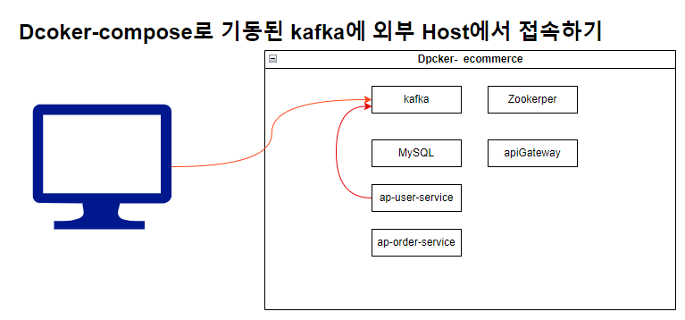
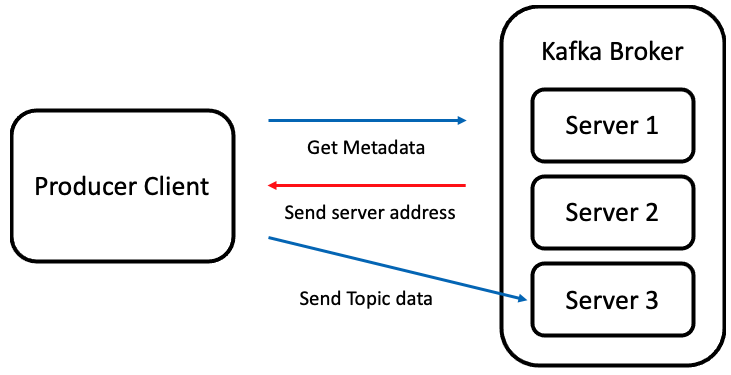
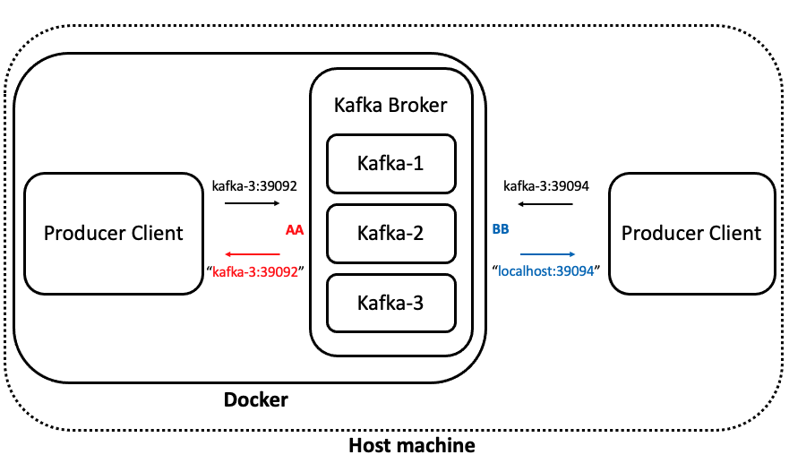
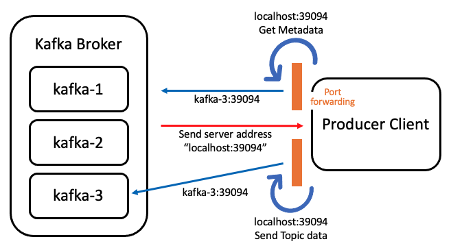

<style>
.burk {
background-color: red;
color: yellow;
display:inline-block;
}
</style>


# B. Kafka listener 설정
[Docker로 Kafka 구성 시 Host machine과 통신하기 위한 listener 설정 방법](https://taaewoo.tistory.com/59)
- Hadoop Ecosystem/Kafka
- 2022.05.16

관련 글
- [Spark structured streaming으로 Kafka topic 받기 #1 - Kafka 클러스터 구성하기](https://taaewoo.tistory.com/28)
- [Spark structured streaming으로 Kafka topic 받기 #2 - Spark 및 Hadoop 서비스 실행하기](https://taaewoo.tistory.com/29)
- [Spark structured streaming으로 Kafka topic 받기 #3 - pyspark로 HDFS에 topic data 저장하기](https://taaewoo.tistory.com/32)

## 1. Host machine과 통신

Docker로 Kafka 클러스터를 구성했을 때 <span class=burk> Host machine에서 Topic을 Produce 할 수 있는 방법</span>
- 기본: Kafka 클러스터를 Docker로 구성하고 Container 내부에서 Produce
- 하지만 Docker Compose로 구성된 Container들이 아닌 현재 Docker를 실행하고 있는 Host machine, 즉 외부에서 Kafka Broker에게 Produce를 하려고 하니 여러 가지 문제발생
  - 

### 1.1 Kafka의 Produce 과정

Kafka Producer가 Broker에게 데이터를 전달하는 과정
- 단순히 topic 데이터만을 Kafka Broker에게 전송하면 된다고 생각하겠지만, 
- 내부적으로 여러 과정이 있습니다. 기본적으로 아래 그림과 같은 순서대로 진행.
- 

  1. topic이 저장된 위치를 알기 위해 Metadata를 Kafka Broker 중 하나에게 요청
  2. 요청을 받은 Broker는 Client가 원하는 topic이 위치한 서버 리스트를 전송
  3. Client는 Broker로부터 받은 서버 리스트를 참고해서, 서버에 직접 접근 및 데이터 전송

### 1.2 listeners 및 advertised.listeners 설정

Docker로 구성된 Kafka 클러스터에서는 
- 각 Broker가 hostname을 포함하여 서로의 정보들을 사전에 알고 있습
- 클러스터 내부에서 Produce / Consume을 진행해도 Broker는 간편하게 hostname과 port를 반환해주면 됩
- 외부에서 Kafka 클러스터에 접근할 때
  - 각 Broker의 hostname을 반환해주더라도 외부에서는 해당 hostname의 정보를 가지고 있지 않기 때문에 오류 발생
  ```shell
  Name or service not known : kafka-1 : Could not resolve host name.
  ```
  - 그래서 Kafka는 옵션 값 설정을 통해 내부 / 외부 통신 시 구분해서 서버 주소를 반환해줄 수 있습
    - <span class=burk>"server.properties"</span> 파일에서 설정 가능합니다.

      ```shell
      - listeners : Kafka가 서비스를 제공하는 주소(다수 등록 가능)
      - advertised.listeners : Client에게 Metadata와 함께 반환할 서버 주소
      ```
  - 예시
    - Docker로 Kafka 클러스터 구성 시 docker-compose.yml에 작성하는 내용
      - Host machine과 Docker container는 39092:39092, 39094:39094로 각 서비스 port에 맞게 port forwarding을 진행
      - 

        ```shell
        KAFKA_LISTENER_SECURITY_PROTOCOL_MAP : AA:PLAINTEXT, BB:PLAINTEXT
        KAFKA_LISTENERS : AA://kafka-3:39092, BB://kafka-3:39094
        KAFKA_ADVERTISED_LISTENERS : AA://kafka-3:39092, BB://localhost:39094
        KAFKA_INTER_BROKER_LISTENER_NAME : AA
        ```  
        - "KAFKA_LISTENER_SECURITY_PROTOCOL_MAP" 
          - 값을 통해서 구분하고 싶은 네트워크 추가와 보안 프로토콜을 정dml
          - 보안 프로토콜은 PLAINTEXT, SSL, SASL 등 여러 가지가 있고 {listener 이름}:{보안 프로토콜} 형식으로 작성
          - 위의 예시에서는 "AA"와 "BB"라는 이름의 listener를 추가
        - "KAFKA_LISTENERS" 
          - 등록 한 listener마다 서버 주소를 설정해줌으로써 어떤 네트워크를 사용했는지 Kafka가 구분할 수 있습
          - 예시와 같이 설정이 되었을 때, "kafka-3" hostname에 39092 port로 들어온 서비스는 이제 AA listener로 구분
        - "KAFKA_ADVERTISED_LISTENERS" 
          - listener에 맞게 다시 Client에게 반환시킬 서버 주소
          - Client는 이 서버 주소를 받아 직접 Topic을 produce / consume 함
          - 예시에서는 AA를 Docker 내부 통신을 의도했기 때문에 Client에게 hostname을 포함한 주소를 반환해줘도 Client는 해당 hostname을 사전에 알고 있습
          - 하지만 BB는 Docker 외부, 즉 Host machine과 통신을 의도했기 때문에, hostname 대신 localhost를 적었습니다. Host machine은 Docker container와 통신하려면 port forwarding 된 localhost를 사용해야 하기 때문
        - "KAFKA_INTER_BROKER_LISTENER_NAME" 
          - Kafka가 사전에 내부 통신을 위한 listener가 어떤 이름인지 알 수 있습니다,
    - KAFKA_LISTENERS에 모두 'kafka-3'를 설정한 이유
      - Host machine은 Kafka broker의 hostname을 모르기 때문에 localhost로 반환해주는 것인데, 외부 통신을 의도한 BB listener는 "kafka-3"이라는 hostname을 직접 명시했을까요? 
      - 위의 그림과 설정에서는 Host machine과 Docker container 간의 port forwarding 과정이 빠져있기 때문입
      - Kafka 클러스터와 Host machine의 Producer Client만 다시 분리해서 port forwarding 과정을 추가하면 아래 그림과 같습니다.
        - 

    - Kafka Broker 입장에서는 Host machine과 Docker container 간의 port forwarding은 중요하지 않습니다. 단지 자신에게 들어오는 최종적인 요청 값만 고려하기 때문.

### 1.3 Kafka 클러스터 docker-compose.yml

Zookeeper 3개, Kafka 3개 Docker container를 생성하는 docker-compose.yml 예시
- Docker 내부 통신, 외부 통신(Host machine) 설정이 되어있습
- 만약 Producer / Consumer가 Host machine이 아닌 외부 서버에 위치한다면 listeners와 advertised.listeners를 추가적으로 설정해야 함


```yaml
version: '2'
services:
  zookeeper-1:
    image: confluentinc/cp-zookeeper:latest
    hostname: zookeeper-1
    ports:
      - "12181:12181"
    environment:
      ZOOKEEPER_SERVER_ID: 1
      ZOOKEEPER_CLIENT_PORT: 12181
      ZOOKEEPER_TICK_TIME: 2000
      ZOOKEEPER_INIT_LIMIT: 5
      ZOOKEEPER_SYNC_LIMIT: 2
      ZOOKEEPER_SERVERS: zookeeper-1:12888:13888;zookeeper-2:22888:23888;zookeeper-3:32888:33888

  zookeeper-2:
    image: confluentinc/cp-zookeeper:latest
    hostname: zookeeper-2
    ports:
      - "22181:12181"
    environment:
      ZOOKEEPER_SERVER_ID: 2
      ZOOKEEPER_CLIENT_PORT: 12181
      ZOOKEEPER_TICK_TIME: 2000
      ZOOKEEPER_INIT_LIMIT: 5
      ZOOKEEPER_SYNC_LIMIT: 2
      ZOOKEEPER_SERVERS: zookeeper-1:12888:13888;zookeeper-2:22888:23888;zookeeper-3:32888:33888

  zookeeper-3:
    image: confluentinc/cp-zookeeper:latest
    hostname: zookeeper-3
    ports:
      - "32181:12181"
    environment:
      ZOOKEEPER_SERVER_ID: 3
      ZOOKEEPER_CLIENT_PORT: 12181
      ZOOKEEPER_TICK_TIME: 2000
      ZOOKEEPER_INIT_LIMIT: 5
      ZOOKEEPER_SYNC_LIMIT: 2
      ZOOKEEPER_SERVERS: zookeeper-1:12888:13888;zookeeper-2:22888:23888;zookeeper-3:32888:33888

  kafkacat:
    image: confluentinc/cp-kafkacat
    command: sleep infinity

  kafka-1:
    image: confluentinc/cp-kafka:latest
    ports:
      - "19092:19092"
      - "19094:19094"
    depends_on:
      - zookeeper-1
      - zookeeper-2
      - zookeeper-3
    environment:
      KAFKA_BROKER_ID: 1
      KAFKA_ZOOKEEPER_CONNECT: zookeeper-1:12181,zookeeper-2:12181,zookeeper-3:12181
      KAFKA_LISTENERS: INTERNAL://kafka-1:19092,EXTERNAL://kafka-1:19094
      KAFKA_ADVERTISED_LISTENERS: INTERNAL://kafka-1:19092,EXTERNAL://localhost:19094
      KAFKA_LISTENER_SECURITY_PROTOCOL_MAP: INTERNAL:PLAINTEXT,EXTERNAL:PLAINTEXT
      KAFKA_INTER_BROKER_LISTENER_NAME: INTERNAL

  kafka-2:
    image: confluentinc/cp-kafka:latest
    ports:
      - "29092:29092"
      - "29094:29094"
    depends_on:
      - zookeeper-1
      - zookeeper-2
      - zookeeper-3
    environment:
      KAFKA_BROKER_ID: 2
      KAFKA_ZOOKEEPER_CONNECT: zookeeper-1:12181,zookeeper-2:12181,zookeeper-3:12181
      KAFKA_LISTENERS: INTERNAL://kafka-2:29092,EXTERNAL://kafka-2:29094
      KAFKA_ADVERTISED_LISTENERS: INTERNAL://kafka-2:29092,EXTERNAL://localhost:29094
      KAFKA_LISTENER_SECURITY_PROTOCOL_MAP: INTERNAL:PLAINTEXT,EXTERNAL:PLAINTEXT
      KAFKA_INTER_BROKER_LISTENER_NAME: INTERNAL
    
  kafka-3:
    image: confluentinc/cp-kafka:latest
    ports:
      - "39092:39092"
      - "39094:39094"
    depends_on:
      - zookeeper-1
      - zookeeper-2
      - zookeeper-3
    environment:
      KAFKA_BROKER_ID: 3
      KAFKA_ZOOKEEPER_CONNECT: zookeeper-1:12181,zookeeper-2:12181,zookeeper-3:12181
      KAFKA_LISTENERS: INTERNAL://kafka-3:39092,EXTERNAL://kafka-3:39094
      KAFKA_ADVERTISED_LISTENERS: INTERNAL://kafka-3:39092,EXTERNAL://localhost:39094
      KAFKA_LISTENER_SECURITY_PROTOCOL_MAP: INTERNAL:PLAINTEXT,EXTERNAL:PLAINTEXT
      KAFKA_INTER_BROKER_LISTENER_NAME: INTERNAL
```
 
## 2.사내개발장비에 설정한 내용
위 내용을 참조하여 설정한 내용
- inno3t2는 docker-compose를  수행한 host Machine
- 사용은 별도의 서버(개인용 노트북)에서 이용

```yaml
version: '2'

services:
  zookeeper:
    container_name: zookeeper
    image: confluentinc/cp-zookeeper:latest
    mem_limit: 200m
    environment:
      ZOOKEEPER_CLIENT_PORT: 2181
      ZOOKEEPER_TICK_TIME: 2000
    ports:
      - 2181:2181
    networks: 
      my-network:
        ipv4_address: 172.19.0.100

  kafka_inno3t2:
    container_name: kafka
    image: confluentinc/cp-kafka:latest
    mem_limit: 500m
    depends_on:
      - zookeeper
    ports:
      - "4192:4192"
#      - "4193:9092"
    environment:
      KAFKA_ZOOKEEPER_CONNECT: zookeeper:2181

      KAFKA_LISTENERS: "EXTERNAL://:4192, INTERNAL://kafka:9092"
      KAFKA_ADVERTISED_LISTENERS: "EXTERNAL://10.250.141.146:4192, INTERNAL://kafka:9092"
      KAFKA_LISTENER_SECURITY_PROTOCOL_MAP: "EXTERNAL:PLAINTEXT, INTERNAL:PLAINTEXT"
      KAFKA_INTER_BROKER_LISTENER_NAME: INTERNAL

#      KAFKA_LISTENERS: EXTERNAL_SAME_HOST://:29092,EXTERNAL_DIFFERENT_HOST://:4192,INTERNAL://:9092
#      KAFKA_ADVERTISED_LISTENERS: INTERNAL://kafka:9092,EXTERNAL_SAME_HOST://localhost:29092,EXTERNAL_DIFFERENT_HOST://10.250.141.157:4192
#      KAFKA_LISTENER_SECURITY_PROTOCOL_MAP: INTERNAL:PLAINTEXT,EXTERNAL_SAME_HOST:PLAINTEXT,EXTERNAL_DIFFERENT_HOST:PLAINTEXT
#      KAFKA_INTER_BROKER_LISTENER_NAME: INTERNAL

      KAFKA_OFFSETS_TOPIC_REPLICATION_FACTOR: 1

    volumes:
      - /var/run/docker.sock:/var/run/docker.sock
    networks:
      my-network:
        ipv4_address: 172.19.0.101      

networks: 
  my-network:
    external: true
    name: ecommerce-network
```

## References

- https://rmoff.net/2018/08/02/kafka-listeners-explained/
- https://github.com/rmoff/kafka-listeners/blob/master/docker-compose.yml
- https://www.confluent.io/blog/kafka-client-cannot-connect-to-broker-on-aws-on-docker-etc/?utm_source=github&utm_medium=rmoff&utm_campaign=ty.community.con.rmoff-listeners&utm_term=rmoff-devx
- https://www.confluent.io/blog/kafka-listeners-explained/?utm_source=github&utm_medium=rmoff&utm_campaign=ty.community.con.rmoff-listeners&utm_term=rmoff-devx