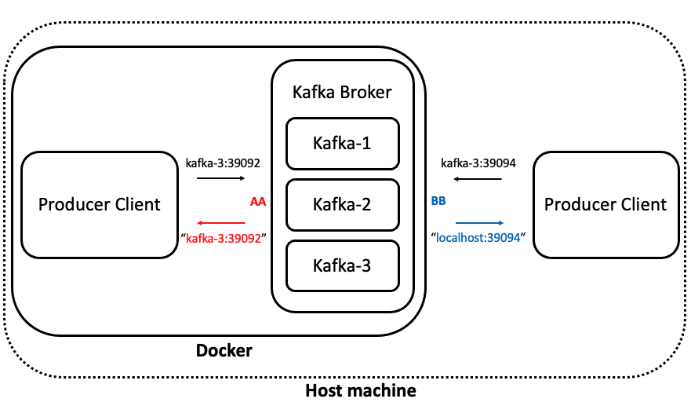

clear

# B. Kafka listener 설정
https://taaewoo.tistory.com/59
- Hadoop Ecosystem/Kafka
- 2022. 5. 16. 01:44

관련 글
[Spark structured streaming으로 Kafka topic 받기 #1 - Kafka 클러스터 구성하기](https://taaewoo.tistory.com/28)

[Spark structured streaming으로 Kafka topic 받기 #2 - Spark 및 Hadoop 서비스 실행하기](https://taaewoo.tistory.com/29)

[Spark structured streaming으로 Kafka topic 받기 #3 - pyspark로 HDFS에 topic data 저장하기](https://taaewoo.tistory.com/32)

## B. Docker로 Kafka 구성 시 Host machine과 통신하기 위한 listener 설정 방법

이번 글에서는 Docker로 Kafka 클러스터를 구성했을 때 Host machine에서 Topic을 Produce 할 수 있는 방법을 소개하겠습니다. 위의 관련 글에서처럼 Kafka 클러스터를 Docker로 구성하고 Container 내부에서 Produce하는 것은 쉽게 할 수 있었습니다. 하지만 Docker Compose로 구성된 Container들이 아닌 현재 Docker를 실행하고 있는 Host machine, 즉 외부에서 Kafka Broker에게 Produce를 하려고 하니 여러 가지 문제들이 있었습니다.

Kafka의 Produce 과정

Kafka Producer가 Broker에게 데이터를 전달하는 과정부터 먼저 알아야합니다. 단순히 topic 데이터만을 Kafka Broker에게 전송하면 된다고 생각하겠지만, 내부적으로 여러 과정이 있습니다. 기본적으로 아래 그림과 같은 순서대로 진행됩니다.

Producer Client는 처음부터 Topic data를 보내는 것이 아니라 topic이 저장된 위치를 알기 위해 Metadata를 Kafka Broker 중 하나에게 요청합니다. 요청을 받은 Broker는 Client가 원하는 topic이 위치한 서버 리스트를 보내줍니다. 그리고 최종적으로 Client는 Broker로부터 받은 서버 리스트를 참고해서, 서버에 직접 접근 및 데이터 전송을 합니다.

listeners 및 advertised.listeners 설정

Docker로 구성된 Kafka 클러스터에서는 각 Broker가 hostname을 포함하여 서로의 정보들을 사전에 알고 있습니다. 그래서 클러스터 내부에서 Produce / Consume을 진행해도 Broker는 간편하게 hostname과 port를 반환해주면 됩니다. 하지만 문제는 외부에서 Kafka 클러스터에 접근할 때입니다. 각 Broker의 hostname을 반환해주더라도 외부에서는 해당 hostname의 정보를 가지고 있지 않기 때문에  아마 아래와 비슷한 에러가 발생할 겁니다.

Name or service not known : kafka-1 : Could not resolve host name.

그래서 Kafka는 옵션 값 설정을 통해 내부 / 외부 통신 시 구분해서 서버 주소를 반환해줄 수 있습니다. 해당 설정은 "server.properties" 파일에서 설정 가능합니다.

    - listeners : Kafka가 서비스를 제공하는 주소 ( 다수 등록 가능 )

    - advertised.listeners : Client에게 Metadata와 함께 반환할 서버 주소

단순히 옵션만 보면 각각 어떤 역할을 하는지 모를 수 있습니다. 아래의 예시를 통해 설명드리겠습니다. 아래 예시는 Docker로 Kafka 클러스터 구성 시 docker-compose.yml에 작성하는 내용입니다. 참고로 Host machine과 Docker container는 39092:39092, 39094:39094로 각 서비스 port에 맞게 port forwarding을 진행했습니다.
- 
  
  - KAFKA_LISTENER_SECURITY_PROTOCOL_MAP : AA:PLAINTEXT, BB:PLAINTEXT
  - KAFKA_LISTENERS : AA://kafka-3:39092, BB://kafka-3:39094
  - KAFKA_ADVERTISED_LISTENERS : AA://kafka-3:39092, BB://localhost:39094
  - KAFKA_INTER_BROKER_LISTENER_NAME : AA

"KAFKA_LISTENER_SECURITY_PROTOCOL_MAP" 값을 통해서 구분하고 싶은 네트워크 추가와 보안 프로토콜을 정할 수 있습니다. 보안 프로토콜은 PLAINTEXT, SSL, SASL 등 여러 가지가 있고{listener 이름} : {보안 프로토콜} 형식으로 작성합니다. 위의 예시에서는 "AA"와 "BB"라는 이름의 listener를 추가했습니다.

"KAFKA_LISTENERS" 값에 위 옵션에서 등록 한 listener마다 서버 주소를 설정해줌으로써 어떤 네트워크를 사용했는지 Kafka가 구분할 수 있습니다. 예시와 같이 설정이 되었을 때, "kafka-3" hostname에 39092 port로 들어온 서비스는 이제 AA listener로 구분할 수 있습니다.

"KAFKA_ADVERTISED_LISTENERS" 값은 위에서 구분한 listener에 맞게 다시 Client에게 반환시킬 서버 주소입니다. Client는 이 서버 주소를 받아 직접 Topic을 produce / consume 합니다. 예시에서는 AA를 Docker 내부 통신을 의도했기 때문에 Client에게 hostname을 포함한 주소를 반환해줘도 Client는 해당 hostname을 사전에 알고 있습니다. 하지만 BB는 Docker 외부, 즉 Host machine과 통신을 의도했기 때문에, hostname 대신 localhost를 적었습니다. Host machine은 Docker container와 통신하려면 port forwarding 된 localhost를 사용해야 하기 때문입니다.

"KAFKA_INTER_BROKER_LISTENER_NAME" 값을 통해서 Kafka가 사전에 내부 통신을 위한 listener가 어떤 이름인지 알 수 있습니다,

하지만 위 그림과 설정에서 이상한 점을 느낄 수 있습니다. Host machine은 Kafka broker의 hostname을 모르기 때문에 localhost로 반환해주는 것인데, 외부 통신을 의도한 BB listener는 "kafka-3"이라는 hostname을 직접 명시했을까요? 위의 그림과 설정에서는 Host machine과 Docker container 간의 port forwarding 과정이 빠져있기 때문입니다. Kafka 클러스터와 Host machine의 Producer Client만 다시 분리해서 port forwarding 과정을 추가하면 아래 그림과 같습니다.
- 

Kafka Broker 입장에서는 Host machine과 Docker container 간의 port forwarding은 중요하지 않습니다. 단지 자신에게 들어오는 최종적인 요청 값만 고려하기 때문입니다.

Kafka 클러스터 docker-compose.yml

위의 내용들을 토대로 최종적으로 Zookeeper 3개, Kafka 3개 Docker container를 생성하는 docker-compose.yml은 아래와 같습니다. 해당 docker-compose.yml 파일을 이용하면 Docker 내부 통신, 외부 통신(Host machine) 설정이 되어있습니다. 만약 Producer / Consumer가 Host machine이 아닌 외부 서버에 위치한다면 listeners와 advertised.listeners를 추가적으로 설정해야 합니다.

docker-compose.yml
version: '2'
services:
zookeeper-1:
image: confluentinc/cp-zookeeper:latest
hostname: zookeeper-1
ports:
- "12181:12181"
  environment:
  ZOOKEEPER_SERVER_ID: 1
  ZOOKEEPER_CLIENT_PORT: 12181
  ZOOKEEPER_TICK_TIME: 2000
  ZOOKEEPER_INIT_LIMIT: 5
  ZOOKEEPER_SYNC_LIMIT: 2
  ZOOKEEPER_SERVERS: zookeeper-1:12888:13888;zookeeper-2:22888:23888;zookeeper-3:32888:33888

zookeeper-2:
image: confluentinc/cp-zookeeper:latest
hostname: zookeeper-2
ports:
- "22181:12181"
  environment:
  ZOOKEEPER_SERVER_ID: 2
  ZOOKEEPER_CLIENT_PORT: 12181
  ZOOKEEPER_TICK_TIME: 2000
  ZOOKEEPER_INIT_LIMIT: 5
  ZOOKEEPER_SYNC_LIMIT: 2
  ZOOKEEPER_SERVERS: zookeeper-1:12888:13888;zookeeper-2:22888:23888;zookeeper-3:32888:33888

zookeeper-3:
image: confluentinc/cp-zookeeper:latest
hostname: zookeeper-3
ports:
- "32181:12181"
  environment:
  ZOOKEEPER_SERVER_ID: 3
  ZOOKEEPER_CLIENT_PORT: 12181
  ZOOKEEPER_TICK_TIME: 2000
  ZOOKEEPER_INIT_LIMIT: 5
  ZOOKEEPER_SYNC_LIMIT: 2
  ZOOKEEPER_SERVERS: zookeeper-1:12888:13888;zookeeper-2:22888:23888;zookeeper-3:32888:33888

kafkacat:
image: confluentinc/cp-kafkacat
command: sleep infinity

kafka-1:
image: confluentinc/cp-kafka:latest
ports:
- "19092:19092"
- "19094:19094"
  depends_on:
- zookeeper-1
- zookeeper-2
- zookeeper-3
  environment:
  KAFKA_BROKER_ID: 1
  KAFKA_ZOOKEEPER_CONNECT: zookeeper-1:12181,zookeeper-2:12181,zookeeper-3:12181
  KAFKA_LISTENERS: INTERNAL://kafka-1:19092,EXTERNAL://kafka-1:19094
  KAFKA_ADVERTISED_LISTENERS: INTERNAL://kafka-1:19092,EXTERNAL://localhost:19094
  KAFKA_LISTENER_SECURITY_PROTOCOL_MAP: INTERNAL:PLAINTEXT,EXTERNAL:PLAINTEXT
  KAFKA_INTER_BROKER_LISTENER_NAME: INTERNAL

kafka-2:
image: confluentinc/cp-kafka:latest
ports:
- "29092:29092"
- "29094:29094"
  depends_on:
- zookeeper-1
- zookeeper-2
- zookeeper-3
  environment:
  KAFKA_BROKER_ID: 2
  KAFKA_ZOOKEEPER_CONNECT: zookeeper-1:12181,zookeeper-2:12181,zookeeper-3:12181
  KAFKA_LISTENERS: INTERNAL://kafka-2:29092,EXTERNAL://kafka-2:29094
  KAFKA_ADVERTISED_LISTENERS: INTERNAL://kafka-2:29092,EXTERNAL://localhost:29094
  KAFKA_LISTENER_SECURITY_PROTOCOL_MAP: INTERNAL:PLAINTEXT,EXTERNAL:PLAINTEXT
  KAFKA_INTER_BROKER_LISTENER_NAME: INTERNAL

kafka-3:
image: confluentinc/cp-kafka:latest
ports:
- "39092:39092"
- "39094:39094"
  depends_on:
- zookeeper-1
- zookeeper-2
- zookeeper-3
  environment:
  KAFKA_BROKER_ID: 3
  KAFKA_ZOOKEEPER_CONNECT: zookeeper-1:12181,zookeeper-2:12181,zookeeper-3:12181
  KAFKA_LISTENERS: INTERNAL://kafka-3:39092,EXTERNAL://kafka-3:39094
  KAFKA_ADVERTISED_LISTENERS: INTERNAL://kafka-3:39092,EXTERNAL://localhost:39094
  KAFKA_LISTENER_SECURITY_PROTOCOL_MAP: INTERNAL:PLAINTEXT,EXTERNAL:PLAINTEXT
  KAFKA_INTER_BROKER_LISTENER_NAME: INTERNAL

References

https://rmoff.net/2018/08/02/kafka-listeners-explained/

https://github.com/rmoff/kafka-listeners/blob/master/docker-compose.yml

https://www.confluent.io/blog/kafka-client-cannot-connect-to-broker-on-aws-on-docker-etc/?utm_source=github&utm_medium=rmoff&utm_campaign=ty.community.con.rmoff-listeners&utm_term=rmoff-devx

https://www.confluent.io/blog/kafka-listeners-explained/?utm_source=github&utm_medium=rmoff&utm_campaign=ty.community.con.rmoff-listeners&utm_term=rmoff-devx