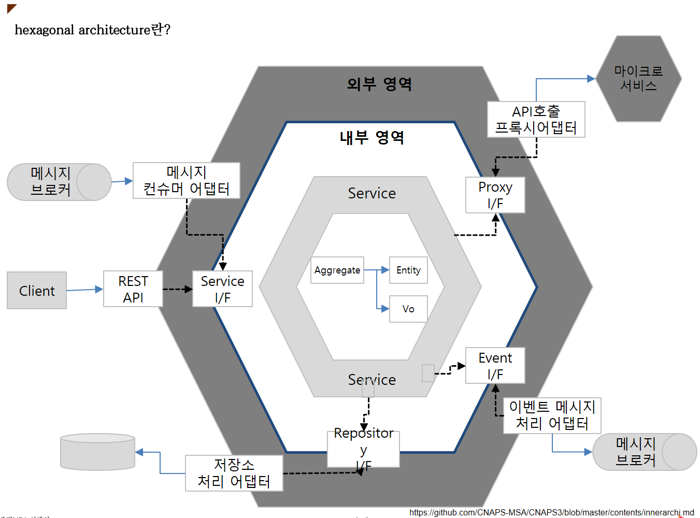

# BackEnd Package구조(JAVA)
- 참조 문서 : 도메인 주도 설계로 시작하는 마이크로서비스 개발
- JAVA로 작성하는 MSA 표준
  - 도메인 주도 설계 + Java + JPA + SpringBoot 기반 Case로 한정

(arch:package)=
## 1. 개요

현시점은 단순 CRUD수준이나, 향후 일정부분의 복잡성 및 향휴 유지보수를 고려하여 리소스 유형별로 Package을 정의함


## 2. 내부 영역

|   대분류   | 패키지 명         |유형| 명명 규칙                 |명칭 및 역할| 작성 기준   |
|:-------:|:--------------| :----- |:----------------------| :----- |:--------|
| service |       service       |인터페이스| 	~Service             |	서비스 인터페이스: 서비스 퍼사드 역할||
|         | service.impl |클래스| 	~ServiceImpl         |	서비스 구현체: 업무 처리 흐름 구현 (인프라 구현)||
|         |  service.vo  |클래스| 	클래스+'_'+ 메소드 +  'VO' |	서비스 구현체: 업무 처리 흐름 구현 (인프라 구현)||
| Domain  |   domain.entity   |엔티티 클래스| 엔티티명+Entity           |엔티티 정의 클레스 (@Entity)||
|         |  domain.biz  |비지니스로직클레스| 엔티티명+Biz              |도메인 개념을 명확히 표현할 수 있는 
|         | domain.repository |인터페이스| ~Repository           |JPA로 구현하는 클래스<BR>(향후 별도 추가 상세 정의필요)||
|         |     domain.vo     |in/out| value Object          |비지니스로직클레스 + In/Out||

## 3. 외부영역

|    대분류     | 패키지명              | 유형          | 명명 규칙              |명칭 및 역할| 작성 기준|
|:----------:|:------------------|:------------|:-------------------| :----- |:--------|
| Controller |     controller     | @Controller | REST 콘트롤러          |	REST 콘트롤러: REST API발행, 인바운드 요청처리||
|            |   controller.vo   | 클래스         | ~DTO               |동기 호출 시 데이터 전송 객체로 사용||
|            | controller.mapper | 클래스         | REST 콘트롤러+"Mapper" |데이터 형식 변환(JSON <-> DTO)||
|            | controller.errors | 클래스         |||
|  adaptor   |   adaptor.kafka   | 클래스         | kafka 스트림관련        |설정 클래스||
|            | adaptor.security | 클래스         | 인증관련               ||
|            | adaptor.swagger | 클래스         | Swagger 관련 설정      ||

```shell
| adaptor.sync           |클래스|~Caller|REST 클라이언트: 동기 아웃바운드 처리||
| adaptor.sync.dto       |클래스|~DTO|데이터 전송 객체: 동기 호출 시 데이터 전송 객체로 사용||
| adaptor.event.sub      |클래스|~Consumer|비동기 호출 수신||
| adaptor.event.pop      |인터페이스|~Producer|비동기 호출 송신 인터페이스||
| adaptor.event.pop.impl |클래스|~ProducerImpl|비동기 호출 송신 인터페이스 구현||
| sys.component          |클래스|||

```
