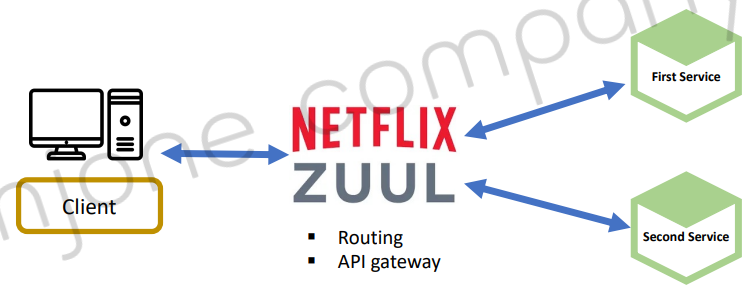

<style>
.burk {
    background-color: red;
    color: yellow;
    display:inline-block;
}
</style>

#  2: API Gateway Service

- API Gateway Service
- Netflix Ribbon과 Zuul
- Spring Cloud Gateway – 기본
- Spring Cloud Gateway – Filter
- Spring Cloud Gateway – Eureka 연동
- Spring Cloud Gateway – Load Balancer

## 1. API Gateway Service
API Gateway Service 주요 기능
- 인증 및 권한 부여
- 서비스 검색 통합
- 응답 캐싱
- 정책, 회로 차단기 및 QoS 다시 시도
- 속도 제한
- 부하 분산
- 로깅, 추적, 상관 관계
- 헤더, 쿼리 문자열 및 청구 변환
- IP 허용 목록에 추가


## 2. Netflix Ribbon과 Zuul
- Spring Cloud에서의 MSA간 통신
  1. RestTemplate
      ```java
      RestTemplate restTemplate = new RestTemplate();
      restTemplate.getForObject("http://localhost:8080/", User.class, 200);
      ```
  2. Feign Client
      ```java
      @FeignClient("stores")
      public interface StoreClient {
          @RequestMapping(method = RequestMethod.GET, value = "/stores")
          List<Store> getStores();
      }
      ```


- Ribbon: Client side Load Balancer
  1. 서비스 이름으로 호출
  2. Health Check
     -  Spring Cloud Ribbon은 Spring Boot 2.4에서 Maintenance상태


### Netflix Zuul 구현
1. 구성
   - First Service
   - Second Service
   - Netflix Zuul First Service
   - 

2. 프로젝트 생성
   - First Service, Second Service
   - 왜 버전을 이전과 다르게 했을까?(2023-01-18)
    ```shell
    - Spring Boot: 2.3.8
    - Dependencies: Lombok, Spring Web, Eureka Discovery Client
    ```
### 관련 소스
1. 업무 Controller : FirstServiceController
   - SecondServiceController 도 동일 

    ```java
    @RestController
    @RequestMapping("/")
    @Slf4j
    public class FirstServiceController {
    
        @GetMapping("/welcome")
        public String welcome() {
            log.info("welcome()");
            return "Welcome to the First service.";
        }
    
    }
    ```
2. application.yaml
    ```yaml
    server:
      port: 0
    #  port: ${random.int(10000,51000)}
    
    spring:
      application:
        name: my-first-service
    
    eureka:
      client:
        register-with-eureka: true
        fetch-registry: true
        service-url:
          defaultZone: http://localhost:8761/eureka
      instance:
        instance-id: ${spring.cloud.client.ip-address}:${spring.application.instance_id:${random.value}}
        prefer-ip-address: true
    ```
3. 테스트
   - 포트는 서비스 기동시 마다 변경
    ```shell
    http://192.168.43.50:2203/welcome
    ```         
### Step4) Zuul Service
- Spring Boot: 2.3.8
- Dependencies: Lombok, Spring Web, Zuul
```note
Spring boot 2.4.X부터는 zuul, hystrix가 더 이상 제공되지 않습니다.
Spring cloud 커뮤니티에서 zuul 대신 권고하고 있는 API Gateway가 Spring cloud gateway입니다.
```


## 3. Spring Cloud Gateway – 기본
## 4. Spring Cloud Gateway – Filter
## 5. Spring Cloud Gateway – Eureka 연동

## 6. Spring Cloud Gateway – Load Balancer


```yaml
Netflix Zuul 구현
§ Step2) First Service, Second Service
Netflix Zuul 구현
§ Step3) Test
Netflix Zuul 구현
§ Step4) Zuul Service
- Spring Boot: 2.3.8
- Dependencies: Lombok, Spring Web, Zuul
Netflix Zuul 구현
§ Step5) Zuul Service
Netflix Zuul 구현
§ Step6) ZuulFilter
Spring Cloud Gateway – 기본
§ Step1) Dependencies
- DevTools, Eureka Discovery Client, Gateway
§ Step2) application.properties (or application.yml)
Spring Cloud Gateway – 기본
§ Step3) Test
Spring Cloud Gateway – 기본
Pre
dica
te
Spring Cloud Gateway – Filter
First Service
Second Service
Client Spring Cloud gateway
Gateway
Handler
Mapping
Predicate
Pre
dica
te
Pre Filter
Post Filter
Request
Response
§ Property
§ Java Code
Spring Cloud Gateway – Filter
§ Step4) Filter using Java Code – FilterConfig.java
Spring Cloud Gateway – Filter
§ Step4) Filter using Java Code – FirstServiceController.java, SecondServiceController.java
Spring Cloud Gateway – Filter
§ Step4) Test
Spring Cloud Gateway – Filter
§ Step5) Filter using Property – application.yml
Spring Cloud Gateway – Filter
§ Step5) Test
Spring Cloud Gateway – Custom Filter
§ Step6) Custom Filter – CustomFilter.java
Spring Cloud Gateway – Custom Filter
§ Step6) Custom Filter – application.yml
Spring Cloud Gateway – Custom Filter
§ Step6) Custom Filter – FirstServiceController.java, SecondServiceController.java
Spring Cloud Gateway – Global Filter
§ Step7) Global Filter – GlobalFilter.java
Spring Cloud Gateway – Global Filter
§ Step7) Global Filter – application.yml
Spring Cloud Gateway – Global Filter
§ Step7) Global Filter – Test
Spring Cloud Gateway – Custom Filter (Logging)
§ Step8) Logging Filter – LoggingFilter.java
Spring Cloud Gateway – Custom Filter (Logging)
§ Step8) Logging Filter – application.yml
Spring Cloud Gateway – Custom Filter (Logging)
§ Step8) Logging Filter – Test
Gateway
Client
Gateway
Handler
Global
Filter
Custom
Filter
Logging
Filter
Proxied
Service
Spring Cloud Gateway – Eureka 연동
FIRST SERVICE
INSTANCE A
API Gateway
Eureka Server: Service Discovery, Registration
SECOND SERVICE
http://127.0.0.1:8000/first-service/welcome INSTANCE A
http://127.0.0.1:8000/second-service/welcome
1)
2)
3)
3)
http://127.0.0.1:8082/second-service/welcome
http://127.0.0.1:8081/first-service/welcome
second-service/welcome
Spring Cloud Gateway – Eureka 연동
§ Step1) Eureka Client 추가 – pom.xml, application.yml
- Spring Cloud Gateway, First Service, Second Service
Spring Cloud Gateway – Eureka 연동
§ Step2) Eureka Client 추가 –application.yml
- Spring Cloud Gateway
Spring Cloud Gateway – Eureka 연동
§ Step3) Eureka Server – Service 등록 확인
- Spring Cloud Gateway, First Service, Second Service
Spring Cloud Gateway – Load Balancer
§ Step4) First Service, Second Service를 각각 2개씩 기동
2) $ mvn spring-boot:run -Dspring-boot.run.jvmArguments='-Dserver.port=9003'
3) $ mvn clean compile package
$ java -jar -Dserver.port=9004 ./target/user-service-0.0.1-SNAPSHOT.jar
1) VM Options à -Dserver.port=[다른포트]
Spring Cloud Gateway – Load Balancer
§ Step5) Eureka Server – Service 등록 확인
- Spring Cloud Gateway, First Service, Second Service
Spring Cloud Gateway – Load Balancer
§ Step6) Random port 사용
- Spring Cloud Gateway, First Service, Second Service
Spring Cloud Gateway – Load Balancer
§ Step6) Post 확인 – FirstController.java
Spring Cloud Gateway – Load Balancer
§ Step6) Random port 사용
- Spring Cloud Gateway, First Service, Second Service
```
