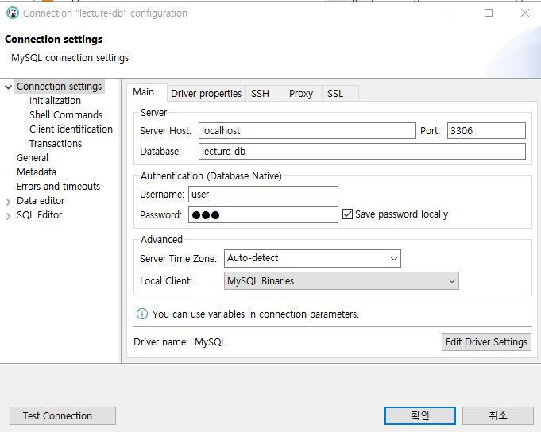
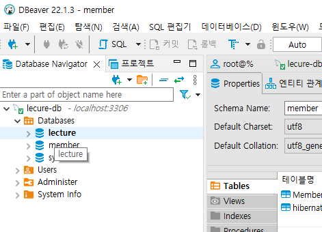
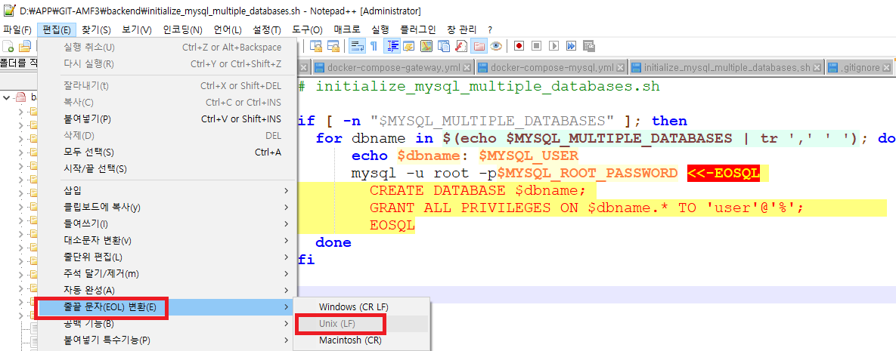
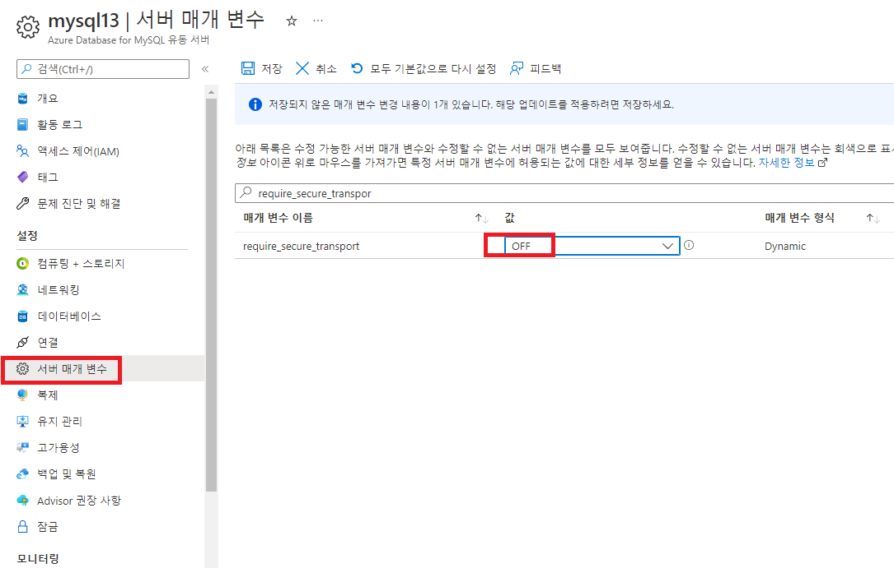

# Lecture-mysql


## 1.mysql 연동(DOcker 기반)
2022-07-24일

### 1.1 MYSQL을 Docker로 기동하기
1. Docker-compose 파일 생성
   - docker-compose-mysql.yml
    ```yaml
    # $ mysql -uroot -h127.0.0.1 -p
    mysql:
        image: mysql:5.7
        mem_limit: 350m
        ports:
        - "3306:3306"
        environment:
        - MYSQL_ROOT_PASSWORD=rootpwd
        - MYSQL_DATABASE=lecture
        - MYSQL_USER=user
        - MYSQL_PASSWORD=pwd
        healthcheck:
        test: ["CMD", "mysqladmin" ,"ping", "-uuser", "-ppwd", "-h", "localhost"]
        interval: 10s
        timeout: 5s
        retries: 10
    ```
### 1.2 테스트
1. 실행
    ```bash
    cd .  (docker-compose-mysql.yml 파일이 있는 디렉토리)

    docker-compose -f docker-compose-mysql.yml up

    ```
2. mysql 결과 확인
   - DBeaver 다운로드 및 설치
     - 접속정보 
     - database에 'lecture'가 보이면 OK
     - 
3. 주의사항
   - 로컬에 '3306'으로 서비스 중인 내역이 있으면 Skip
   - 로컬에 MySQL 및 기타 유사한 DB가 있으면 uninstall 또는 서비스 중지후 실행 권고
## 2 기존 서비스에서 MySQL 접속하기
1. lectured의 Application.yaml변경
   - 이 부분은 Mysql 기동이후 MySQL에 접속하기 위한 부분
   - Local테스트 없이 직접 docker기반 테스트만 함
   - 전체 내용은 소스 참조
   - 소스 수정은 별도 하지 않음
        ```yaml
        # 추가된 내용
        spring.datasource:
        url: jdbc:mysql://mysql/lecture
        username: user
        password: pwd

        spring.datasource.hikari.initializationFailTimeout: 60000

        spring.jpa.generate-ddl: true
        spring.jpa.hibernate.ddl-auto: update
        spring.jpa.properties:
        hibernate:
            show_sql: true
            format_sql: true
        ```
2. Docker-compose 파일 변경
   - 다른 사람과 테스트 독립성을 하여 별도 compose 파일 생성
   - docker-compose-lecture.yml(mysql 관련 추가)
   - 1단계에서 테스트한 MYSQL 관련 설정을 추가
        ```yaml
        # $ mysql -uroot -h127.0.0.1 -p
        mysql:
            image: mysql:5.7
            mem_limit: 350m
            ports:
            - "3306:3306"
            environment:
            - MYSQL_ROOT_PASSWORD=rootpwd
            - MYSQL_DATABASE=lecture
            - MYSQL_USER=user
            - MYSQL_PASSWORD=pwd
            healthcheck:
            test: ["CMD", "mysqladmin" ,"ping", "-uuser", "-ppwd", "-h", "localhost"]
            interval: 10s
            timeout: 5s
            retries: 10
        ```
    - lecture에 depend-on추가
        ```yaml
            depends_on:
            - kafka, mysql
        ```
3. 실행
    ```bash
    cd lecture
    mvn clean package

    cd  ..  #root 디렉토리로 이동

    docker-compose -f docker-compose-lecture.yml build
    docker-compose -f docker-compose-lecture.yml up

    # swagger로 테스트
    ```
4. mysql 결과 확인
   - DBeaver 다운로드 및 설치
     - 접속정보 
        ```bash
        # docker-desktop에서 CLI로 접근
        SELECT id, category_id_id, max_enrollment, min_enrollment, status, title, version
            FROM `lecture`.lecture_table;

        1	11	20	10	CLOSED	string
        2	11	20	10	CLOSED	string
        3	11	20	10	CLOSED	string
        4	11	20	10	CLOSED	string
        5	11	20	10	CLOSED	string
        6	11	20	10	CLOSED	string
        7	11	20	10	CLOSED	string
        8	11	20	10	CLOSED	string
        ```
## 3. Multi DB 테스트
- 하나의 MySQL에 2개 이상의 database만들기
- 참조한 내용: https://namsieon.com/24

### 3.1 shell파일 생성
- docker-compose-mysql 파일과 동일한 위치에 "initialize_mysql_multiple_databases.sh"생성 (끝문자가 unix 형식이어야 함)
  - unix 형식으로 끝문자 변경하기
  - 

    ```sh
    # initialize_mysql_multiple_databases.sh

    if [ -n "$MYSQL_MULTIPLE_DATABASES" ]; then
    for dbname in $(echo $MYSQL_MULTIPLE_DATABASES | tr ',' ' '); do
        echo $dbname: $MYSQL_USER
        mysql -u root -p$MYSQL_ROOT_PASSWORD <<-EOSQL
            CREATE DATABASE $dbname;
            GRANT ALL PRIVILEGES ON $dbname.* TO 'user'@'%';
            EOSQL
    done
    fi
    ```
#### 3.1.1 initialize_mysql_multiple_databases.sh파일 관리 방법 수정
해당 파일은 unix 형식(LF)만으로 구성되어져야 함 ==> Window형식이면(crlf)오류 발생
- 관리의 편의및 MySQl을 관리를 100% 도커 기반으로 하기위하야 docker 이미지 파일에 추가 하는 방법도 있음
- [A. Multi 생성을 Mysql 이미지에 포함하기](A-mysql:label)참조

### 3.2 docker-compose 수정 내용
- DB명에 '-'사용시 오류가 발생함
- 'MYSQL_MULTIPLE_DATABASES' 추가
- 'volumes' 부분 추가: sh수행
  - 잘못 생성되었으면 vloumn을 삭제하고 다시 수행
- volumn 추가
    ```yaml
    version: '2'
    volumes:
      mysql-volume: {}
    services:
    # $ mysql -uroot -h127.0.0.1 -p
    mysql:
        image: mysql:5.7
        mem_limit: 350m
        ports:
        - "3306:3306"
        environment:
        - MYSQL_ROOT_PASSWORD=rootpwd
        - MYSQL_MULTIPLE_DATABASES=lecture,member
        - MYSQL_USER=user
        - MYSQL_PASSWORD=pwd
        volumes:
        - ./initialize_mysql_multiple_databases.sh:/docker-entrypoint-initdb.d/initialize_mysql_multiple_databases.sh
        - mysql-volume:/var/lib/mysql
          healthcheck:
          test: ["CMD", "mysqladmin" ,"ping", "-uuser", "-ppwd", "-h", "localhost"]
          interval: 10s
          timeout: 5s
          retries: 10
    ```

## 4. MYSQL 한글입력을 위한 character set 설정

- command 부분 추가
    ```yaml
    version: '2'
    volumes:
    mysql-volume: {}
    services:
    # $ mysql -uroot -h127.0.0.1 -p
    mysql:
        image: mysql:5.7
        mem_limit: 350m
        ports:
        - "3306:3306"
        environment:
        - MYSQL_ROOT_PASSWORD=rootpwd
        - MYSQL_MULTIPLE_DATABASES=lecture,member
        - MYSQL_USER=user
        - MYSQL_PASSWORD=pwd
        volumes:
        - ./initialize_mysql_multiple_databases.sh:/docker-entrypoint-initdb.d/initialize_mysql_multiple_databases.sh
        - mysql-volume:/var/lib/mysql
        command:
        - --character-set-server=utf8
        - --collation-server=utf8_general_ci
        healthcheck:
          test: ["CMD", "mysqladmin" ,"ping", "-uuser", "-ppwd", "-h", "localhost"]
          interval: 10s
          timeout: 5s
          retries: 10
    ```
## 5. Azure Mysql 생성
1. Azure Portal에서 MySQL 생성
2. 네트워크 규칙에서 접속 Cclient IP 대역 입력(콘솔에서 해당 클라이언트만 등록 기능 있음)
    시작: 0.0.0.0
    종료: 255.255.255.255
3. SSL 사용 DISABLE
   - require_secure_transport=off
   
4. 클라이언트 도구를 통하여 접속(DBever)
   - DB 및 user 생성
(A-mysql:label)=
## A. Multi 생성을 Mysql 이미지에 포함하기
1. Dockerfile
    ```yaml
    FROM mysql:5.7
    COPY initialize_mysql_multiple_databases.sh /docker-entrypoint-initdb.d/initialize_mysql_multiple_databases.sh
    ENV TZ=Asia/Seoul
    ```

2. 이미지 생성
    ```bash
    docker build -f Dockerfile --tag myinno-mysql:5.7 .
    ```
