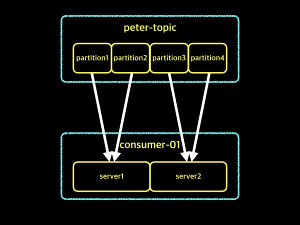

# Kafka Consumer Group
-
Kafka 운영자가 말하는 Kafka Consumer Group
- 원본 문서: https://www.popit.kr/kafka-consumer-group/
- 2022-08-05
-
## 컨슈머 그룹

- Consumer Group란?
  - 컨슈머 인스턴스들을 대표하는 그룹
- Consumer Instance란?
  - 하나의 프로세스 또는 하나의 서버라고 할 수 있습니다
  - 여기에서는 이해를 돕기 위해서 하나의 서버로 설명
-  Offset란?
   -  파티션안에 데이터 위치를 유니크한 숫자로 표시한 것을 offset이라 부르고,
   -  컨슈머는 자신이 어디까지 데이터를 가져갔는지 offset을 이용해서 관리

### 컨슈머 그룹 의미


- 위 그림은 2개의 컨슈머 그룹을 나타내고 있습니다.
- 2개의 컨슈머 그룹은 서로를 구분하기 위한 이름으로 consumer-01, consumer-02이라고 되어 있고,
  - consumer-01 그룹의 구성원은 4개의 서버로 구성되어 있으며,
  - consumer-02 그룹의 구성은 6개의 서버로 구성
  - 각각의 그룹내의 서버들끼리는 서로의 정보를 공유하고 있어, 만약 하나의 서버가 Down되더라도 다른 서버가 그 서버의 역할을 할 수 있게됩니다

### 컨슈머 그룹의 목적
 컨슈머 그룹을 사용하는 이유
- 첫번째 이유는 가용성에 대한 부분
  - 

    - peter-topic이라는 토픽을 consumer-01 그룹이 데이터를 가져가고 있는 예제
    - consumer-01 그룹은 하나의 컨슈머 인스턴스가 있습니다.
    - 안정적으로 운영하던 중 컨슈머 인스턴스 server1이 장애가 발생
    - 장애가 발생하였기 때문에 server1은 더 이상 자신의 역할을 못하게 되었고, 데이터를 가져오는 작업도 중단
    - 컨슈머 그룹에서 1대의 컨슈머 인스턴스가 아닌 4대의 컨슈머 인스턴스로 운영중이었다면 어떨까요?
    - 4대의 서버중 하나의 서버에서 장애가 발생하였다면 어떻게 되었을까요? 아래 그림을 보도록 하겠습니다.
  - 
    - server1이 장애가 발생
    - consumer-01 그룹은 4대의 서버로 구성되어 있어 server1만 제외되고, 나머지 서버 3대로 멈추지 않고 계속해서 작업을 이어갈 수 있습니다. 이러한 이유 때문에 우리는 컨슈머 그룹을 사용하고, 한대가 아닌 여러대의 컨슈머 인스턴스를 구성하여 안정성을 확보하는것이 필요
    -
- 두번째 이유는 컨슈머 그룹들을 구분하고, 컨슈머 그룹들은 자신의 그룹에 대한 offset 관리를 하기 때문
  - 개념적인 설명을 위해서 몇가지 조건을 가정
  - A 사용자와 B 사용자가 있고, 둘다 동일한 토픽에 대해서 데이터를 가져가길 원하는 상황이며, 컨슈머 그룹이라는 것이 없다고 가정
  - 컨슈머 그룹이 없기 때문에, 카프카에서는 컨슈머들을 구분할 수 없고, 또한 컨슈머들은 자신들만의 offset을 유지할 수 없습니다.
  - 
    - peter-topic에 1, 2, 3, 4라는 데이터가 들어가 있고, A 사용자가 1, 2, 3번까지 데이터를 가져갔습니다. 그리고는 다음에 가져갈 메시지는 4라는 자리 위치를 기록
    - 컨슈머 그룹이라는 것이 없다고 가정했으므로, 카프카는 컨슈머들에 대한 구분이 없습
    - 단지 컨슈머가 연결된 상태일뿐,  A 사용자가 데이터를 가져가는 것인지, B 사용자가 데이터를 가져가는 것인지에 대한 구분이 없는 상태
    - 그래서 B 사용자가 가져오기를 할 때, A 사용자가 데이터를 가져오면서 저장했던 offset 정보를 그대로 이용
    - 

    - 이미 A 사용자가 데이터를 가져오면서 next 메시지 4번이라고 기록하였기 때문에 위 그림처럼 B 사용자는 데이터 1, 2, 3은 가져오지 못한채 데이터 4만 가져오게 될 것
    - 이 상황에서 또 다른 문제는 A 사용자가 데이터를 가져오기를 시도 할때입니다. B 사용자가 데이터 4번을 가져간 후 next 표시를 했기 때문에 A 사용자는 4번 데이터를 가져오지 못할 것
    - 이러한 이유 때문에 카프카에서는 컨슈머 그룹마다 컨슈머 그룹 네임을 지정하여 각각의 그룹들을 구분하고, 각각의 컨슈머 그룹별로 자신만의 offset을 관리 하게 됩니다.
    - 컨슈머 그룹을 사용하게 되면, 동일한 토픽을 여러 컨슈머 그룹이 컨슘하더라도 서로 각기 다른 offset을 가지고 데이터의 손실 없이 가져가기를 할 수 있게 됩니다.
  - 
  - 

    - peter-topic이라는 하나의 토픽을 consumer-01, consumer-02 2개의 그룹이 가져가기를 하고 있는 예제
    - A 사용자는 consumer-01 그룹을 이용하여, 데이터 1, 2, 3을 가져온 상태이고 이후 4번 데이터를 가져올 것입니다.
    - B 사용자는 consumer-02 그룹을 이용하여  1, 2, 3, 4 데이터를 가져오고 다음에 들어오는 데이터를 가져올 것입니다.
  - 이렇게 카프카에서는 하나의 토픽이지만 2개 이상 여러개의 컨슈머 그룹이 데이터를 가져갈 수 있고, 각 그룹별로 서로 다른 offset을 유지할 수 있습니다.
  - 컨슈머 그룹을 만들때, 미리 동일한 이름의 컨슈머 그룹이 있는지를 체크 해보고 만드는게 중요합니다.

### 컨슈머 그룹과 파티션 수의 관계

카프카에서는 하나의 파티션에 대해 컨슈머 그룹내 하나의 컨슈머 인스턴스만 접근할 수 있다
- 파티션에 대해 한명의 reader만 허용하여 데이터를 순서대로 읽어갈 수 있게 하기 위함(ordering 보장)
- 파티션 수보다 컨슈머 그룹의 인스턴스 수가 많을 수 없습.
    
- 위 그림은 한개의 partition으로 구성된 peter-topic이라는 토픽이 있고, 컨슈머 인스턴스는 server1과 server2로 구성된 consumer-01이라는 컨슈머 그룹이 있습니다.
  - 카프카에서는 하나의 파티션에 컨슈머 그룹내 하나의 인스턴스만 접근이 가능하기 때문에,
  - 비록 컨슈머 인스턴스가 2개로 구성되어 있지만, server1만 접근하여 데이터를 가져오고 server2는 일을 하지 못하고 대기하고 있는 상태
  - 컨슈머 인스턴스 하나는 대기 상태이므로, 예제의 상황이 효율적인 상황은 아닙니다. 제 생각에는 효율적인 구성을 위해서 토픽의 파티션 수와 컨슈머 인스턴스 수는 동일하게 맞추어 주거나 절반정도 수준으로 구성해주는 것이 좋습니다.

#### 4개의 파티션 + 2개의 컨슈머 인스턴스

- peter-topic이라는 하나의 토픽은 4개의 파티션으로 구성
-컨슈머 그룹은 consumer-01이라는 이름을 사용하며, 컨슈머 인스턴스 수는  2개

- 하나의 파티션에 하나의 컨슈머 인스턴스만 연결
- 파티션수에 비해 컨슈머 인스턴스수가 적기 때문에 하나의 컨슈머 인스턴스는 2개의 파티션에 대해서 가져오기를 하고 있습

#### 4개의 파티션 + 4개의 컨슈머 인스턴스

- 파티션 수 4개와 컨슈머 인스턴스 수 4개로 두 수가 같은 경우에 대한 예제
- 각각의 파티션과 컨슈머 인스턴스는 1:1로 연결
- 가장 이상적인 상태
- 컨슈머 인스턴스 2개인 경우와 지금 보고 있는 컨슈머 인스턴스 4개의 차이는 무엇이 있을까요? 정답은 바로 데이터를 가져오는 속도의 차이입니다.

예를들어, 각각의 파티션에 순서대로 1, 2, 3, 4라는 데이터가 들어있고, 컨슈머가 파티션에 있는 데이터를 가져올 때, 1초가 걸린다고 가정하겠습니다. 가정한 내용을 바탕으로, 그림을 추가하여 설명 이어가도록 하겠습니다.

- 컨슈머 인스턴스 2개 - 1초
    
- 컨슈머 인스턴스 2개 - 2초
    

- 컨슈머 인스턴스 4개 - 1초
    

- 이러한 장점만 보고 파티션수를 무작정 늘리는 것은 좋지 않습니다.
  - 토픽의 파티션 수는 토픽이 생성된 이후에 언제든지 늘릴 수 있지만,
  - 절대로 줄일 수는 없습니다.
  - 그래서, 일방적으로 파티션 수를 많이 늘리기 보다는 사전 테스트를 통해서 어느정도의 컨슈머 인스턴스 수를 유지했을 때, 데이터를 가져오는데 밀리는 증상이 없는지를 찾아서 해당 수만큼 파티션 수를 만들어주는 것이 효율적

### 하나의 토픽에 2개의 컨슈머 그룹
컨슈머 그룹 응용편 마지막 예제로서, 하나의 토픽에 2개의 컨슈머 그룹이 연결되었을 때입니다. 응용편이기 때문에 토픽의 파티션수와 컨슈머 인스턴스 수를 모두 다르게 구성했습니다. 아래 그림을 살펴보겠습니다.


- 먼저 consumer-01 그룹
  - 4개의 파티션으로 구성된 peter-topic의 데이터를 가져오는데, 컨슈머 인스턴스 수는 3개
  - 파티션 하나당 하나의 컨슈머 인스턴스가 연결되고, 토픽의 파티션 수보다 컨슈머 인스턴스 수가 부족하기 때문에 컨슈머 인스턴스 3개중의 어느 하나는 2개의 파티션에 대해서 데이터를 가져오게 됩
  - 설명을 드리기 위한 예제일뿐, 실제 서비스에 이렇게 구성하시게 되면 바람직한 구성은 아니겠죠?

- consumer-02그룹
  - 파티션 수보다 컨슈머 인스턴스 수가 많은 경우
  - 이런 경우에는 파티션 하나당 하나의 컨슈머 인스턴스가 연결되기 때문에, 마지막 컨슈머 인스턴스는 일을 하지 못하고 대기 상태로 남아 있게 됩
  -  단지 설명을 위한 예제중의 하나일뿐입니다. 실제로 구성하실 때는 테스트를 해보시고 적정한 값으로 구성하시기를 권장

## Binders
- https://docs.spring.io/spring-cloud-stream/docs/Brooklyn.RELEASE/reference/htmlsingle/#_producers_and_consumers


## Convention
- https://data-engineer-tech.tistory.com/36

- 카프카에서 토픽을 생성할 때 유효한 문자는 [영문, 숫자, '.', '_', '-']만 사용할 수 있다. 그리고 유의할 점은 마침표(.)와 밑줄(_)은 충돌할 수 있기 때문에 둘 중 하나만 사용하는 것이 좋다.
 
- 선택할 수 있는 예시들은 다음과 같다.
    ```console
    <namespace>.<product>.<event-type>
    <application>-<data-type>-<event-type>
    <organization>.<application-name>.<event-type>.<event>
    <message type>.<dataset name>.<data name>
    <root name space>.<product>.<product specific hierarchy>
    <app type>.<app name>.<dataset name>.<stage of processing>
    <app type>.<dataset name>.<data>
    ```console
출처: https://data-engineer-tech.tistory.com/36 [데이터 엔지니어 기술 블로그:티스토리]

## yaml 설정하기

```yaml
      bindings:
        event-in:
          group: amf42
          destination: lecture
          contentType: application/json
        event-out:
          destination: lecture
          contentType: application/json
```
```yaml
#https://sup2is.github.io/2020/04/21/spring-cloud-stream-example.html
spring:
  application:
    name: orderservice
  cloud:
    stream:
      bindings:
        input:
          destination: memberChangeTopic
          content-type: application/json
          group: orderGroup
      kafka:
        binder:
          zkNodes: localhost
          brokers: localhost
```
- spring.cloud.stream.bindings.{channel-name}.destination: 생산할 kafka topic
- spring.cloud.stream.bindings.{channel-name}.content-type: 발행하는 메시지의 content-type을 설정
- spring.cloud.stream.kafka.binder.zkNodes: zookeeper 관련 설정을 한다 위와 같이 매핑해도 자동적으로 2181 포트와 매핑된다.
- spring.cloud.stream.kafka.binder.brokers: kafka 관련 설정을 한다 위와 같이 매핑해도 자동적으로 9092 포트와 매핑된다.
