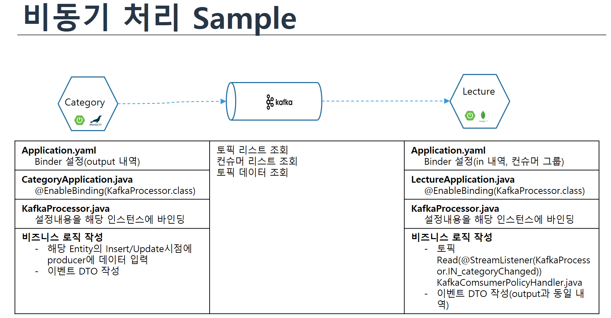
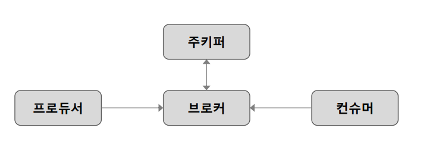
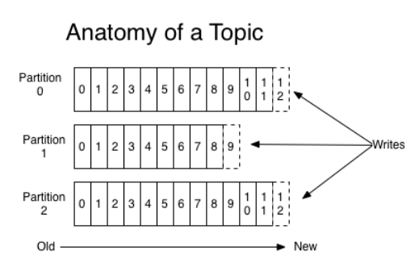

#  kafka를 통한 비동기 통신
- AMF3 강의 기준으로 정리
- 참조:
  - Mysuni 강의: 실시간 데이터 처리&Kafka
  - 허아람 수석 - AI/Data 분야 고수

- TODO
   - MultiPartitioin 관련 처리 현황 추가
## 1. kafka기본 용어정리
1. 브로커
   - 하나 이상의 서버에서 클러스터로 구동
   - 서버 자원만 있으면 scale out 용이함
   - 클러스터를 관리하기 위한 주키퍼 클러스터 필요
     - (주키퍼에서 브로커/토픽 파티션의 메타데이터 정보 및 컨트롤러 선출 관리)
     - 
2. 토픽(topic)
   - 토픽을 기준으로 메시지 관리
   - 메시지를 Produce/Consume 하기 위한 단위
   - 하나 이상의 파티션으로 구성
      
3. 파티션
   - <span class="burk"> 메시지가 실제 저장되는 단위 그룹 </span>
   - 메시지는 오프셋이라는 <span class="burk">순번에</span> 따라 저장
   - 파티션 별 메시지 <span class="burk">순서 보장</span>
   - 파티션은 서로 다른 서버에 분산될 수 있음
     - (하나의 토픽이 여러 서버에 분산 될 수 있음을 의미. 분산 처리를 통한 성능)
   - 파티션은 늘릴 수만 있음 (<span class="burk">줄일 수 없으므로</span> 운영상 주의 해야함)
4. 복제 (리플리케이션)
   - 파티션을 다른 브로커에 복제
   - 클러스터 내 <span class="burk">총 브로커의 개수 이하</span>로만 복제 가능
   - 리더 리플리카와 팔로워 리플리카의 두가지 형태
   - 파티션은 리더로 지정된 하나의 리플리카를 가짐
   - 모든 프로듀서와 컨슈머는 <span class="burk">리더 리플리카를 통해서만 파티션에 접근</span>
   - 팔로워 리플리카는 리더의 메시지 복제하여 리더와 동일하게 유지 (ISR)
   - 리더 리플리카가 중지되면 팔로워 리플리카 중 하나가 리더로 선출
5. 프로듀서
   - 메시지를 특정 토픽에 생성
   - 메시지는 키, 값, 타임스탬프로 구성
   - 기본적으로 어떤 파티션에 메시지 전송 되는지 관여하지 않음
   - 키, 파티셔너로 토픽의 특정 파티션으로 메시지 전송 가능
     - (<span class="burk">같은 키를 가지면 같은 파티션으로 데이터 전송 보장</span>)
6. 컨슈머
   - 토픽의 메시지를 읽어서 처리
   - 메시지가 생성된 순서대로 읽음
   - 메시지의 오프셋을 기록하여 읽는 메시지 위치를 관리
   - <span class="burk">중단 되었다 다시 시작하더라도 다음 메시지부터 처리</span>
   - 컨슈머는 컨슈머 그룹의 멤버로 동작
7. 컨슈머 그룹
   - 컨슈머들은 컨슈머 그룹에 속하며 컨슈머 그룹은 하나 이상의 컨슈머로 구성
   - 한 토픽을 소비하는 여러 컨슈머 그룹 동작 가능
   - 컨슈머 그룹 별로 각 파티션의 메시지 오프셋 관리
   - 토픽의 각 파티션은 컨슈머 그룹 내에서 하나의 컨슈머만 소비할 수 있음

## 2. 명명규칙
1. 토픽
   - Format: MSA이름+'-'+[핵심엔티티]+행위(과거분사)
   - MSA이름, 핵심엔티티과 동일하면 생략
   - ex> category-CategoryChanged ==> categoryChanged
2. 컨슈머 그룹
   - Format: 'CGR-' + 소비하는 MSA + '-' + 토픽
   - ex> CGR-lecture-categoryChanged
4. channelName
   - spring.cloud.stream.bindings.<channelName>.<property>=<value>
   - Format: [out/in] + '-' + 토픽
   - out-categoryChanged

## 3. Producer(out) 구현하기
1. application.yaml 환경설정
   - spring.cloud.stream.binders 이하 부분
     - channel-name = out-categoryChanged
     - 토픽: categoryChanged
    ```yaml
    spring:
      profiles: docker
      cloud:
        stream:
          kafka:
            binder:
              brokers: kafka:9092
          bindings:
    #       event-in:
    #         group: lecturecategory
    #         destination: lecture
    #         contentType: application/json
            out-categoryChanged:  #producer의 이벤트 이름
              destination: categoryChanged  #토픽이름
              contentType: application/json

    ```
2. 설정값을 인스턴스에 바인딩
   - 바인딩 소스
      ```java
      public interface KafkaProcessor {
        //application.yaml에 정의한 이벤트 이름
          @Output("out-categoryChanged")
          MessageChannel outboundTopic();

      }
	  ```

   - KafkaProcessor.java가 Binding을 하기 위해서 해당 소스를 Application.java에서 아래와 같이 추가 되어 있음
      ```java
      import com.everyoneslecture.lecturecategory.kafka.KafkaProcessor;

      @SpringBootApplication
      @EnableAspectJAutoProxy
      @EnableBinding(KafkaProcessor.class)   <== 이 부분
      public class LectureCategoryApplication {
      ````
3. Publising을 위한 기본 이벤트 처리 모듈
   - AbstractEvent.java
   - 별도 수정하지 않았으나, 시간 처리 부분의 Format만 변경
      ```java
      public class AbstractEvent {

        String eventType;
        String timestamp;   <== String으로 변경하고, 아래 Formatter적용

        public AbstractEvent(){
            this.setEventType(this.getClass().getSimpleName());
            SimpleDateFormat defaultSimpleDateFormat = new SimpleDateFormat("yyyy-MM-dd-HH:mm:ss");
            this.timestamp = defaultSimpleDateFormat.format(new Date());
    //        this.timestamp = System.currentTimeMillis();
        }

      ```
4. 이벤트 Layout (DTO) 정의
   - getter/setter는 lombok 적용
    ```java
    import lombok.AllArgsConstructor;
    import lombok.Getter;
    import lombok.Setter;

    @Getter
    @Setter
    @AllArgsConstructor
    public class LectureCategoryChanged extends AbstractEvent {

      String	jobType; //INSERT, UPDATE, DELETE (작업구분)

      Long categoryId;
        String categoryName;

    }

    ```
5. 이벤트 생성
   - 관련 Entity 변경시에 이베트 등록
     ```java
     @Entity
     public class LectureCategory {

         @Id @GeneratedValue
         private Long categoryId;

         private String categoryName;


         @PostPersist
         public void onPostPersist(){
           LectureCategoryChanged lectureCategoryChanged = new LectureCategoryChanged
               ("INSERT", this.getCategoryId(), this.getCategoryName());
           lectureCategoryChanged.publishAfterCommit();
         }

         @PostUpdate
         public void onPostUpdate(){
           LectureCategoryChanged lectureCategoryChanged = new LectureCategoryChanged
               ("UPDATE", this.getCategoryId(), this.getCategoryName());
           lectureCategoryChanged.publishAfterCommit();
         }
     }
     ```

## 4. Consumer(IN) 구현하기
1. 환경설정(application.yaml)
   - application.yaml`
     ```yaml
     spring.profiles: docker

     server.port: 8080

     spring:
       cloud:
         stream:
           kafka:
             binder:
               brokers: kafka:9092
           bindings:
             in-categoryChanged:   #이벤트 이름 (consumer-MSA이름-토픽이름)
               destination: categoryChanged   #토픽이름
               contentType: application/json    #데이터형식
               group: CGR-lecture-categoryChanged  #consumer 그룹: CGR-MSA이름-토픽이름
     ```
2. binder 설정 인스턴스에 반영(producer와 동일 방법)
   - application.java(Main이 있는 클래스)에 Annotation추가
     ```java
     @SpringBootApplication(scanBasePackages={"everylecture"})
     @EnableBinding(KafkaProcessor.class)  //kafka관련 설정 Binder
     //@EnableFeignClients 이중으로 등록되어 있어 여기서는 제거
     @EnableAutoConfiguration
     ```
   - KafkaProcessor에서 Channel Name을 설정함
     ```java
     public interface KafkaProcessor {
         String EVENT_categoryChanged = "in-categoryChanged";

       //application.yaml에서 정의한 이벤트 그룹이름
       @Input(EVENT_categoryChanged)
         SubscribableChannel inboundTopic();
     }
     ```
3. 데이터 수신 처리 반영
-  여기 까지 했는데 어떻게 반영 프로그램이 호출될까?
```java
@Service
public class KafkaComsumerPolicyHandler {
    private final Logger log = LoggerFactory.getLogger(KafkaComsumerPolicyHandler.class);

	@Autowired
     CategoryRepository categoryRepository;

    @StreamListener(KafkaProcessor.IN_categoryChanged)
    public void whatever(@Payload String eventString){
    	log.debug(eventString);
    }

    @StreamListener(KafkaProcessor.IN_categoryChanged)
    public void wheneverPetReserved_displayOnTheStore(@Payload CategoryChanged categoryChanged){
    	log.debug(categoryChanged.toJson());

    	//임시로 누가 호출하는지 확인하기 위한 stacktrace 출력

    	try {
    		new Exception("테스트");
    	} catch (Exception e) {
    		log.debug("호출결로확인", e);
    	}
    	// if(!petReserved.validate())
        //     return;

        Category category = new Category();
        category.setCategoryId(categoryChanged.getCategoryId());
        category.setCategoryName(categoryChanged.getCategoryName());

        if ("INSERT".equals(categoryChanged.getJobType())) {
            categoryRepository.save(category);
        } else if ("UPDATE".equals(categoryChanged.getJobType())) {
            categoryRepository.save(category);
        } else if ("DELETE".equals(categoryChanged.getJobType())) {
            categoryRepository.delete(category);
        }
        log.debug(categoryChanged.toJson());
    }

```


## 5. 테스트

1. 데이터 분류 추가
    ```bash
    curl -X POST "http://127.0.0.1:8080/category/lectureCategories" -H "accept: */*" -H "Content-Type: application/json" -d "{ \"categoryId\": 10, \"categoryName\": \"최종테스트\"}"
    ```
2. lecture에서 데이터 확인
    ```bash
    curl -X GET "http://127.0.0.1:8080/lecture/readCategories/2" -H "accept: */*"

    {
      "categoryName": "최종테스트",
      "_links": {
        "self": {
          "href": "http://lecture:8080/lecture/readCategories/2"
        },
        "category": {
          "href": "http://lecture:8080/lecture/readCategories/2"
        }
      }
    }
    ```
3. kafka 토픽 정보 확인
   - kafka의 CLI로 접근
    ```bash
    $ /bin/kafka-topics --list --bootstrap-server localhost:9092

    __consumer_offsets
    categoryChanged
    event-in
    ```
4.  kafka consumer 리스트
    ```bash
    $ /bin/kafka-consumer-groups \
       --bootstrap-server localhost:9092 \
       --list
    anonymous.00d8c045-d793-40e4-99cb-d7b7444b3b04
    anonymous.9f98f61d-9fd2-4a62-b792-1d1026e1c776
    CGR-lecture-categoryChanged
    ```
5. 특정 컨슈머의 처리 현황 조회
    ```bash
    $ /bin/kafka-consumer-groups \
       --bootstrap-server localhost:9092 \
       --group CGR-lecture-categoryChanged \
       --describe

    GROUP                       TOPIC           PARTITION  CURRENT-OFFSET  LOG-END-OFFSET  LAG             CONSUMER-ID                                                                 HOST            CLIENT-ID
    CGR-lecture-categoryChanged categoryChanged 0          1               1               0               consumer-CGR-lecture-categoryChanged-2-9e5a3e36-fb8f-4fbb-a2c9-98c1aef2ad33 /172.18.0.7     consumer-CGR-lecture-categoryChanged-2

    ```
6. 토픽 데이터 조회
    ```bash
    $ /bin/kafka-console-consumer \
       --bootstrap-server localhost:9092 \
       --topic categoryChanged \
       --from-beginning
    {"eventType":"LectureCategoryChanged","timestamp":"2022-08-08-12:12:37","jobType":"INSERT","categoryId":2,"categoryName":"최종테스트"}
    ```
