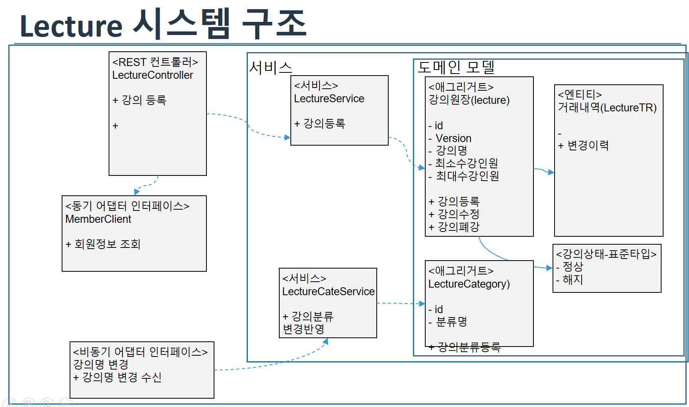

 # Lecture-동기호출


## 1. 동기호출 관련 수정된 내용
Lecture --> member 호출 시도
1. lecture의 pom.xml 추가
    ```xml
    <!-- Caused by: java.lang.IllegalStateException: No Feign Client for loadBalancing defined -->
    <dependency>
        <groupId>org.springframework.cloud</groupId>
        <artifactId>spring-cloud-starter-netflix-ribbon</artifactId>
    </dependency>
    ```

2. 관련 자바 소스
    - ApplicationContext에 feign 관련 별도 설정은 없음 (있으면 삭제)
    - 오류 발생시 처리하는 Exception 객체 추가(FeignClientExceptionErrorDecoder)
    ```java
    package lecturemgt.config.feign;

    import lecturemgt.controller.errors.FeignClientExceptionErrorDecoder;

    @Configuration
    @EnableFeignClients(basePackages = "lecturemgt")
    @Import(FeignClientsConfiguration.class)
    public class FeignConfiguration {

        /**
        * Set the Feign specific log level to log client REST requests.
        */
        @Bean
        feign.Logger.Level feignLoggerLevel() {
            return feign.Logger.Level.BASIC;
        }

        @Bean
        @ConditionalOnMissingBean(value = ErrorDecoder.class)
        public FeignClientExceptionErrorDecoder commonFeignErrorDecoder() {
            return new FeignClientExceptionErrorDecoder();
        }
    }
    ```

   - FeignClientException.java
   - FeignClientExceptionErrorDecoder.java
3. I/F 호출
   - member 서비스의 고객명 동기 호출
   - TODO: http://member:8080/member/merbers/1  설정으로 변경시 port설정을 어디에 추가 하나?
    ```java
    package lecturemgt.adaptor.client;


    @FeignClient(name= "member", configuration = {FeignConfiguration.class})
    public interface MemberClient {
        @GetMapping("/member/members/{memberId}")
        ResponseEntity<MemberInfoDTO> findById(@PathVariable("memberId") int id);
    }

    ```
4. 해당 I/F 호출
    ```java
    @RestController
    //@RequestMapping("/lectures")
    public class LectureController {

    /**
        * 강의등록하기
        * @param userid
        * @param bookId
        * @return
        * @throws InterruptedException
        * @throws ExecutionException
        * @throws JsonProcessingException
        */
        @PostMapping("/leatures")
        public ResponseEntity<LecturesPostOutDTO> registerLecture(@RequestBody LecturesPostInDTO lecturesPostInDTO)
            throws InterruptedException, ExecutionException, JsonProcessingException {
            log.debug("registerLecture-강의등록하기: {}", lecturesPostInDTO);

            ResponseEntity<MemberInfoDTO> memberInfoResult = memberClient.findById(lecturesPostInDTO.getMemberId()); //feign - 책 정보 가져오기
            MemberInfoDTO memberInfoDTO = memberInfoResult.getBody();
            log.debug("member info: {}", memberInfoDTO);

            Lecture lecture = lecturePostInMapper.toEntity(lecturesPostInDTO);
            lecture.setOpName(memberInfoDTO.getName());		//등록자명

            Lecture returnLecture= lectureService.registerLecture(lecture);
            LecturesPostOutDTO returnDto = lecturesPostOutMapper.toDto(returnLecture);


            log.debug("강의등록하기-end: {}" , returnDto);
            return ResponseEntity.ok().body(returnDto);
        }
    }
    ```
