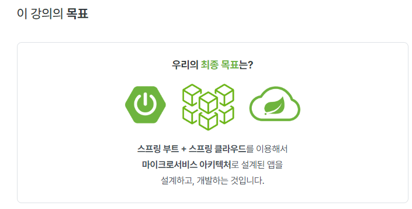

# MSA-SpringCloud


```{note}
꼭 참조한 문서의 원천을 표시하자. (내가 참조한 문서)
저작권등의 문제가 있음 ==> 외부 공유는 불가
본인 참고용으로만 사용하자
```

2023-01 시작 (myinno)

## 개요

Spring Cloud로 개발하는 마이크로서비스 애플리케이션(MSA)

-  
- 이도원
  - 現) 엔제이원컴퍼니 대표
  - 現) 동국대학교 국제정보대학원 정보보호학과 대우교수
  - 前) JP Mogan Chase AMJ Tech consultant (일본)
  - 前) 삼성 SDS CMS 사업본부 책임 엔지니어

<a class="reference internal" href="../../../index.html">
     <H2>Main.돌아가기</H2>
</a>

